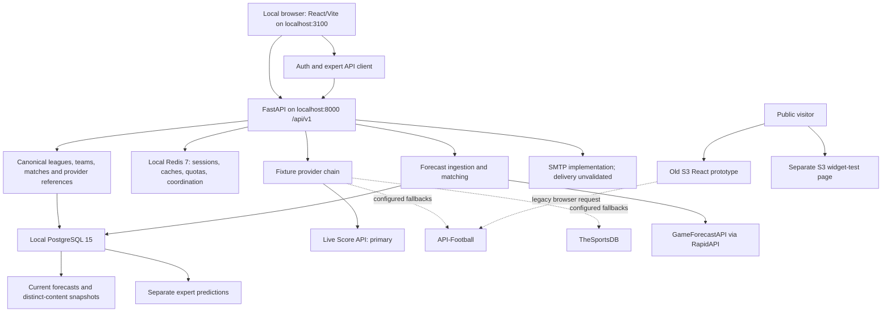

# PredictionsAppsUI — Independent Technical Review

**Review date:** 18 September 2026, UTC. AWS/core-source evidence was checked through about 04:19 UTC; Git was rechecked at 04:31 UTC and database coverage at 04:32 UTC. The main independent browser runs were around 04:09–04:17 UTC. The review spans late 17 September and early 18 September in New York. A focused mobile-search retest and confidence-source recheck completed at 04:33 UTC.

**Scope:** inspect → test → verify → challenge → report → recommend. No implementation, deployment, dependency installation, Git mutation, migrations, account creation, publishing, or cloud-resource changes were performed. This report is the only project file created by this audit. Temporary build/browser/evidence artifacts were written outside the repository.

**Important snapshot limitation:** Claude was actively changing the working tree during this audit. Results describe observed files and individual runs, not a frozen release candidate. Nine fingerprinted source/test files had changed by 04:19 UTC; further edits and two Claude commits occurred during report preparation. Late provider-anomaly/UI changes after the passing runs are NOT VALIDATED by those earlier runs. Earlier transient frontend errors are not reported as current failures where later independent runs passed. Recheck findings against subsequent changes before implementing them.

**Repository reviewed:** `/Users/stephanefotso/Documents/DevProjects/PredictionsAppsUI`. The alternate `~/Documents/PredictionsAppsUI` path in the request does not exist. Claude’s assessment and the actual checkout are in the DevProjects path.

## 1. Executive summary

**The project is a working local integration in progress, with material correctness gaps. The public deployment is still an old prototype.** Claude’s latest addenda describe real improvements, but the original executive summary and START HERE are obsolete and should not direct the next session.

Independently established:

- Local React pages talk to FastAPI; PostgreSQL and Redis health checks succeed. Stored data initially contained **48 fixtures, 30 current GameForecast forecasts and 60 forecast snapshots**. At 04:32 UTC the same 48 fixtures/30 forecasts had **70 snapshots and 23 published expert predictions**, after concurrent Claude activity. These local expert counts are not evidence of organic production usage.
- Live Score API is the effective primary fixture provider; GameForecast is the effective forecast provider. API-Football and TheSportsDB adapters are retained and configured as fallbacks in the running environment. No new provider calls were required for this audit.
- The independently tested frontend snapshot passed type checking, strict lint and a production bundle build. **269 selected backend tests passed.** The main independent mocked Chromium run produced **59 passes and one failure**, for mobile search; Claude subsequently added a mobile search control and the focused mobile test independently passed at 04:33 UTC. New handoff claims of 339 backend/71 browser passes are separate from our own executed counts. Late edits require renewed checks.
- Several prior defects are fixed locally: explicit percentage conversion, honest missing-market display, measured homepage counts, distinct forecast timestamps, pending forecast retries and stored forecast history.
- Remaining defects can misattribute predictions to the wrong home/away order or overwrite fixture identity. Repair snapshots can misstate when a forecast was first obtained. These directly affect the product’s central promise.
- GitHub is **three commits behind local main/progress**. Claude committed most overnight WIP during this review; additional edits were still underway at the final snapshot. There are no GitHub Actions workflows or run records in the inspected repository.
- AWS contains **two relevant S3 sites, last updated in October 2025**. No current project API, database, Redis service, container service or scheduled processing was found in the successful checks across all 17 enabled regions. The old public homepage still displays hard-coded performance figures; direct prediction-page links fail.

| Major area | Verdict | Meaning |
|---|---|---|
| Product direction and chosen Phase 1 stack | PASS WITH CONCERNS | Fits the approved scope; trial duration and six-competition forecast coverage need evidence |
| Local public browsing UI | PASS WITH CONCERNS | Real stored data renders; mobile search was corrected after the main run; copy/test gaps remain |
| Frontend compilation/lint/build | PASS | Independently executed snapshot passed; later edits not certified by that run |
| Forecast identity, integrity and historical evidence | CHANGES REQUIRED | Reproduced mapping/provenance defects |
| Backend test/type/lint baseline | CHANGES REQUIRED | Selected tests pass; critical lint and mypy fail; full database suite not run |
| Authenticated end-to-end workflow | NOT VALIDATED | No accounts or application records changed by this audit |
| GitHub/CI and release reproducibility | CHANGES REQUIRED | Three unpublished commits plus new WIP, no CI, runtime mismatch |
| Current public deployment | HOLD | Old static prototype; no current backend deployment found |
| Documentation | CHANGES REQUIRED | Current and historical instructions conflict |
| Dedicated security-hardening phase | HOLD | Deferred by owner; recorded separately from functional priorities |

Do not restart the project, replace the selected providers, build an internal model, or reinstate mandatory administrator approval. Correct identity/provenance, complete isolated workflow verification, and establish a reproducible baseline first.

## 2. Project goal and authoritative sources

The documented goal is a subscription-oriented soccer prediction application combining automated baseline forecasts with expert human analysis for regular, expert and administrator users. This comes from `docs/requirements/COMPREHENSIVE_REQUIREMENTS_DOCUMENT.md:30`, not from an invented replacement objective.

The owner’s latest decisions amend how the initial release reaches that goal:

- Experts publish directly during Phase 1.
- Working functionality takes priority; dedicated security hardening is Phase 2.
- Live Score API’s 14-day trial supplies match data.
- GameForecastAPI’s free/trial access supplies predictions; no internal forecasting model is required now.
- Preserve API-Football and TheSportsDB as fallbacks.
- Initial focus: Premier League, La Liga, Serie A, Bundesliga, Ligue 1 and UEFA Champions League; free providers preferred, up to $25/month if worthwhile. This provider preference is not approval for an AWS hosting budget or a purchase.

Authority order: **owner decisions → current source/runtime evidence → current root setup instructions → dated Claude addenda as claims → original requirements for longer-term scope → historical design/session documents**. Neither source-code presence nor a document checkbox proves deployment or successful execution.

The initial documentation inventory contained **110 authored Markdown files / 47,191 lines**, including 46 historical session notes plus the archive README. Current status, requirements, setup, provider research, architecture, testing and relevant historical claims were examined. Historical/database-design documents were catalogued and examined for relevant claims; this report does not imply every line or every old assertion was individually corroborated. Generated test artifacts were excluded. A mechanical relative-Markdown-link check found zero missing targets; external URLs and prose commands are separate checks. Claude subsequently added `MORNING_HANDOFF_2026-09-18.md` (251 lines), which was read separately; this brings the authored inventory to 111 documents before this audit report.

## 3. Claude report verification summary

References below are to `CLAUDE_PROJECT_STATUS_AND_NEXT_STEPS.md` unless another source is named. Earlier claims can be accurate historical observations while being wrong instructions for today.

| Claude’s major claim | Independent finding and evidence | Status / agreement / correction |
|---|---|---|
| Original summary: app frozen since October 2025, frontend unbuildable, main is a prototype | September 2026 commits and substantial WIP; final frontend checks pass | CONTRADICTED as current status. Label original summary historical and replace current summary |
| A: real application promoted to main and obsolete branches archived | Remote main/progress both `37103bd`; four archive tags; old named branches absent | VERIFIED. Agree; do not repeat branch promotion |
| A: BTTS/total-goals work retained, documentation archived, frontend repaired | Current schemas/pages/adapters and archive exist; current frontend checks pass | VERIFIED for implementation presence and current frontend build; not proof of every original acceptance criterion |
| B: credentials removed from active code | Current backend path uses server configuration; old public bundle/source map still contains credential material | PARTIALLY VERIFIED. Distinguish source cleanup, historical exposure, rotation and deployed cleanup |
| B: migrations made portable | Migration files and local database at `f6a7b8c9d0e1` exist | PARTIALLY VERIFIED. Fresh upgrade, rollback and restore not rerun under read-only rules; documented enum downgrade limitation remains unvalidated |
| C: direct publishing and security deferred | Owner explicitly confirmed; code creates expert profile and permits direct publication | VERIFIED. Preserve this policy |
| D: Live Score and GameForecast integrations implemented | Registered routes, adapters, stored fixture/forecast provenance and working local UI | VERIFIED for implementation and observed stored-data path; not all-six live coverage |
| D: API-Football and TheSportsDB retained | Backend adapters and frontend legacy structures exist; runtime fallback list contains both | VERIFIED retention/configuration. Successful current-season failover NOT VALIDATED |
| D/E: explicit GameForecast percentage scale and repaired probabilities | Parser uses explicit scale 100; selected tests pass; runtime exact-score values include 0.01 and 0.14 rather than 1.0 for 1% | VERIFIED current fix. Agree; do not redo parser from scratch |
| E: quota-safe discovery, fair scheduling and retries | Defaults for five verified IDs, caches, budget refusal and least-recently-synced ordering; mock tests pass | PARTIALLY VERIFIED. Cold seven/warm six requests assumes one page per competition; UCL ID/coverage unresolved |
| E: coverage now measured honestly | Initial endpoint/UI showed 6 configured competitions, 48 fixtures, 30 upcoming forecasts, 3 expert predictions, no accuracy record; later local counts in §1/10 | VERIFIED locally. Six configured competitions is not six forecast-covered competitions |
| E: match identity is protected through provider switching | New matching/refusal logic exists, but existing-reference paths bypass or weaken identity checks | PARTIALLY VERIFIED; disagree with an unconditional integrity assurance. See B1/B2 |
| E: preserved forecast evidence and prematch status | Current rows plus initially 60, subsequently 70 snapshots; nullable prematch flag implemented | PARTIALLY VERIFIED; repair code can substitute repair time for original retrieval time. See B3 |
| E: UI no longer fabricates missing markets or generation times | Independent market assertions and local browser observations pass | VERIFIED for tested default path; legacy fake-data flag still exists |
| E: old eight expert endpoint test failures fixed | Mocked expert endpoint tests pass within 269 selected backend tests | VERIFIED for that subset. No claim of an entirely green backend suite |
| E: test/lint/build work completed | Final frontend checks pass; backend F821/mypy fail; initial mobile failure subsequently fixed/retested; WebKit absent | PARTIALLY VERIFIED. Publish actual command, count, exit and exclusions |
| Original backend “never deployed anywhere” | No current project backend found in inspected account/services/regions | NOT VALIDATED as a historical universal claim. State bounded present evidence |
| Two old S3 sites represent current cloud footprint | S3 metadata, assets, HTTP and browser checks confirm two old sites | VERIFIED for identified project resources; distinguish other account projects |
| No CI/CD and no full current cloud app | No workflows/runs/deployments; regional inventory contains no current app backend | VERIFIED in inspected scope |
| Subscription, settlement, analytics and internal model remain unfinished | Mock subscription handlers, placeholder backtests/performance, no settlement pipeline | VERIFIED gaps. Internal model intentionally unnecessary for current phase |
| Original 6–8 week estimate and $60–110 lean AWS estimate | Historical planning ranges; remaining scope changed and some networking line items need correction | Effort NOT VALIDATED; planning INFERENCE only. Current rate inputs checked separately, not an actual bill; see §26 |
| START HERE requires new develop branch, proxy creation and TheSportsDB deletion | Branch promotion/proxy already done; deleting retained fallback conflicts with owner decision | CONTRADICTED as current instructions. Replace, do not execute |
| Research recommendation was corrected | `docs/research/FOOTBALL_DATA_SOURCES_EVALUATION.md:9` withdraws earlier commercial/ML recommendation and selects approved providers | VERIFIED correction. Consolidate obsolete body rather than copying its old $54 plan |

### Late morning-handoff verification

Claude created `MORNING_HANDOFF_2026-09-18.md` while this report was being drafted. Its new claims were checked separately:

| New claim | Independent finding | Status / correction |
|---|---|---|
| 339 backend tests passed twice; 71 browser tests passed | Not independently rerun as a complete suite; our 269 selected tests and earlier 59/60 browser run are different scopes/times. The sole mobile failure subsequently passed a focused independent rerun | NOT VALIDATED for the claimed complete suites; do not call them disproved by our smaller runs |
| Mobile search/footer problems addressed | Mobile menu search independently retested: 1 pass. Footer accuracy promise and frozen year removed in source | VERIFIED scoped fixes; no need to redo them |
| Confidence is never shown for a model forecast, line 123 | Model mapper derives probability bands; model detail and cards render ConfidenceBadge without source suppression | CONTRADICTED at 04:33 source recheck; B11 remains |
| 70 snapshots exist | Read-only SQL and coverage at 04:32 confirm 70 | VERIFIED count; does not prove original-capture provenance or validate every prematch flag |
| Ligue 1 fills automatically after allowance reset, lines 221–222 | No autonomous scheduler found; reset restores budget but does not trigger ingestion | CONTRADICTED as automatic execution. State what request/job triggers the next sync |
| A second full six-competition refresh fits ten daily requests, lines 228–230 | Six plus six is twelve; configured application budget is eight | CONTRADICTED arithmetic. Only a partial second pass fits, before discovery/pagination/retries |
| All nine uncovered fixtures lack forecasts because the vendor supplied none | Missing attachment alone cannot establish vendor absence | NOT VALIDATED without complete raw/page/matching evidence |
| No UCL fixtures until 13 October | Local queried window/provider result is not independently verified competition-calendar completeness | NOT VALIDATED as an absolute schedule claim; UCL provider ID remains unresolved |
| No stored probability changed / nothing lost | Handoff also describes deleting zero-probability score entries and adding snapshots; original numeric values, distribution membership and historical provenance are different claims | PARTIALLY VERIFIED; correct wording and resolve B3 before evidence guarantees |
| Two commits/branches at f4b2d0c | The handoff’s own additional commit makes final local main/progress 0a988d7, three ahead of remote | Historical immediately after writing; use §4 snapshot |

The new tracked handoff includes a local QA-account password at lines 214–215. Its value is deliberately not reproduced here. It contradicts a blanket assertion that tracked documentation contains no credentials; treat it under the agreed credential/documentation policy, without exposing it again.

## 4. Local repository status

Mandatory Git commands were executed, including status, branch, 20-commit log, remotes, local HEAD and `git ls-remote origin`.

| Item | Observed state |
|---|---|
| Checkout | `/Users/stephanefotso/Documents/DevProjects/PredictionsAppsUI` |
| Branch | `main` |
| Local HEAD at final 04:31 snapshot | `0a988d7ee4e6cf59d07e7c77745abc8fb43993da` |
| HEAD subject | `docs: morning handoff and Phase 1 correctness addendum` |
| Local progress at final snapshot | `0a988d7ee4e6cf59d07e7c77745abc8fb43993da` |
| Origin | `https://github.com/fotso94/PredictionsAppsUI.git` |
| Ahead / behind remote main | Initially 1 / 0; finally **3 / 0**, verified against actual remote refs |
| Pre-report status at 04:19 UTC | 74 modified tracked paths, 1 deleted tracked path, 14 untracked file/directory entries; no staged changes |
| Deleted tracked source | `frontend/src/data/mockData.ts`, part of Claude’s work |
| Migration initially untracked, now committed by Claude | `backend/alembic/versions/f6a7b8c9d0e1_snapshot_prematch_flag_nullable.py`; runtime DB at this head |
| Final 04:31 dirty state | Modified `backend/app/services/providers/base.py`, `backend/app/services/providers/gameforecast.py`, `frontend/src/pages/MatchDetailPage.tsx`; untracked `frontend/e2e/screenshots/` plus this report; no staged changes |

An untracked directory entry can contain multiple files; the earlier 14 is not an individual-file count. At 04:19 dirty work included provider matching, budgets, forecast evidence, expert endpoints, UI pages/services, manifests and Playwright tests. Claude subsequently committed most of it. The complete pre-report status listing is in the evidence directory, `git-status-end-before-report.txt`, and the untracked entries are reproduced in §27.

Initially the one unpushed commit `4ca601c` changed 18 files (902 insertions/167 deletions), including snapshots/repair/scale/coverage. During the audit Claude added `f4b2d0c037f468546c20632a739024078d54a192` (correctness pass) and `0a988d7ee4e6cf59d07e7c77745abc8fb43993da` (morning handoff), and advanced local progress to match main. The three-commit difference is **110 files, 9,403 insertions, 1,591 deletions**. None was pushed at the final remote check. The local database/tested behavior still cannot be assumed reproducible from a GitHub clone at remote `37103bd`. The audit did not create these commits.

## 5. GitHub repository status

Authenticated read-only GitHub access succeeded as `fotso94`. The repository is public and its default branch is main.

| Surface | Result |
|---|---|
| Remote HEAD/main/progress | All `37103bdacfe4806deda4b831c6d944c0dd3add2d` |
| Branches | main, progress |
| Latest inspected push metadata | 2026-09-18 03:24:31 UTC |
| Tags | Four annotated archive tags, below |
| Releases | 0 |
| Pull requests / issues returned | 0 / 0 |
| Actions workflows / runs | 0 / 0 |
| Deployment records / environments | 0 / 0 |
| Check runs on inspected remote commit | 0 |
| Combined commit status | pending with no statuses; this is not evidence a CI run is executing |
| Documentation | Remote contents accessible; newer local WIP is not represented there |

| Archive tag | Peeled commit |
|---|---|
| archive/dev-local-2025-09-22 | `b32cd9edaba9367c18a35104ace706fc3ebaeca1` |
| archive/dev-orphan-deploy-scripts-2025-09-24 | `a5a283fd7eb41dfb6658e9da380ed3fbecb941d6` |
| archive/main-cra-prototype-2025-09-22 | `fdd40cbd3d46ac05ee4c318be3bccbf6c863d363` |
| archive/progress-v1-2025-10-14 | `54cb0ad38a0843be91f67ac785243196a9330759` |

This audit did not modify branches, tags, issues, PRs, workflows or repository settings. GitHub settings not explicitly inspected, such as a complete current branch-protection/security-policy assessment, are NOT VALIDATED.

## 6. Local-versus-GitHub comparison

There are three distinct application states:

1. **Local working tree:** most tested overnight work is now in `f4b2d0c`, with handoff `0a988d7` and additional ongoing changes. The independent tests ran against the earlier working-tree snapshot, not an immutable final release candidate.
2. **GitHub main/progress:** integration exists at `37103bd`, three local commits behind, plus later local WIP.
3. **AWS public sites:** October 2025 static assets, without the current backend/provider path.

Do not describe a local passing test as a remote CI result or a deployed feature. The current local `dist/index.html` also does not match the S3 index hash, so earlier claims that a local dist directory was byte-identical to S3 are historical, not current.

## 7. Current architecture



The current backend is a single FastAPI application, not the four-service production design in historical documents. PostgreSQL stores canonical identities, provider references, current forecasts, snapshots and expert content. Redis is required by more than performance caching: sessions/token functions and provider budgets depend on it.

Refresh is request-driven: ordinary match reads default to `refresh=true`; a separate administrative sync endpoint also exists. No autonomous scheduled fixture/forecast/result worker was found in current backend application/scripts. Audit UI requests were intercepted to use `refresh=false` and avoid triggering synchronization.

Port 3100 was the active project frontend. Port 3000 belonged to another local project and was not used as evidence for PredictionsAppsUI. The backend service is commented out in the current Compose file; the active backend runs separately. Compose defines PostgreSQL, Redis and Adminer.

No PredictionsAppsUI-specific CloudFront distribution, DNS name, ACM certificate, monitoring pipeline or CI/CD deployment was found. The account’s existing CloudFront/DNS/certificate belong to another site.

## 8. Technology stack

| Layer | Evidence-backed stack |
|---|---|
| Frontend | React 18, TypeScript 5.2 family, Vite 4.5 family; package version ranges, not a claim every installed patch equals the manifest minimum |
| UI and routing | React Router 6, Tailwind 3, Headless UI, Heroicons, Framer Motion, Helmet |
| HTTP/state/chart dependencies | Axios, React Query, Recharts |
| Browser automation | Installed Playwright runner; Chromium available, required WebKit binary absent |
| Backend | FastAPI, Uvicorn, Pydantic 2 / pydantic-settings, SQLAlchemy 2, Alembic, psycopg2, HTTPX |
| Authentication | JWT via python-jose, bcrypt/passlib, Redis-backed session/token services |
| Database/cache | Compose `postgres:15-alpine`, `redis:7-alpine`; Adminer utility |
| Python | Project requires 3.11; installed backend venv used for tests is 3.9.6 |
| Provider interfaces | Normalized fixture/forecast DTOs, adapter selection, persistent match references, Redis quotas/caches |
| Infrastructure | Local Docker Compose and Dockerfiles; historical cloud plans/scripts; no current deployable Terraform/CDK/CloudFormation stack found |
| Existing hosting | Two public S3 website endpoints in us-east-1 |

Source declares 69 ORM tables across five schemas. Read-only SQL counted 70 tables across `analytics` (13), `audit` (8), `ml_models` (12), `predictions` (19), `users` (18). One is `users.alembic_version`; excluding migration metadata yields 69, consistent with the ORM count. This count alignment does not prove every domain service works.

## 9. Feature-by-feature status matrix

“VERIFIED” below is scoped to the evidence column. It does not mean deployed unless explicitly stated. “NOT IMPLEMENTED” describes inspected code; “NOT VALIDATED” means the evidence needed to decide was not obtained.

| Documented feature / requirement | Status | Evidence and current limit |
|---|---|---|
| Registration and uniqueness/password validation, FR-AUTH-001 | PARTIALLY VERIFIED | Routes/schemas and selected auth tests; no real account creation |
| Email verification | NOT VALIDATED | Complete registration→email→verification acceptance not exercised |
| Login/logout/refresh sessions, FR-AUTH-002 | PARTIALLY VERIFIED | Auth primitive tests pass; forms render; timezone token defect B4 |
| RBAC and audited role changes, FR-AUTH-003 | PARTIALLY VERIFIED | Permission tests; public registration still accepts admin role; complete audit trail not established |
| Direct expert onboarding/publication | PARTIALLY VERIFIED | Source and mocked endpoint/permission tests pass; no independent browser write journey |
| Administrator-only approval / high-stakes review, FR-PRED-004 | NOT IMPLEMENTED as a complete gate | Explicitly deferred; flag-off route behavior does not establish administrator-only approval |
| Baseline external predictions, amended FR-PRED-001 | VERIFIED for stored sample | 30 current GameForecast rows, source/probability fields rendered |
| All six selected competitions have live forecasts | NOT VALIDATED | Six configured; observed forecasts across four competitions, Ligue 1 quota-deferred, UCL unresolved |
| 1X2 outcomes | VERIFIED for tested data | Explicit percentage conversion, sums/ranges tests, real display; identity defect still affects attribution |
| Both teams to score | VERIFIED for tested cases | Parser, schemas, UI and independent BTTS-only card/filter assertions |
| Over/under 2.5 and 3.5 | PARTIALLY VERIFIED | Provider pipeline and UI code; expert complementary validation incomplete |
| Over/under 1.5 | NOT IMPLEMENTED in current normalized pipeline | Not required by the approved explicit 2.5/3.5 implementation; record as optional scope decision |
| Exact scores and remainder | VERIFIED for inspected sample | Separate exact-score probabilities and “other” remainder; no invented complete distribution |
| Double chance / handicap / premium extended markets | NOT VALIDATED as complete features | Permission/design references do not establish current end-to-end support |
| Provider reasoning/recommendations | VERIFIED for stored sample | Match detail displays supplied reasoning; vendor predictive quality not verified |
| Calibrated confidence or proven accuracy | NOT IMPLEMENTED | UI likelihood buckets are not calibration; no scored performance record |
| Model/algorithm version | NOT VALIDATED | Provider name and model-run time exist; no verified vendor algorithm-version identifier |
| Expert create/edit/delete, FR-PRED-002/003 | PARTIALLY VERIFIED | Mocked endpoints/services; market consistency B5 and no independent DB/browser mutation test |
| Expert override/audit preservation | PARTIALLY VERIFIED | Code exists; full persisted override linkage and old requirement thresholds not established |
| Separate model and expert attribution | PARTIALLY VERIFIED | Separate schemas/sections; sampled model fixture had zero experts; no mixed-data mutation journey |
| Subscription-aware publication / kickoff expiry, FR-PRED-005 | PARTIALLY VERIFIED | Endpoint/service structure; complete tier/expiry acceptance not exercised |
| Forecast history/provenance | PARTIALLY VERIFIED | Initially 60, later 70 snapshots; distinct timestamps; repair provenance defect B3 |
| Results settlement / won-lost-void, FR-PRED-006 | NOT IMPLEMENTED as complete pipeline | Stored fixtures/results are not settlement jobs or scored outcomes |
| Internal ML training/inference / LLM source | NOT IMPLEMENTED | Intentionally unnecessary for current external-forecast Phase 1 |
| Backtesting/calibration | NOT IMPLEMENTED | Expert backtest/performance handlers contain placeholders |
| Fixture/leagues/teams, FR-DATA-001 | VERIFIED for cached local reads | 48 stored matches, six league pages, one team detail; real stored data |
| Standings | PARTIALLY VERIFIED | Provider endpoint/code exists; browser refresh avoided to preserve quota |
| Full/half-time scores/statistics, FR-DATA-002 | PARTIALLY VERIFIED | Some provider/fixture fields exist; current trial omits match statistics/lineups; settlement unimplemented |
| Automatic scheduled refresh | NOT IMPLEMENTED | Request-driven sync only in inspected app/scripts |
| Quotas/cache/stale/error handling | PARTIALLY VERIFIED | Mock tests and real paused banner; full account-wide/concurrent live budget not re-exercised |
| API-Football/TheSportsDB retention | VERIFIED | Adapter structures and effective fallback configuration |
| Usable automatic failover on current season | NOT VALIDATED | Configured does not prove valid entitlement/key or current data |
| Today/tomorrow navigation | VERIFIED for sampled dates | Actual cached-data browser sweep, desktop/mobile; DST boundary B7 |
| Match details | VERIFIED for stored sample | Fixture identity, source, reasoning, probabilities, timestamps render |
| Missing optional values | VERIFIED for tested cases | Six independent assertions; unavailable values not fabricated as zero |
| Loading/error/empty states | VERIFIED with simulated API | Main mocked browser suite; mobile search failure later fixed and focused test passed |
| Search | PARTIALLY VERIFIED | Mobile control added and focused test passed; useful real search results/empty/error coverage remains shallow |
| Head-to-head detail analysis | NOT IMPLEMENTED on current detail path | Default mapper empty; documented historical analysis not rendered |
| Responsive layout | VERIFIED for tested Chromium sizes | 1440×900 and 390px-class mobile; 30 route observations without overflow |
| Profile/avatar/password/preferences, FR-USER-001 | PARTIALLY VERIFIED | Pages/services exist; all persistence, uploads and notifications not exercised |
| Favorites/followed competitions | NOT VALIDATED as working persistence | Homepage promises more than verified behavior |
| Per-user prediction history/performance | NOT IMPLEMENTED | Dashboard now explicitly states no per-user history/settlement endpoint |
| Subscription management, FR-USER-002 | NOT IMPLEMENTED beyond mock behavior | Role-derived reads and successful-looking update response without persistence |
| Payments | NOT IMPLEMENTED | Explicit original Phase 1 exclusion; no need to add to current integration phase |
| Expert credentials/application review, FR-USER-003 | PARTIALLY VERIFIED | Direct publishing supersedes approval gate; auto-verified flag is not credential vetting |
| SMTP notifications | PARTIALLY VERIFIED | SMTP implementation and mocked tests; real delivery unvalidated |
| SES / SendGrid adapters | NOT IMPLEMENTED | Placeholder methods return false |
| Accuracy analytics, FR-ANALYTICS-001 | NOT IMPLEMENTED | No settled scoring/baseline/calibration implementation |
| Expert comparisons/rankings, FR-ANALYTICS-002 | NOT IMPLEMENTED as measured analytics | Placeholder performance values; no valid ranking evidence |
| Engagement dashboard, FR-ANALYTICS-003 | NOT VALIDATED | Tables/designs do not establish measured dashboard |
| Audit logs/search/export/retention, FR-AUDIT-001/002 | PARTIALLY VERIFIED | Schema/service presence; complete coverage/search/export/retention not proven |
| Privacy export/deletion/consent, FR-AUDIT-003 | NOT VALIDATED | No complete workflow test |
| Feedback, social/collaboration, chat | NOT VALIDATED as implemented | Long-term role matrix mentions; social/chat explicitly excluded from original Phase 1 |
| Native mobile / internationalization | NOT IMPLEMENTED in reviewed scope | Explicit original Phase 1 exclusions |
| Export/API-access product tiers and admin tier management | NOT VALIDATED | Designs/permissions not sufficient runtime evidence |
| Accessibility / Lighthouse / PWA claims | NOT VALIDATED | No WCAG or Lighthouse run; PWA readiness unsupported |
| Performance/scale/availability/recovery NFRs | NOT VALIDATED | No load, failover, restore or uptime test; 100k concurrency and 70% accuracy are targets only |
| Current app public deployment | CONTRADICTED | Public sites are old static assets; no current API environment found |

Original expert acceptance thresholds such as minimum explanation length, key-factor count and allowed confidence adjustment require an explicit current requirements decision. They should not be silently declared satisfied by a form that accepts a prediction.

## 10. Prediction-engine review

### Inputs, provenance and freshness

The current phase ingests predictions from GameForecastAPI rather than computing them with an internal model. Fixture identity comes primarily from Live Score API. Source name, external event ID, matching method/confidence, raw provider payload, model-run time, provider-update time and retrieval time are represented in the implementation.

Initial read-only runtime evidence showed 48 fixtures, 30 current forecasts and 60 snapshots; final 04:32 SQL/coverage reads confirmed 30 forecasts and 70 snapshots. Expert published-count moved from 3 to 23 during concurrent local activity; no such records were created by this audit. For 18 September, a cached date query returned five fixtures, four with GameForecast forecasts. An inspected forecast had model-run time `2026-09-17T00:00:00Z` and retrieval around `2026-09-18T03:13:19Z`. These are different facts and the current UI correctly separates them. This audit did not independently reacquire the vendor response; it establishes stored-data provenance, not direct revalidation of every upstream event.

The last persisted sync report recorded Premier League 9/9, La Liga 5/5, Serie A 10/10 and Bundesliga 6/5 with an unmatched event, then Ligue 1 budget exhaustion and no UCL completion. Later stored coverage is 30, so that last-sync report is older than the subsequent attachment/repair state. A stale report must not be interpreted as proof the newest retry code still fails.

### Quotas and coverage

Observed application budgets: Live Score 1,200/day with 73 used; API-Football 90 with 3 used; TheSportsDB 1,000 with 3 used; GameForecast 8 with a historical counter of 9 and zero remaining. The new budget tests address refusal handling, so the old 9/8 counter alone does not demonstrate a new regression. Live Score’s application budget was configured fail-open; loss of Redis therefore weakens quota guarantees.

GameForecast’s public Basic plan advertises 10/day and 10/hour. Application budget 8 is a safety reserve, not the provider’s advertised plan. Tested cold seven/warm six request counts assume one events page for each competition; discovery failures, pagination, retries or another client can consume the remaining allowance. Five competition IDs are configured; UCL still needs verification. [GameForecastAPI pricing](https://www.gameforecastapi.com/)

### Logic, output and uncertainty

The parser now uses explicit percent-to-unit conversion, finite/range checks and sparse-market handling. Real stored exact-score values are no longer inflated from 1% to 100%. Missing 1X2/BTTS/odds fields stay unavailable; independent UI tests covered this. Exact-score remainder stays separate from enumerated scores.

However, an existing reversed home/away reference is accepted without reversing probabilities, and fixture references can bypass identity checks entirely. Those are P1 product-correctness defects, irrespective of the security phase.

The UI’s confidence categories are derived from outcome-probability thresholds; for example a maximum above 60% is labelled “very-high.” This is a presentation rule, not evidence the model is calibrated or independently reliable. Provider recommendations and explanations are vendor outputs. No independently verified algorithm version, training data, calibration, predictive accuracy, performance baseline or reproducible internal inference is available.

Stored raw payloads and snapshots enable future replay and comparison, but repair-time provenance needs correction before using the history for performance evaluation. No settled scoring, Brier/log-loss calculation, void rules, minimum sample or benchmark is implemented. The app is football-related, not political/election prediction software; the requested election-specific audit is not applicable.

### Demo and unsupported-claim distinction

The default backend path uses stored provider data and has honest empty/unknown states. Legacy randomized frontend mappings remain behind `VITE_ALLOW_FAKE_PREDICTIONS=true`; this is an environment flag, not a development-build-only restriction. The old backend aggregator also retains random/placeholder logic, but no current route callers were found. Neither is evidence that sampled current forecasts were fabricated.

The deployed old homepage still shows hard-coded 15,234 predictions, 78.5% accuracy, 8,429 users and 82.3% success. Current local honesty fixes do not cure those public claims until an authorized replacement deployment is verified.

## 11. UI / Playwright results

Installed Playwright was used in separate processes with temporary configuration/artifacts, avoiding Claude’s concurrent browser session. Provider-triggering reads were rewritten to cached `refresh=false`; production/provider requests using the exposed old browser credential were blocked. No QA users or prediction records were created.

| Run | Result | Scope |
|---|---|---|
| Main independent mocked desktop Chromium | 30 passed | Existing tests at the 04:09–04:17 observed snapshot |
| Main independent mocked mobile Chromium | 29 passed, 1 failed | Search input hidden at that snapshot; 390px-class emulation |
| Focused mobile-search rerun at 04:33 UTC | 1 passed, 0 skipped/failed | New menu search at Header.tsx:270; independently retested after fix |
| Claude morning-handoff full-suite claims | NOT VALIDATED independently | 339 backend passes twice and 71 browser passes are claimed; no trustworthy final browser report retrieved |
| Configured iPhone/WebKit run | NOT VALIDATED | 30 cases could not launch because required WebKit executable absent; not 30 product failures |
| Independent market assertions | 6/6 passed | BTTS-only cards, no invented zero, 1X2/BTTS filtering, unknown generation time, anomaly visibility |
| Actual cached-data sweep | 30 route/viewport observations clean | 15 routes × desktop/mobile: homepage, dates, stored match, league/team, forms, protected redirects, 404 |
| Current local sweep errors | 0 observed console, failed-request, HTTP, broken-image or horizontal-overflow errors | Applies only to sampled routes and controlled reads |
| Deployed browser checks | CHANGES REQUIRED | Old homepage; direct prediction deep links fail; widget page not current app |
| Real expert publish/edit/delete and account/subscription workflows | NOT VALIDATED | Would mutate application records; not independently exercised |

Test quality matters: the dashboard truthfulness test reaches a login redirect without authenticating, so it does not verify the actual dashboard. Desktop search mostly checks absence of `undefined`/`NaN`, not useful results. Date tests do not establish fixture inclusion on DST boundary days. The report therefore does not treat every passing test title as verified behavior.

Deployed URLs inspected:

- [Old React site](http://soccer-predictions-app-7787.s3-website-us-east-1.amazonaws.com/): homepage 200; direct `/predictions/today` 404 and asset requests incorrectly beneath `/predictions/assets/`, also 404. The browser shows an empty route. HTTP inspection established the error document is the same SPA HTML; relative assets make it unusable at that path.
- [Old widget test](http://predictions-app-778778324.s3-website-us-east-1.amazonaws.com/): 200, title “API-Football Widget Test - Predictions Platform.” External widget/bootstrap scripts were blocked; widget behavior is NOT VALIDATED.

Old-site API errors caused by deliberately blocked external requests are controlled-failure evidence, not proof API-Football itself is down.

## 12. Test / build / lint results

| Check actually run | Result | Limit |
|---|---|---|
| Selected backend providers/services/expert permissions/mocked endpoints/email | 247 passed, 24 deprecation warnings | Network blocked; no real DB/Redis/provider mutation tests |
| Authentication primitive tests | 22 passed, 24 deprecation warnings | Same isolation; timezone reproduction separately exposed a gap |
| Total selected backend tests | 269 passed | Not full-suite coverage or integration certification |
| Backend critical-error flake8 | FAIL | `F821` undefined annotation name `ExpertProfile`, `backend/app/core/deps.py:184` |
| Backend `mypy app` | FAIL | Numerous optional-value and SQLAlchemy typing errors; no maintained green baseline established |
| Frontend `tsc --noEmit --incremental false` | PASS, exit 0 | Installed dependencies, actively changing checkout |
| Strict frontend ESLint | PASS, exit 0, no warnings/errors | Final run; earlier failures resolved by Claude |
| Vite production build to temporary directory | PASS | 1,216 modules; JS 679.42 kB / 188.67 kB gzip; oversized-chunk warning |
| Coverage percentage | NOT VALIDATED | Coverage generation disabled to avoid repository writes; historical 96%/other percentages not reproduced |
| Database integration/migrations/rollback/backup restore | NOT VALIDATED | Not run because they create/change schema/data; local DB state only read |
| Safari/WebKit | NOT VALIDATED | Missing installed browser binary; nothing installed |
| Load/performance/failover/accessibility | NOT VALIDATED | No trustworthy measured results established |

Backend pytest used `PYTHONDONTWRITEBYTECODE=1`, disabled cache/coverage plugins and default coverage addopts, and installed an in-process socket connection block before `pytest.main()`. Tests with database creation, migrations, real Redis or external calls were excluded. The installed Python 3.9.6 environment differs from the documented 3.11 target; a passing subset does not establish fresh-install reproducibility.

The normal frontend build writes project `dist`; this audit instead ran type checking and evaluated the existing Vite configuration in memory with output redirected outside the repository. No dependency installation or lockfile alteration was performed by this audit.

## 13. AWS resource inventory

### Identity and inspection scope

Mandatory commands returned:

- Account: **845667439863**.
- Identity ARN: **`arn:aws:iam::845667439863:user/superadmin`**.
- Profile: **me**.
- Default region: **unset** (`aws configure get region --profile me` returned empty/exit 1). Regional reads explicitly supplied a region.

All 17 enabled regions were inspected: `ap-south-1`, `eu-north-1`, `eu-west-3`, `eu-west-2`, `eu-west-1`, `ap-northeast-3`, `ap-northeast-2`, `ap-northeast-1`, `ca-central-1`, `sa-east-1`, `ap-southeast-1`, `ap-southeast-2`, `eu-central-1`, `us-east-1`, `us-east-2`, `us-west-1`, `us-west-2`. Another 17 regions were listed as not opted in. No regions were enabled by this audit.

There were **561 regional read checks: 33 service/resource groups × 17 regions**, plus global and detailed resource reads. Successful empty lists are evidence of absence only for that service/account/region and time.

### Project resources

“Code reference” distinguishes an active runtime/configuration reference from historical documentation. “IaC” means managed by infrastructure code in this repository; management from another repository is not inferred.

| Name / ID | Region | Purpose and status | Code reference | IaC | Evidence |
|---|---|---|---|---|---|
| `soccer-predictions-app-7787` | us-east-1 | Public old React site; 17 objects, 2,727,869 bytes; newest object timestamps 2025-10-08 03:48 UTC | Historical deployment docs/scripts; no current backend mapping | No current stack found | S3 list/config/object reads; HTTP/assets; browser |
| `predictions-app-778778324` | us-east-1 | Public widget test; 1 object, 7,317 bytes; last modified 2025-10-08 00:27:35 UTC | Historical test/deployment references | No current stack found | S3 reads; HTML/browser title |

Both buckets use index/error document `index.html`, publicly readable object policies, all four bucket public-access-block flags false, and AES256 server-side encryption. Versioning and server access logging were not enabled in the returned configuration. The public-access configuration explains website availability; it is not evidence of an authenticated application backend.

### Other/shared resources found — not attributed to this project

| Name / ID | Region | Purpose/status | Referenced by current app / managed by this repo | Evidence |
|---|---|---|---|---|
| `gha-static-website-237` | us-east-1 | Other S3 bucket; existence verified, contents/purpose beyond name not audited | No / No evidence | list-buckets + get-bucket-location |
| `gha-terraform-jhc-237` | us-east-1 | Other S3 bucket; name suggests Terraform use, not confirmed | No / No evidence | Same |
| `stephanefotso-portfolio` | us-east-1 | Other S3 bucket; portfolio naming | No / No evidence | Same |
| `stephanefotso.zaynetechsolutions.com` | us-east-1 | Other S3 bucket | No / No evidence | Same |
| `zaynetechsolutions.com` | us-east-1 | Origin of account’s existing CloudFront site | No / No evidence | S3 location + CloudFront origin |
| CloudFront `E3FVWV7K0JHWVZ` / `d8ams62mps2ke.cloudfront.net` | Global | Enabled/Deployed, origin zaynetechsolutions.com website, aliases for that site | No / No evidence | list-distributions |
| Route 53 `Z040857122ZZ9G8CLX8HG` | Global | zaynetechsolutions.com zone; 10 records, none mapping PredictionsAppsUI | No / No evidence | hosted-zone/record reads |
| ACM `c6fd360c-3ada-4f35-8e6c-e1a1c16353b9` | us-east-1 | zaynetechsolutions.com; ISSUED, in use | No / No evidence | list-certificates |
| IAM `github-oidc` | Global | Shared deploy role; AdministratorAccess; broad `repo:fotso94/*` trust; last used May 2026 | No active app workflow / No current repo IaC | get-role + attached policies |
| OIDC `token.actions.githubusercontent.com` | Global | Shared GitHub federation provider exists | No active workflow / No current repo IaC | list/get OIDC provider |
| IAM `ansible_admin` | Global | Existing role; use/ownership beyond naming not established | No / No evidence | list-roles |
| IAM `AWSServiceRoleForAmazonEKS` | Global | AWS service-linked role; no EKS clusters found | No / AWS managed, not repo IaC | list-roles + region inventory |
| IAM `AWSServiceRoleForAmazonEKSNodegroup` | Global | Service-linked role; no current project cluster | No / AWS managed | Same |
| IAM `AWSServiceRoleForAutoScaling` | Global | Service-linked role | No / AWS managed | list-roles |
| IAM `AWSServiceRoleForElasticLoadBalancing` | Global | Service-linked role; no load balancers found | No / AWS managed | list-roles + inventory |
| IAM `AWSServiceRoleForResourceExplorer` | Global | Service-linked role | No / AWS managed | list-roles |
| IAM `AWSServiceRoleForSupport` | Global | Service-linked role | No / AWS managed | list-roles |
| IAM `AWSServiceRoleForTrustedAdvisor` | Global | Service-linked role | No / AWS managed | list-roles |
| EventBridge `default` bus in each of the 17 listed regions | Regional, all 17 | Default bus exists; ARN pattern `arn:aws:events:<region>:845667439863:event-bus/default` | No / AWS default | list-event-buses |
| EventBridge `AutoScalingManagedRule` | us-east-1 | ENABLED, AWS-managed autoscaling target; not a project sync schedule | No / AWS managed | list-rules + targets |

These other resources are not labelled orphaned and are not deletion recommendations. No ownership investigation of their separate projects was performed.

### Empty results and unavailable checks

Successful regional checks found no EC2 instances, EBS volumes, elastic IP allocations, NAT gateways, ELBv2 load balancers, Lambda functions, REST/HTTP API Gateway APIs, DynamoDB tables, RDS instances/clusters, ElastiCache provisioned/serverless caches, ECS clusters, EKS clusters, Amplify apps, ECR repositories, SQS queues, SNS topics, Secrets Manager secret metadata, SSM parameter metadata, CloudWatch log groups/metric alarms, Step Functions state machines, SageMaker endpoints/notebooks, or CloudFormation stacks. No provisioned Bedrock models were found. Secret values were not retrieved.

App Runner checks failed to reach endpoints in `eu-north-1`, `ap-northeast-3`, `ap-northeast-2`, `ca-central-1`, `sa-east-1`, `us-west-1`; those combinations are **NOT VALIDATED**. Bedrock custom-model listing returned unknown-operation errors in `eu-north-1`, `ap-northeast-3`, `ap-northeast-2`, `ap-southeast-1`, `us-east-2`, `us-west-1`; those combinations are **NOT VALIDATED**. Available counterparts returned no resources.

No project Bedrock/SageMaker code integration was found. Empty model inventories do not prove zero historical/on-demand AI usage. Other accounts, organizations, disabled regions, historical deployments and services not listed here are outside the verified scope.

## 14. Repository-to-AWS mapping

| Repository component | Expected role | Actual AWS mapping | Assessment |
|---|---|---|---|
| Current React frontend | Current public UI | Old S3 bundle only, different from current output | Not deployed |
| FastAPI backend | Auth, expert CRUD, provider proxy | No identified deployment | Missing for public app |
| PostgreSQL/Alembic models | Users, fixtures, forecasts, experts, evidence | Local Docker DB only; no RDS found | Cloud runtime absent |
| Redis services | Sessions, cache, quotas | Local Redis only; no cloud Redis found | Cloud runtime absent |
| Provider adapters | Live Score/GameForecast/fallback calls | Operate through local backend | No corresponding cloud app configuration established |
| Forecast/result scheduler | Automatic freshness and settlement | No application worker or EventBridge rule found | Not implemented/deployed |
| SMTP service | Transactional email | No verified production delivery path | Not validated |
| Infrastructure plans | Future ECS/RDS/CloudFront/etc. | Documents only; unrelated shared account resources | Plans are not deployments |
| Historical deploy scripts/archive tags | Old static S3 hosting | Two bucket websites align with old artifacts | Historical, unmanaged current state |
| GitHub Actions deployment | Repeatable releases | No workflow/run/environment/deployment | Absent |

## 15. Infrastructure drift and inconsistencies

The primary inconsistency is **implementation/deployment divergence**, not a proven Terraform drift result. Current infrastructure has no applicable managed Terraform/CDK/CloudFormation baseline in this repository, so a formal state-versus-cloud drift result is **NOT VALIDATED / not applicable to an established stack**. No plan/apply or CloudFormation drift-detection operation was run.

- Cloud assets date from October 2025; current Git and local work date from September 2026.
- No project CloudFront/DNS/TLS/backend mapping exists despite detailed architecture documents describing one.
- Local database head was initially represented by an untracked migration; Claude committed it during the audit, but the remote checkout still lacks that current state.
- AWS profile has no default region. Explicit `--region us-east-1` is a reproducibility requirement unless the owner later configures a default.
- Shared OIDC role is broad and unused by an actual project workflow. Its existence does not make CI/CD implemented.
- Public old bundle and source map still expose an API-key literal. This audit did not test that key or print its value. Source cleanup and secret rotation are different tasks.
- Widget-test bucket appears redundant for the current product, but retirement requires an explicit later cloud action. Nothing was removed.

## 16. CI/CD status

**Verdict: CHANGES REQUIRED.** No workflow files/runs, deployment records or GitHub environments were returned. There are consequently no branch triggers, build/deployment stages or successful runs to correlate with AWS.

Current frontend uses `VITE_DATA_SOURCE` and `VITE_API_BASE_URL` (default localhost:8000); the default backend path keeps provider credentials on the server. Production values, secret injection and deployment targets are not validated. A shared GitHub OIDC provider/role exists but is not connected to a project pipeline.

The next CI baseline, once authorized, should prove frontend type/lint/build, isolated backend unit/integration tests under Python 3.11, fresh migration on a disposable database and meaningful Chromium/browser workflows. This is a recommendation for the next authorized implementation phase, not a workflow created by the auditor.

## 17. Documentation and reproducibility findings

**Verdict: CHANGES REQUIRED.** Another engineer can access the repository and see the intended setup, but the current tested working tree is not fully published and clean setup has not been independently completed.

| Engineer task | Current assessment |
|---|---|
| Clone | GitHub accessible, but clone gives older state than this audit |
| Install dependencies | Manifests/lockfile exist; installation prohibited during audit, so fresh install NOT VALIDATED |
| Configure environment | Examples/current README exist; subordinate documents use stale names and paths |
| Run local stack | Existing runtime healthy; root corrected Compose command exists; backend separately launched |
| Run tests/build | Selected existing-environment tests and frontend build verified; full clean suite unvalidated |
| Run migrations | Local schema head read; fresh upgrade/downgrade not executed |
| Deploy | No current IaC/pipeline/runbook proven against a real current deployment |
| Verify deployment | Old S3 endpoints testable; no current release acceptance procedure proven |
| Restore/clean up | Historical scripts/docs exist; restore and teardown not validated or executed |

Specific contradictions:

1. Root `README.md:6` still names API-Football as the source; its provider table correctly selects Live Score/GameForecast.
2. `README.md:175` says the production proxy is “not built yet,” contradicting current routers and README’s own backend section.
3. `README.md:151` suggests flag-off restores admin verification. The admin approval handler is a success-only stub and expert approval/publish routes still carry admin-enforcement TODOs. Direct publication itself remains approved.
4. Canonical Compose command is `docker compose -f docker/docker-compose.yml --project-directory . …`. `docker/README.md:80` instead uses plain `docker-compose up -d`; `backend/README.md:18` has a broken sequential `cd docker` then `cd backend` path.
5. `frontend/README.md:107` describes obsolete `src/services/api.ts`, `process.env.VITE_API_URL`, future backend integration and removed mock directories.
6. Frontend README/architecture assert production readiness, Lighthouse 95+, lazy-loading/PWA/accessibility properties without current measurements. App routes are eagerly imported; no current performance audit proves the broad claims.
7. Claude’s latest-state notice still points mainly to A/B despite C/D/E. Original START HERE instructs already-completed or reversed actions.
8. Historical KAN-26 summary says COMPLETE at 14/17 tasks (82%), acknowledges incomplete integration/deployment work, then shows checked deployment steps. Those checkmarks are not reliable execution evidence.
9. Original full-downgrade enum limitation is described in Claude B.3 but not adequately incorporated into setup/rollback guidance. It was not rerun here.
10. A historical SQL dump/backup document is not proof of a valid restore. Restore acceptance remains NOT VALIDATED.

No separate morning handoff existed in the initial inventory. Claude added `MORNING_HANDOFF_2026-09-18.md` during the audit; it was read in full. Its test counts, quota arithmetic, automatic-refresh assertions and credential content are addressed in §3. No `docs.md` was found.

## 18. Bugs and technical debt

Priorities reflect the owner’s functionality-first direction. P1 items below threaten correct predictions or release evidence; deferred security work is explicitly separate.

| ID / priority | Finding | Evidence / consequence |
|---|---|---|
| **B1 / P1** | Existing forecast ref accepts reversed teams but writes unchanged home/away probabilities | `backend/app/services/forecast_service.py:438`, `:452`. Pure/mock reproduction: stored Liverpool–Everton; provider Everton–Liverpool with .8/.1/.1 attaches Liverpool home .8, though provider Liverpool .1 |
| **B2 / P1** | Existing fixture ref bypasses identity validation and can overwrite teams/competition | `backend/app/services/match_registry.py:352`, `_apply_fixture:418`. Source path trusts ref then replaces home/away/league, risking old expert predictions attached to a repurposed match |
| **B3 / P1 before accuracy evaluation** | Repair snapshot uses repair time as retrieval time | `backend/scripts/repair_forecasts.py:116`, `:143`; `forecast_service.py:486`, `:516`. Pure reproduction turns a forecast fetched before kickoff into an apparent post-kickoff snapshot |
| **B4 / P2** | JWT expiration mixes local and UTC timestamps | `backend/app/core/security.py:132`, `:158`. New York process test: valid newly issued 30-minute token decodes but immediately fails verification; seven-day tokens rejected roughly four hours early during EDT |
| **B5 / P2** | Expert over/under and partial BTTS updates can create inconsistent probability pairs | `backend/app/schemas/predictions.py:225`. Accepted over .9 / under .9; partial edit must validate against persisted other side |
| **B6 / resolved during audit** | Mobile search initially unavailable; now fixed | New search in `Header.tsx:270`; focused mobile Chromium test passed at 04:33 UTC. Preserve fix; broader search acceptance still shallow |
| **B7 / P2** | Local date windows incorrect across DST transition | `frontend/src/services/match-data-source.ts:192`, `backend/app/api/v1/endpoints/matches.py:39`. Noon offset plus fixed 24h cannot represent a 23/25h local day |
| **B8 / P2** | Passing tests overclaim dashboard/date/search acceptance | `dashboard-truthfulness.spec.ts:13`, `timezone.spec.ts:58`, `:75`; anonymous redirect and no transition-day clock/inclusion assertions |
| **B9 / P2** | Backend lint/type baseline fails | `deps.py:184` F821; mypy errors; Python target mismatch |
| **B10 / P2** | Legacy match migration not proven for truly old league identity | Canonical-league creation does not adopt all old league rows; new tests seed “legacy” using canonical league helper, missing original provider-specific case |
| **B11 / P2** | Likelihood buckets labelled strong confidence | `backend-match-data.service.ts:191`; max probability >60% → very-high, without calibration evidence |
| **B12 / P3** | UI claims exceed current function | `HomePage.tsx:208` says expert featured predictions where actual cards are GameForecast; `:342` promises saving followed competitions; new footer implies verified experts despite automatic verification |
| **B13 / P3** | Seven footer links are placeholders | `Footer.tsx:56`, `:61`, `:66`, `:71`, `:85`, `:91`, `:97`, `href="#"`; link tests exclude them |
| **B14 / P1 for public release** | Old deployment and broken deep links | Independent S3/HTTP/browser evidence, §11/13 |

For B7, New York’s 1 November 2026 local day is 04:00Z through next-day 05:00Z. The current noon-offset logic starts at 05:00Z and excludes the first hour. Normal dates passing does not validate this case.

Deferred security observations: public registration permits `role=admin` (`auth.py:269`); old public bundle/source map contains a credential literal; shared GitHub deploy role has broad trust and AdministratorAccess; comprehensive auth/role/secret/rate-limit review remains outstanding. These do not authorize this auditor to implement hardening or delay all local functionality work. They must be addressed before treating a future public multi-user deployment as production-ready.

The footer accuracy promise and frozen year were fixed by the later source check. Its new “verified experts” wording still needs truthful semantics. Direct publishing automatically marks profiles verified. That is a product-truthfulness issue distinct from requiring admin approval: permission to publish must not imply independently reviewed credentials when no review occurred.

## 19. Cost-generating resources

The two project buckets hold **2,735,186 bytes total**, approximately 2.61 MiB. At the inspected S3 Standard first-tier storage rate, raw storage is substantially below $0.01/month. Requests, transfer and tax/credits affect actual billing. No project compute/database/cache/NAT resource was found to create an always-on hourly bill. [S3 pricing](https://aws.amazon.com/s3/pricing/)

The old widget bucket is probably unnecessary for the current application, but removing it would save negligible storage cost. Its retirement is primarily clarity/maintenance work. Other account S3/CloudFront/Route 53 resources belong to separate projects; their bills were not allocated to PredictionsAppsUI.

This audit did **not** independently obtain a current Cost Explorer invoice/account-credit allocation. Claude’s $0.01–0.05 estimate is a plausible small-traffic illustration, not a measured current bill. Historical account age alone does not establish eligibility for every AWS credit/free offer.

Provider subscriptions are separate from AWS. Trial expiry can stop fresh data even while AWS storage costs remain negligible.

## 20. Current blockers

| Blocker | Blocks | Does not block |
|---|---|---|
| B1/B2 fixture identity | Trusting every attached probability and preserving expert linkage through provider changes | Independent UI/copy/test work |
| B3 repair provenance | Valid historical accuracy evaluation | Browsing clearly attributed current forecasts |
| Missing six-competition live evidence and trial expiry policy | Claiming complete, sustainable initial coverage | Testing stored/cached examples and honest unavailable states |
| No isolated authenticated DB/browser acceptance | Declaring publishing/editing/session workflow complete | Source review and mocked tests |
| Three unpublished commits and new WIP | Reproducing tested state from GitHub | Continued local authorized development |
| No current backend cloud deployment or CI | Public release of current app | Local integration work |
| Python mismatch, lint/type failures | Claiming reproducible backend quality baseline | Existing selected tests |
| WebKit binary absent | Safari-specific validation | Chromium desktop/mobile validation |

No user-only authentication/MFA/access condition prevented completion of this review. Unvalidated areas are explicitly scoped rather than guessed. Jira ticket truth was not reconciled; no Jira access/export was supplied or used.

## 21. What should not be redone

- Keep React/Vite, FastAPI, PostgreSQL and Redis. No evidence justifies a rewrite or immediate four-service cloud decomposition.
- Keep the provider abstraction, canonical registry direction, explicit percent conversion, raw evidence, snapshots, budgets, pending retries and source/error disclosures. Correct the specific defects within them.
- Keep Live Score/GameForecast as selected, and retain API-Football/TheSportsDB structures.
- Keep direct expert publication. Do not build mandatory admin review to satisfy obsolete requirements during this phase.
- Do not rebuild the already implemented backend proxy or move provider credentials back into the default browser path.
- Do not repeat main/progress promotion or delete archival history as routine cleanup.
- Keep already repaired BTTS/missing-market/timestamp/coverage behavior and add regression coverage around it.
- Do not train a model merely because historical ML tables/docs exist.
- Do not repeat data purge/repair/migration commands against the active database simply to obtain a green audit. Use a disposable environment in a separately authorized implementation/test phase.

## 22. Missing requirements and the original 13 owner decisions

The original decision list is no longer 13 unanswered blockers:

| Original decision | Current state / what remains |
|---|---|
| 1. Rotate credentials and rewrite history | Source cleanup reported and partly verified; actual rotation/history policy not independently established. Owner deferred dedicated security work. Do not rewrite history automatically |
| 2. Keep/take down old S3 sites | Still an owner deployment/retirement choice. Sites remain old; this audit made no change |
| 3. Branch strategy/promotion | Resolved and executed: real main exists; archive tags preserve retired branches. New branch creation is unnecessary |
| 4. Retain BTTS and archive docs | Resolved. Claude committed overnight work and added a handoff during this audit; three commits remain local and more edits are underway |
| 5. Expert approval policy | Resolved: direct publication for Phase 1 |
| 6. Storage strategy | Current implementation stores provider current rows + snapshots separately from expert predictions. Preserve it for now; exact long-term retention policy remains unspecified |
| 7. Fake predictions | Default local path now uses real stored forecasts and honest absence. Document demo-only policy and flag behavior; old public demo still needs release decision |
| 8. Deployment architecture/budget | Not fully resolved by a $25 provider preference. Decide actual AWS budget and public-release scope before provisioning |
| 9. Domain/TLS | No project domain mapping found; select later for public release |
| 10. Data and email providers | Data decision resolved: Live Score trial + GameForecast free/trial, retained fallbacks. Production email choice/delivery and trial-end policy remain open |
| 11. IAM/deploy role/access-key policy | Dedicated security/deployment-phase work, not a prerequisite to every local feature task; current key count/rotation not independently revalidated |
| 12. Jira status | NOT VALIDATED; requires access/export only if ticket reconciliation is needed |
| 13. Python 3.11 | Target already documented; actual venv still 3.9.6. Recreating/installing environment is implementation work, not done in audit |

Additional acceptance decisions needed: exact supported optional markets; expiry/stale age policy; trial expiration dates and fallback behavior; forecast refresh cadence within real quotas; competition coverage definition; expert “verified” semantics; whether subscription persistence is required before the first public pilot; settlement/void rules and minimum samples before accuracy claims; data retention and correction provenance; DST/timezone contract; authoritative release health checks.

No need to answer all these before addressing the proven local correctness defects. Resolve them at the phase where they materially affect behavior or spending.

## 23. Recommended corrections

1. Make all existing-reference paths enforce ordered fixture identity before any match/forecast mutation. Cover recycled IDs, reversed teams, competition mismatch, reschedules and preexisting expert links.
2. Preserve original retrieval/kickoff evidence during reparsing. Record interpretation/repair time separately and keep replay idempotent.
3. Correct timezone handling in both JWT verification and date-window calculation. These are functional failures, not optional security polish.
4. Validate complete resulting expert probability markets after partial updates.
5. Preserve the corrected mobile search; strengthen tests that pass on redirects and correct unsupported confidence/expert/performance copy.
6. Verify real provider coverage from existing/approved quota evidence and make stale/deferred state explicit; do not equate six configured leagues with six covered forecasts.
7. Establish one Python 3.11/clean-database/browser test baseline and publish the tested source/migration set through the owner’s normal workflow.
8. Consolidate current docs and requirements amendments, then plan an explicitly authorized cloud release. Keep deferred hardening separate and visible.

Exact changes and acceptance criteria are in the final INSTRUCTIONS FOR CLAUDE section.

## 24. Recommended next steps in priority order

| Order | Task | Completion evidence |
|---|---|---|
| 1 | Finish B1/B2 identity protection | Reversed/reused-ID regression tests prove no match, forecast, snapshot or expert-link mutation |
| 2 | Fix B3 evidence timestamp handling | Before-kickoff original retrieval survives after-kickoff repair; second run no change |
| 3 | Fix B4/B5 and DST date windows | UTC/New York token tests; create/edit market tests; 23/25h fixture inclusion tests |
| 4 | Verify broader search behavior and truthful tests/copy | Browser tests reach intended pages and validate visible results; no unsupported claims |
| 5 | Verify retained data through isolated DB/end-to-end tests | Expert publish/edit/delete and source switching preserve unrelated data and attribution |
| 6 | Verify all-six coverage and trial limits | Dated per-competition table, upstream/request counts and clear unavailable reasons |
| 7 | Establish reproducible tested revision | Python 3.11, clean migration, frontend/backend/browser results, coherent Git revision and updated docs |
| 8 | Prepare public deployment and Phase 2 controls | Costed design, scoped credentials/roles, HTTPS routing, rollback, backups and smoke checks; deploy only with owner authorization |

## 25. Proposed phased continuation plan

| Phase | Work | Exit criteria | Planning effort |
|---|---|---|---|
| A — Forecast and workflow correctness | Identity, repair provenance, token time, expert markets, date boundaries | Reproductions fixed with meaningful regressions; no corruption of existing expert/history data | 3–5 engineer-days |
| B — Reproducible local pilot | Python 3.11, disposable DB tests, authenticated browser workflow, mobile/tests/copy, docs and quota/coverage evidence | One reproducible revision passes defined tests; incomplete leagues/features honestly disclosed | 3–6 days |
| C — Public pilot preparation and deployment | Minimal IaC/CI, backend/DB/Redis, HTTPS/static routing, provider/email configuration, backup/rollback and release-focused security | Explicitly authorized current release accessible end-to-end, smoke-tested and identifiable by revision | 5–10 days |
| D — Product expansion | Subscription persistence if required, settlement/scoring, notifications and analytics; broader security/performance work | Acceptance scoped individually; measured performance before accuracy claims | Separately estimate, typically additional weeks |

The ranges are engineering judgment for one experienced engineer familiar with the code, not guaranteed delivery dates. They assume working trial access and controlled scope. Provider-support waits, missing credentials, deployment choices and new product requirements can extend calendar time. Internal ML is not a prerequisite for these phases.

## 26. Estimated effort and AWS cost

**INFERENCE, not validated delivery timing:** approximately **11–21 engineer-days** for Phases A–C is a more useful current planning range than repeating all historical startup work. This does not include all original enterprise requirements, payments, comprehensive analytics, ML, high availability or independent security certification. Claude’s historical 6–8 weeks, KAN’s 20–25 person-weeks/10-week schedule, the requirements’ 16-week roadmap and the eight-week AWS plan cover different scopes; do not add them together or label them current remaining effort.

### Provider costs checked on official public pages

| Provider | Public plan evidence | Implication |
|---|---|---|
| Live Score API trial | €0 for one-time 14 days, 1,500 requests/day | Temporary free access; local application budget is 1,200. Actual account trial start/expiry NOT VALIDATED |
| Live Score Starter | €11/month, 14,500 requests/day; fixture/score/standings coverage, not match statistics/lineups | Possible post-trial candidate within the approximate provider budget, subject to actual account/currency/tax/required features; not a purchase recommendation already approved |
| GameForecast Basic | Free, 10/day, 10/hour | Fits limited daily ingestion; no capacity for frequent six-league refreshes without careful scheduling/cache |

Sources: [Live Score API pricing](https://live-score-api.com/prices), [GameForecastAPI pricing](https://www.gameforecastapi.com/). Public plan descriptions are not proof of the owner’s actual account entitlements or current quota reset. No trial/subscription was created or changed. Preserve fallbacks; no paid upgrade is assumed.

### Illustrative lean AWS deployment, us-east-1, 730 hours/month

| Component | Verified rate / planning amount | Monthly estimate |
|---|---|---|
| Fargate Linux/x86, one 0.25 vCPU / 0.5 GB task | Official per-second CPU/memory rates converted to hours | ~$9.01; 0.5 vCPU / 1 GB about $18.02 |
| RDS PostgreSQL db.t4g.micro, Single-AZ | AWS Pricing API: $0.016/hour | $11.68 compute, storage/backups extra |
| ElastiCache Redis cache.t4g.micro | AWS Pricing API: $0.016/hour for normal on-demand node | $11.68; replicas/extended support extra if applicable |
| Application Load Balancer | $0.0225/hour + $0.008/LCU-hour | $16.43 base + traffic-dependent LCU |
| Public IPv4 | $0.005/address-hour | $3.65 per address; actual count depends on networking |
| S3/CloudFront, DB storage, logs, secrets, DNS | Low-traffic allowance, architecture-dependent | Budget remainder explicitly, roughly $10–30+ combined |
| Optional NAT gateway | Official example $0.045/hour plus processing | ~$32.85 per AZ/month + data and address costs; not included in no-NAT estimate |

A **rough $65–110/month low-traffic pilot** is plausible with one small task, single-AZ small database/cache, modest logging/transfer and no NAT gateway. A larger task, extra addresses, traffic, backups or networking can put it above that. A NAT-based private-task design can add roughly $33+ per AZ before processing. This is not a high-availability or 100,000-user architecture. Include domain registration, email and provider fees separately. Do not assume credits/taxes or actual usage.

Sources: [Fargate pricing](https://aws.amazon.com/fargate/pricing/), [RDS PostgreSQL pricing](https://aws.amazon.com/rds/postgresql/pricing/), [ElastiCache pricing](https://aws.amazon.com/elasticache/pricing/), [load balancer pricing](https://aws.amazon.com/elasticloadbalancing/pricing/), [VPC/IP pricing](https://aws.amazon.com/vpc/pricing/). RDS/Redis/S3 product-rate responses are retained in the evidence directory. Architecture sizing and the range are this auditor’s inference, not an AWS quote or measured bill.

Do not revive App Runner as the default new-customer plan without checking eligibility: AWS’s product page says it stopped accepting new customers on 30 April 2026 and points toward ECS alternatives. Existing-account eligibility was not established here. [AWS App Runner](https://aws.amazon.com/apprunner/)

## 27. Evidence and commands used

The temporary evidence directory is:

`/var/folders/yd/g079qx3d321327p49yt3rt4c0000gn/T/codex-predictions-audit-yz0jpx0c`

It is a temporary audit artifact, not committed project documentation; the OS may eventually remove it. This report retains the conclusions, IDs, counts and commands. Some deployed asset copies contain historical credential material; this report intentionally does not reproduce the values.

| Evidence group | Files |
|---|---|
| Regional AWS | `aws-regional-summary.json`, `aws-supplemental-summary.json`, `aws-regions.json`, per-region `aws-*.json` with command/exit/data/error |
| Global/detailed AWS | `aws-global-*.json`, `aws-detail-*.json` |
| Git/GitHub | `git-final-snapshot.json`, `git-status-start.txt`, `git-status-end-before-report.txt`, `git-ahead-behind.txt`, `git-branches.txt`, `git-local-commit-diff.txt`, `github-*.json` |
| Snapshot volatility | `source-sha256-start.json`, `source-changed-during-audit.json` |
| Deployed HTTP/assets | `deployed-http-summary.json`, `deployed-asset-audit.json`, downloaded HTML/JS/map/CSS |
| Local runtime | `_api_v1_*.json` health/status/coverage/cached matches responses; `local-coverage-final.json` at 04:32 UTC |
| Pricing | `price-rds-micro.json`, `price-redis-micro.json`, `price-s3-standard.json` |
| Browser | `ui/mobile-search-final-results.json`, `ui/mocked-chromium-results.json`, `ui/mocked-results.json`, `ui/local-browser-results.json`, `ui/deployed-browser-results.json`, `ui/independent-market-checks.json`, screenshots/traces |
| Temporary build and scripts | `ui/production-build/`, `ui/build.cjs`, `ui/browse-readonly.cjs`, `ui/browse-deployed.cjs`, `ui/independent-market-checks.cjs`, temporary Playwright configs |

Representative executed commands (service-specific arguments and exact exit/data are in the evidence files):

```bash
# Mandatory identity / Git
aws sts get-caller-identity --profile me
aws configure get region --profile me
git status
git branch --show-current
git log --oneline -20
git remote -v
git rev-parse HEAD
git ls-remote origin
git diff --name-status 37103bd 4ca601c
git rev-list --left-right --count origin/main...HEAD

# GitHub read-only API/CLI
gh auth status
gh api repos/fotso94/PredictionsAppsUI
# branches, tags, releases, pulls, issues, actions/workflows, actions/runs,
# deployments, environments, commits, contents, check-runs and commit status

# AWS list/describe/get operations, profile me and explicit region
aws ec2 describe-regions --all-regions --profile me --region us-east-1
# ec2 instances/volumes/addresses/nat-gateways, elbv2 load-balancers
# lambda functions; apigateway REST APIs; apigatewayv2 APIs
# rds instances/clusters; dynamodb tables; elasticache clusters/serverless
# ecs clusters; eks clusters; ecr repositories; amplify apps; apprunner services
# secretsmanager metadata; ssm parameter metadata
# logs groups; cloudwatch metric alarms; events buses/rules/targets
# stepfunctions state machines; sqs queues; sns topics
# sagemaker endpoints/notebooks; bedrock custom/provisioned models
# cloudformation stacks; acm certificates
aws s3api list-buckets --profile me --region us-east-1
# For identified buckets: location, website, policy, public-access-block,
# encryption, versioning, logging and object metadata
aws cloudfront list-distributions --profile me --region us-east-1
aws route53 list-hosted-zones --profile me --region us-east-1
# Route 53 records; IAM roles/OIDC/trust/policies; pricing get-products

# Local runtime / source
rg --files -g '*.md'
git status --porcelain
# Read-only HTTP health, provider status/coverage, matches with refresh=false
# docker exec ... psql ... BEGIN READ ONLY; SELECT ...; COMMIT;

# Frontend, existing installed dependencies; output outside project
./node_modules/.bin/tsc --noEmit --incremental false
./node_modules/.bin/eslint . --ext ts,tsx --report-unused-disable-directives --max-warnings 0
./node_modules/.bin/playwright test --config <audit-temp>/ui/playwright-chromium.config.cjs
node <audit-temp>/ui/build.cjs
node <audit-temp>/ui/browse-readonly.cjs
node <audit-temp>/ui/browse-deployed.cjs
node <audit-temp>/ui/independent-market-checks.cjs

# Backend: pytest.main invoked after socket blocking, with equivalent arguments
PYTHONDONTWRITEBYTECODE=1 venv/bin/python -m pytest -q -o addopts= -p no:cacheprovider -p no:pytest_cov \
  tests/providers tests/services/test_forecast_service.py \
  tests/services/test_match_matching.py tests/services/test_provider_chain.py \
  tests/services/test_prediction_aggregator.py tests/core/test_expert_permissions.py \
  tests/api/test_expert_endpoints.py tests/test_permissions.py tests/test_email_service.py
# Separate same-isolation run: tests/test_auth.py
venv/bin/flake8 app --select E9,F63,F7,F82
# mypy app with cache outside repository
```

No migration, destructive reset, provider sync POST, source fix, dependency install, `git fetch`, checkout, commit, push, deployment or AWS mutation was performed by the auditor. The selected pytest commands above are a readable equivalent; the actual execution installed a socket block before calling pytest to ensure mock-only isolation.

Historical untracked entries at 04:19 UTC, before Claude committed the overnight work (not the final dirty-state list):

```text
backend/alembic/versions/f6a7b8c9d0e1_snapshot_prematch_flag_nullable.py
backend/tests/api/test_expert_api_db.py
backend/tests/services/test_forecast_service.py
backend/tests/services/test_match_identity.py
frontend/e2e/
frontend/playwright.config.ts
frontend/src/components/ui/ForecastProvenance.tsx
frontend/src/components/ui/ForecastSyncNotice.tsx
frontend/src/components/ui/forecastStatus.ts
frontend/src/components/ui/imageFallback.ts
frontend/src/components/ui/predictionMarkets.ts
frontend/src/components/ui/probability.ts
frontend/src/hooks/
frontend/src/utils/errors.ts
```

## 28. Final independent verdict

**CHANGES REQUIRED for the local integration; HOLD for describing the current public site as the working product.**

Claude has made substantial real progress. The latest local application is much closer to the approved goal than the original status report suggests. It has functioning cached-data browsing, real external forecast ingestion, separate expert structures, explicit provider failures and a buildable frontend. The work should continue from this foundation.

The highest-value correction is to make fixture identity and forecast evidence trustworthy. Next establish authenticated, isolated database/browser acceptance and a reproducible revision. Current public deployment and CI remain separate unfinished work. No measured forecast accuracy, full-suite green result, all-six live coverage, production email delivery or current cloud backend should be claimed yet.

## 29. START HERE

Read the current owner decisions in §2 and the concrete B1–B5 findings in §18. Begin with **ordered fixture identity, preserved retrieval evidence, consistent time handling and complete expert-market validation**. Add regressions that fail on the demonstrated cases, then rerun the selected tests and genuine isolated DB/browser journeys.

Keep the selected providers, retained fallbacks and direct expert publishing. Do not execute the obsolete START HERE in Claude’s original report. Do not interpret this audit as authorization to deploy, buy services, rewrite history, alter live data or perform the deferred security phase.

After the correctness fixes, produce one dated status with the exact revision, dirty-state disclosure, test counts/exits, per-competition coverage, trial expiry and outstanding limits. Use that evidence to decide when a public pilot is ready.

# INSTRUCTIONS FOR CLAUDE

After the owner authorizes the next implementation phase, continue from the current implementation and the owner’s functionality-first Phase 1 priorities. Keep experts publishing directly, Live Score API trial as primary data, GameForecastAPI free/trial for forecasts, and API-Football/TheSportsDB structures as fallbacks. Do not rebuild an internal model or require administrator approval. This report supplies recommendations; use the owner’s existing authorization boundaries for implementation, data changes, commits, deployments and spending. Do not treat the audit itself as new deployment or purchase authorization.

## R1 — P1: Enforce ordered fixture identity on every existing reference

- **Problem:** Forecast references accept reversed teams without transforming probabilities; fixture references can overwrite a match’s teams/competition.
- **Evidence:** `forecast_service.py:438/:452`; `match_registry.py:352/:418`; independent reverse-order reproduction assigned .8 to the wrong team.
- **Exact expected change:** Centralize validation of ordered home/away teams, competition and a justified reschedule relationship before applying any existing provider reference. Refuse reversed/conflicting/recycled IDs without modifying the current forecast, snapshots, match or expert links. Preserve existing alias support and source attribution.
- **Acceptance criteria:** Tests cover reversed teams, recycled ID, wrong competition, ambiguous names, legitimate owner-provider reschedule, secondary stale kickoff and existing expert predictions. Refusal produces a visible reason and leaves all prior records unchanged.
- **Rerun:** Provider/matching/orchestration unit tests and isolated database identity/provider-switching tests, including genuinely legacy leagues created without the canonical helper.
- **Blocks further implementation:** Blocks trusting new identity-dependent writes and declaring prediction integrity complete; independent UI/documentation work may continue.

## R2 — P1: Preserve original retrieval evidence during forecast repair

- **Problem:** Repair reparses raw payload without carrying original retrieval time into the snapshot.
- **Evidence:** `repair_forecasts.py:116/:143`, `forecast_service.py:486/:516`; before-kickoff retrieval becomes apparent after-kickoff capture in reproduction.
- **Exact expected change:** Carry original `fetched_at` and applicable original kickoff evidence into repaired interpretation snapshots; record repair/interpretation time separately. Preserve originals and do not invent a missing original timestamp. Plan any existing-data correction explicitly before applying it.
- **Acceptance criteria:** Repair after kickoff preserves known pre-kickoff provenance; unknown history remains unknown; a second repair is idempotent; original raw data and expert predictions remain unchanged.
- **Rerun:** Pure repair/snapshot tests and isolated database replay tests. Do not rerun mutation scripts on the active database just for validation.
- **Blocks further implementation:** Blocks historical accuracy/scoring claims; current browsing can continue.

## R3 — P2: Correct access/refresh token time handling

- **Problem:** JWT verification compares local `fromtimestamp` with UTC time.
- **Evidence:** `security.py:132/:158`; a fresh 30-minute token fails verification in America/New_York.
- **Exact expected change:** Use consistent aware UTC or the JWT library’s correct expiry validation for both token types.
- **Acceptance criteria:** Fresh and expired access/refresh tokens behave identically in UTC and New York; boundary expiry is tested without depending on machine timezone.
- **Rerun:** Auth primitives, refresh/session tests and isolated login→refresh→logout browser flow.
- **Blocks further implementation:** Blocks session correctness sign-off; this is functional work within Phase 1.

## R4 — P2: Validate complete expert probability markets after edits

- **Problem:** Over .9 / under .9 is accepted; one-sided updates can conflict with persisted complementary values.
- **Evidence:** `schemas/predictions.py:225` and pure validation reproduction.
- **Exact expected change:** Validate each supported market against the merged resulting prediction, including partial updates. Apply explicit tolerances, bounds and missing-value rules consistently.
- **Acceptance criteria:** Invalid over/under and BTTS totals rejected on create/edit; valid sparse markets preserved; omitted fields do not reset existing values; stored provider forecasts remain separate.
- **Rerun:** Schema/service tests plus isolated expert create/edit endpoint tests.
- **Blocks further implementation:** Blocks declaring expert probabilities valid; unrelated browsing may continue.

## R5 — P2: Make local-day queries correct on DST boundaries

- **Problem:** Noon offset plus fixed 24-hour backend interval loses or misplaces fixtures on 23/25-hour days.
- **Evidence:** `match-data-source.ts:192`, `matches.py:39`; New York 2026-11-01 requires 04:00Z→next-day05:00Z.
- **Exact expected change:** Define a timezone-aware contract using an IANA timezone or explicit UTC bounds derived separately from both local midnights. Keep stored kickoff instants UTC.
- **Acceptance criteria:** Spring/fall transition tests preserve fixture instants and verify inclusion/exclusion at both boundaries; normal-day and tomorrow navigation remain correct.
- **Rerun:** Backend date-filter tests and browser timezone tests with frozen real transition-day clocks.
- **Blocks further implementation:** Blocks date-filter correctness sign-off, not unrelated features.

## R6 — P2: Preserve the mobile fix and make browser tests verify intended pages

- **Problem:** The initial mobile search failure was fixed during this audit, but dashboard truthfulness still passes after redirecting to login and date/search assertions are shallow.
- **Evidence:** Main Chromium run 59/60, followed by a passing focused mobile rerun for new `Header.tsx:270`; remaining gaps in `dashboard-truthfulness.spec.ts:13`, `timezone.spec.ts:58/:75` and result assertions.
- **Exact expected change:** Preserve the newly added mobile search and verify accessible results/empty/error behavior. Authenticate/mock the dashboard session, assert route and dashboard marker, and test search results/empty/errors plus real date inclusion rather than absence of NaN.
- **Acceptance criteria:** Visible usable search at 390px; dashboard test fails on login redirect; boundary tests fail if a fixture is omitted; no test marked as a real-data check when entirely mocked.
- **Rerun:** Mocked desktop/mobile Chromium, independent missing-market cases and isolated authenticated publishing flow. Report WebKit separately until available under authorized environment setup.
- **Blocks further implementation:** Blocks browser-suite completeness claim; backend work may continue.

## R7 — P1 for handoff: Establish a reproducible Python 3.11 and database test baseline

- **Problem:** Tested runtime is Python 3.9.6; backend lint/mypy fail; the migration and overnight work were committed locally during audit but remain absent from remote; further edits are underway.
- **Evidence:** pyproject Python ^3.11, venv version, F821 at `deps.py:184`, DB head `f6a7b8c9d0e1`, Git comparison in §4–6.
- **Exact expected change:** In the authorized implementation environment, align runtime to 3.11, resolve critical lint and define/fix a maintained type baseline, test fresh upgrade on disposable PostgreSQL/Redis and include every required migration/test/source file in the normal reviewed Git handoff. Do not rewrite existing history or wipe active data.
- **Acceptance criteria:** A fresh checkout of one revision can follow one documented setup and pass required checks. Include exact versions, commands, counts/exits, migration head and exclusions; do not claim historical coverage percentages.
- **Rerun:** Frontend type/lint/build; selected backend tests plus isolated DB integration; upgrade and supported rollback/restore tests on disposable resources; browser workflows.
- **Blocks further implementation:** Blocks reproducibility/release declaration, not ongoing local corrective work.

## R8 — P1: Verify actual competition coverage and trial continuation behavior

- **Problem:** Six configured competitions are being confused with complete forecast coverage; GameForecast budget is nearly exhausted by one pass; trial expiration dates unknown.
- **Evidence:** 48 fixtures/30 forecasts; last sync covered four competitions, Ligue 1 deferred, UCL unresolved; official 10/day and local 8/day budget.
- **Exact expected change:** Produce a dated per-competition status with fixture count, attached forecast count, unresolved matches, last successful retrieval, request/page count and reasons for deferral. Verify UCL IDs/entitlement using existing authorized quota. Record trial start/end, reset time and explicit no-purchase fallback policy. Keep cached forecasts/expert content when providers fail.
- **Acceptance criteria:** One honest coverage table agrees with DB and UI; unavailable leagues are labelled; warm/cold/pagination/retry budgets measured; fallback failure does not fabricate data or erase expert links. Do not silently raise budget or subscribe. Correct the handoff: budget reset is not a scheduled sync, and two six-request passes do not fit ten/day or the configured eight/day. Identify the actual trigger and set an affordable cadence.
- **Rerun:** Budget/discovery/order/pending-retry/provider-chain tests; dated read-only status/coverage checks; authorized live calls only within allowance.
- **Blocks further implementation:** Blocks all-six/sustainable-service claims; partial pilot can continue with disclosed gaps.

## R9 — P2: Correct confidence, expert verification and remaining UI promises

- **Problem:** Derived likelihood bands imply model confidence; auto-publication implies verified credentials; featured/model and saved-follow claims exceed observed behavior.
- **Evidence:** `backend-match-data.service.ts:191`, `deps.py:184/:244`, `expert.py:732`, `HomePage.tsx:208/:342`, footer placeholder links.
- **Exact expected change:** Label outcome-probability bands honestly, distinguish provider confidence from calibration, separate permission to publish from reviewed credentials, identify actual featured source and remove unavailable account/accuracy promises and placeholder destinations.
- **Acceptance criteria:** No unmeasured accuracy/credential-review claim; missing verification remains explicit; each visible link resolves or is removed; model/expert labels match records.
- **Rerun:** Browser text/link assertions on home/detail/expert pages, including mixed and empty data.
- **Blocks further implementation:** Blocks those product claims, not direct expert publication.

## R10 — P1 for handoff: Replace obsolete instructions and document current scope

- **Problem:** Original START HERE and several READMEs contradict completed work and owner decisions.
- **Evidence:** Claude report `:8/:587`, root README `:6/:175`, backend/docker/frontend setup contradictions in §17.
- **Exact expected change:** Write one current dated summary and START HERE; clearly archive earlier state. Canonicalize Compose path, Python version, Vite environment names, current proxy/provider architecture, test limits and remaining work. Map original requirements to implemented/partial/deferred status, including subscriptions, settlement, analytics and Phase 2 security.
- **Acceptance criteria:** No instruction to repeat branch promotion, delete retained TheSportsDB, rebuild the proxy or impose admin review; no “production-ready”/coverage/performance checkbox without dated evidence. Flag-off approval must not be described as administrator-only until tested as such.
- **Rerun:** Follow setup on disposable clean environment; compare feature/status tables with actual tests, Git and runtime.
- **Blocks further implementation:** Blocks reliable handoff/completion claim, not independent corrective tasks.

## R11 — P1 for public release: Prepare and verify the current deployment separately

- **Problem:** AWS serves old unsupported statistics and broken deep links; no current API/DB/Redis/CI deployment is identified.
- **Evidence:** Two October 2025 S3 buckets; HTTP/browser checks; empty project backend inventory; no workflows/runs.
- **Exact expected change:** Prepare a minimal costed deployment/rollback plan and tested artifact tied to a revision. During the owner-authorized deployment phase, implement HTTPS SPA routing with correct asset base, backend/DB/Redis configuration, scoped CI access, logs/health/backup checks, and agreed retirement or replacement of the old sites. Include the deferred public-exposure controls, including public admin registration and old credentials, before declaring production readiness.
- **Acceptance criteria:** Public home/today/tomorrow/match/league/auth direct opens and reloads work; displayed data reaches current backend; no hard-coded accuracy/credential material in delivered assets; deployment identifies its revision; rollback and health checks succeed. Other account projects remain untouched.
- **Rerun:** Cloud resource-to-revision mapping, deployment smoke/Playwright tests, deep-link/asset/network checks and scoped security/recovery verification.
- **Blocks further implementation:** Blocks current public-release claim. Does not block local Phase 1 work; do not deploy or spend based solely on this audit.

## R12 — P2: Estimate remaining scope and cost without reviving historical plans

- **Problem:** Old effort totals and provider/cloud budgets describe obsolete or much larger scopes.
- **Evidence:** Claude 6–8 weeks, KAN 20–25 person-weeks, requirements 16 weeks, withdrawn provider $54 plan; current AWS/provider rates in §26.
- **Exact expected change:** Estimate only outstanding acceptance criteria, with separate AWS, provider, email and domain line items; include networking/IP/storage/backup/traffic assumptions and trial expiry. Mark estimates as estimates and actual bills separately.
- **Acceptance criteria:** No automatic purchase; budget matches the approved stack; no assumption that $25 provider allowance authorizes cloud hosting; each phase has measurable exit criteria and unresolved decisions.
- **Rerun:** Official pricing/account-plan checks before commitment, and cost allocation after an authorized deployment exists.
- **Blocks further implementation:** Blocks budget commitment, not local correctness work.
