# Analytics Schema - Entity Relationship Diagram
## Soccer Predictions Platform - Business Intelligence & Reporting

**Document Version**: 1.0  
**Created**: 2025-10-08  
**Jira Task**: KAN-95 (Parent: KAN-15)  
**Status**: Draft for Review

---

## Overview

The **analytics** schema provides comprehensive business intelligence and reporting capabilities. This schema is optimized for read-heavy analytical queries and supports:

- **User Analytics**: User behavior, engagement, and retention metrics
- **Prediction Analytics**: Prediction performance across multiple dimensions
- **Expert Analytics**: Expert performance rankings and trends
- **Subscription Analytics**: Revenue, conversion, and churn metrics
- **System Analytics**: Platform health and usage metrics

### Key Requirements Addressed

✅ **User Engagement Tracking**: Page views, session duration, feature usage  
✅ **Prediction Performance**: Accuracy by source, market, league, confidence  
✅ **Expert Rankings**: Performance-based expert rankings and trends  
✅ **Revenue Analytics**: MRR, ARR, conversion rates, churn  
✅ **System Health**: API performance, error rates, resource usage  
✅ **Time-Series Analysis**: Trend analysis and forecasting  
✅ **Dimensional Analysis**: Slice and dice by multiple dimensions  

---

## ER Diagram

```mermaid
erDiagram
    user_analytics ||--o{ user_engagement_metrics : "tracks"
    user_analytics ||--o{ user_retention_cohorts : "analyzes"
    
    prediction_analytics_summary ||--o{ prediction_performance_trends : "trends"
    
    expert_analytics_summary ||--o{ expert_performance_trends : "trends"
    expert_analytics_summary ||--o{ expert_rankings : "ranks"
    
    subscription_analytics_summary ||--o{ revenue_metrics : "calculates"
    subscription_analytics_summary ||--o{ churn_analysis : "analyzes"
    
    system_analytics_summary ||--o{ api_performance_metrics : "monitors"
    system_analytics_summary ||--o{ error_rate_metrics : "tracks"

    user_analytics {
        uuid id PK
        date analytics_date
        uuid user_id FK "References users.users(id)"
        enum user_type "regular, expert, admin"
        enum subscription_tier "free, basic, premium, pro"
        integer sessions_count
        integer total_session_duration_seconds
        integer page_views
        integer predictions_viewed
        integer predictions_rated
        integer feedback_submitted
        boolean is_active_user "Active in last 30 days"
        timestamp last_activity_at
        timestamp created_at
    }

    user_engagement_metrics {
        uuid id PK
        date metrics_date
        enum engagement_type "daily, weekly, monthly"
        integer total_users
        integer active_users
        integer new_users
        integer returning_users
        decimal engagement_rate "Active/Total users"
        decimal avg_session_duration_seconds
        decimal avg_predictions_per_user
        integer total_page_views
        timestamp created_at
    }

    user_retention_cohorts {
        uuid id PK
        date cohort_month "Month user joined"
        integer cohort_size "Users in cohort"
        integer month_number "Months since join (0, 1, 2, ...)"
        integer retained_users "Users still active"
        decimal retention_rate "Retained/Cohort size"
        timestamp created_at
    }

    prediction_analytics_summary {
        uuid id PK
        date analytics_date
        enum source_type "ml_baseline, expert, admin"
        enum market_type "1x2, btts, over_under, etc."
        uuid league_id FK "References predictions.leagues(id)"
        enum confidence_level "low, medium, high, very_high"
        integer total_predictions
        integer correct_predictions
        decimal accuracy "Percentage"
        decimal avg_confidence
        decimal calibration_error
        decimal roi "Return on investment"
        timestamp created_at
    }

    prediction_performance_trends {
        uuid id PK
        date trend_date
        enum source_type "ml_baseline, expert, admin"
        decimal accuracy_7day_avg "7-day moving average"
        decimal accuracy_30day_avg "30-day moving average"
        decimal accuracy_trend "Positive/negative trend"
        integer predictions_count_7day
        integer predictions_count_30day
        timestamp created_at
    }

    expert_analytics_summary {
        uuid id PK
        date analytics_date
        uuid expert_profile_id FK "References users.expert_profiles(id)"
        integer total_predictions
        integer correct_predictions
        decimal accuracy
        integer overrides_count
        decimal override_success_rate
        decimal avg_confidence
        decimal calibration_score
        integer specialties_count
        timestamp created_at
    }

    expert_performance_trends {
        uuid id PK
        date trend_date
        uuid expert_profile_id FK "References users.expert_profiles(id)"
        decimal accuracy_30day_avg
        decimal accuracy_90day_avg
        decimal accuracy_trend
        integer predictions_30day
        integer predictions_90day
        timestamp created_at
    }

    expert_rankings {
        uuid id PK
        date ranking_date
        uuid expert_profile_id FK "References users.expert_profiles(id)"
        integer overall_rank
        integer accuracy_rank
        integer volume_rank
        integer specialty_rank
        decimal composite_score
        timestamp created_at
    }

    subscription_analytics_summary {
        uuid id PK
        date analytics_date
        enum subscription_tier "free, basic, premium, pro"
        integer total_subscriptions
        integer new_subscriptions
        integer cancelled_subscriptions
        integer active_subscriptions
        decimal mrr "Monthly Recurring Revenue"
        decimal arr "Annual Recurring Revenue"
        decimal churn_rate
        decimal ltv "Lifetime Value"
        timestamp created_at
    }

    revenue_metrics {
        uuid id PK
        date metrics_date
        decimal total_revenue
        decimal new_revenue
        decimal expansion_revenue
        decimal contraction_revenue
        decimal churn_revenue
        decimal net_revenue
        integer paying_users
        decimal arpu "Average Revenue Per User"
        timestamp created_at
    }

    churn_analysis {
        uuid id PK
        date analysis_date
        enum subscription_tier "free, basic, premium, pro"
        integer churned_users
        decimal churn_rate
        jsonb churn_reasons "Categorized churn reasons"
        decimal avg_lifetime_days
        decimal avg_ltv
        timestamp created_at
    }

    system_analytics_summary {
        uuid id PK
        date analytics_date
        integer total_api_requests
        integer successful_requests
        integer failed_requests
        decimal error_rate
        decimal avg_response_time_ms
        decimal p95_response_time_ms
        decimal p99_response_time_ms
        integer unique_users
        integer peak_concurrent_users
        timestamp created_at
    }

    api_performance_metrics {
        uuid id PK
        timestamp metrics_timestamp
        varchar endpoint_path
        varchar http_method
        integer request_count
        decimal avg_response_time_ms
        decimal p95_response_time_ms
        decimal p99_response_time_ms
        integer error_count
        decimal error_rate
        timestamp created_at
    }

    error_rate_metrics {
        uuid id PK
        timestamp metrics_timestamp
        varchar error_type "4xx, 5xx, timeout, etc."
        varchar error_code
        integer error_count
        text error_message
        varchar affected_endpoint
        timestamp created_at
    }
```



---

## Entity Descriptions

### User Analytics Tables

**user_analytics**: Daily user activity metrics per user  
**user_engagement_metrics**: Aggregated engagement metrics (daily, weekly, monthly)  
**user_retention_cohorts**: Cohort-based retention analysis  

### Prediction Analytics Tables

**prediction_analytics_summary**: Prediction performance by source, market, league, confidence  
**prediction_performance_trends**: Time-series trends with moving averages  

### Expert Analytics Tables

**expert_analytics_summary**: Expert performance metrics  
**expert_performance_trends**: Expert performance trends over time  
**expert_rankings**: Expert rankings by various criteria  

### Subscription Analytics Tables

**subscription_analytics_summary**: Subscription metrics by tier  
**revenue_metrics**: Revenue breakdown (MRR, ARR, ARPU)  
**churn_analysis**: Churn analysis by tier with reasons  

### System Analytics Tables

**system_analytics_summary**: Overall system health metrics  
**api_performance_metrics**: API endpoint performance  
**error_rate_metrics**: Error tracking and analysis  

---

## Design Decisions

### 1. **Pre-Aggregated Data**
**Decision**: Store pre-aggregated analytics data  
**Rationale**: Faster query performance, reduced load on operational databases  
**Trade-offs**: Storage overhead, ETL complexity, potential staleness  

### 2. **Time-Series Design**
**Decision**: Date-based partitioning for all analytics tables  
**Rationale**: Efficient time-range queries, easy archival  
**Trade-offs**: More complex queries for cross-time analysis  

### 3. **Dimensional Analysis**
**Decision**: Multiple dimension columns (source, market, league, tier)  
**Rationale**: Flexible slicing and dicing  
**Trade-offs**: Larger table size, more indexes needed  

### 4. **Separate Schema**
**Decision**: Dedicated analytics schema separate from operational data  
**Rationale**: Read replica optimization, different retention policies  
**Trade-offs**: Data synchronization complexity  

---

## Indexes and Performance

### Primary Indexes
All tables have primary key index on `id` (UUID).

### Query Optimization Indexes
```sql
-- User analytics
CREATE INDEX idx_user_analytics_date ON user_analytics(analytics_date);
CREATE INDEX idx_user_analytics_user_id ON user_analytics(user_id);
CREATE INDEX idx_user_analytics_user_type ON user_analytics(user_type);

-- Prediction analytics
CREATE INDEX idx_prediction_analytics_date ON prediction_analytics_summary(analytics_date);
CREATE INDEX idx_prediction_analytics_source ON prediction_analytics_summary(source_type);
CREATE INDEX idx_prediction_analytics_market ON prediction_analytics_summary(market_type);

-- Expert analytics
CREATE INDEX idx_expert_analytics_date ON expert_analytics_summary(analytics_date);
CREATE INDEX idx_expert_analytics_expert ON expert_analytics_summary(expert_profile_id);

-- Subscription analytics
CREATE INDEX idx_subscription_analytics_date ON subscription_analytics_summary(analytics_date);
CREATE INDEX idx_subscription_analytics_tier ON subscription_analytics_summary(subscription_tier);

-- System analytics
CREATE INDEX idx_system_analytics_date ON system_analytics_summary(analytics_date);
CREATE INDEX idx_api_performance_timestamp ON api_performance_metrics(metrics_timestamp);
```

### Composite Indexes
```sql
CREATE INDEX idx_prediction_analytics_date_source ON prediction_analytics_summary(analytics_date, source_type);
CREATE INDEX idx_expert_rankings_date_rank ON expert_rankings(ranking_date, overall_rank);
```

---

## Business Rules and Constraints

### 1. **Metrics Validation**
```sql
-- Accuracy range 0-100
ALTER TABLE prediction_analytics_summary ADD CONSTRAINT chk_accuracy_range 
  CHECK (accuracy >= 0 AND accuracy <= 100);

-- Engagement rate 0-100
ALTER TABLE user_engagement_metrics ADD CONSTRAINT chk_engagement_rate 
  CHECK (engagement_rate >= 0 AND engagement_rate <= 100);

-- Retention rate 0-100
ALTER TABLE user_retention_cohorts ADD CONSTRAINT chk_retention_rate 
  CHECK (retention_rate >= 0 AND retention_rate <= 100);
```

### 2. **Revenue Validation**
```sql
-- Revenue must be non-negative
ALTER TABLE revenue_metrics ADD CONSTRAINT chk_revenue_non_negative 
  CHECK (total_revenue >= 0 AND mrr >= 0 AND arr >= 0);
```

---

## Migration Strategy

### Phase 1: User Analytics
1. Create `user_analytics` table
2. Create `user_engagement_metrics` table
3. Create `user_retention_cohorts` table

### Phase 2: Prediction Analytics
1. Create `prediction_analytics_summary` table
2. Create `prediction_performance_trends` table

### Phase 3: Expert Analytics
1. Create `expert_analytics_summary` table
2. Create `expert_performance_trends` table
3. Create `expert_rankings` table

### Phase 4: Subscription Analytics
1. Create `subscription_analytics_summary` table
2. Create `revenue_metrics` table
3. Create `churn_analysis` table

### Phase 5: System Analytics
1. Create `system_analytics_summary` table
2. Create `api_performance_metrics` table
3. Create `error_rate_metrics` table

---

## Next Steps

1. **Review and Approval**: Get stakeholder sign-off
2. **ETL Pipeline**: Build data pipeline for analytics aggregation
3. **Create Migration Scripts**: Alembic migrations (KAN-16)
4. **Implement Models**: SQLAlchemy models
5. **BI Tools Integration**: Connect Tableau/Metabase/Looker

---

**Document Status**: ✅ Ready for Review  
**Last Updated**: 2025-10-08  
**Author**: AI Assistant (Augment Code)


