# Audit Schema - Entity Relationship Diagram
## Soccer Predictions Platform - Comprehensive Audit Trail & Compliance

**Document Version**: 1.0  
**Created**: 2025-10-08  
**Jira Task**: KAN-96 (Parent: KAN-15)  
**Status**: Draft for Review

---

## Overview

The **audit** schema provides comprehensive audit trail and compliance capabilities. This schema supports:

- **System-Wide Audit Log**: All significant system events
- **Data Access Logging**: GDPR compliance and security monitoring
- **Permission Changes**: Track all permission and role changes
- **System Events**: Critical system events and alerts
- **Compliance Reports**: Generated compliance reports

### Key Requirements Addressed

✅ **GDPR Compliance**: Data access logging and user consent tracking  
✅ **Security Auditing**: Track all security-relevant events  
✅ **Permission Tracking**: Complete history of permission changes  
✅ **System Event Logging**: Critical system events and alerts  
✅ **Compliance Reporting**: Automated compliance report generation  
✅ **Immutable Audit Trail**: Append-only audit logs  
✅ **7-Year Retention**: Compliance with regulatory requirements  

---

## ER Diagram

```mermaid
erDiagram
    audit_log {
        uuid id PK
        timestamp event_timestamp
        enum event_category "authentication, authorization, data_access, data_modification, system, security"
        enum event_type "login, logout, permission_change, data_read, data_write, etc."
        enum severity "info, warning, error, critical"
        uuid user_id FK "References users.users(id)"
        uuid affected_user_id FK "User affected by action"
        varchar entity_type "users, predictions, ml_models, etc."
        uuid entity_id "ID of affected entity"
        jsonb event_details "Detailed event information"
        jsonb changes_made "Before/after values"
        inet ip_address
        varchar user_agent
        varchar session_id
        boolean is_suspicious "Flagged as suspicious"
        timestamp created_at
    }

    data_access_log {
        uuid id PK
        timestamp access_timestamp
        uuid user_id FK "References users.users(id)"
        enum access_type "read, export, api_access"
        varchar entity_type "users, predictions, matches, etc."
        uuid entity_id "ID of accessed entity"
        varchar access_method "web, api, export, admin_panel"
        jsonb accessed_fields "Fields accessed"
        text access_reason "Reason for access (if required)"
        inet ip_address
        varchar user_agent
        boolean is_authorized "Access was authorized"
        timestamp created_at
    }

    permission_changes {
        uuid id PK
        timestamp change_timestamp
        uuid user_id FK "User whose permissions changed"
        uuid changed_by_user_id FK "Admin who made change"
        enum change_type "role_added, role_removed, permission_granted, permission_revoked"
        varchar role_name "Role affected"
        varchar permission_key "Permission affected"
        jsonb previous_state "Permissions before change"
        jsonb new_state "Permissions after change"
        text change_reason "Reason for change"
        boolean is_temporary "Temporary permission"
        timestamp expires_at "Expiration for temporary permissions"
        timestamp created_at
    }

    system_events {
        uuid id PK
        timestamp event_timestamp
        enum event_type "deployment, migration, backup, restore, maintenance, alert"
        enum severity "info, warning, error, critical"
        varchar event_source "Service/component that generated event"
        text event_message
        jsonb event_metadata "Additional event data"
        uuid triggered_by_user_id FK "User who triggered (if applicable)"
        boolean requires_action "Requires admin action"
        boolean is_resolved "Event resolved"
        uuid resolved_by_user_id FK "Admin who resolved"
        timestamp resolved_at
        timestamp created_at
    }

    compliance_reports {
        uuid id PK
        varchar report_name
        enum report_type "gdpr_access, gdpr_deletion, security_audit, permission_audit, data_retention"
        date report_start_date
        date report_end_date
        uuid generated_by_user_id FK "Admin who generated report"
        enum report_status "generating, completed, failed"
        varchar s3_report_path "S3 path to report file"
        jsonb report_summary "Summary statistics"
        integer total_records "Records in report"
        text report_notes
        timestamp generated_at
        timestamp created_at
    }

    user_consent_log {
        uuid id PK
        uuid user_id FK "References users.users(id)"
        enum consent_type "terms_of_service, privacy_policy, marketing_emails, data_processing"
        boolean consent_given
        varchar consent_version "Version of terms/policy"
        inet ip_address
        varchar user_agent
        timestamp consent_timestamp
        timestamp created_at
    }

    data_retention_log {
        uuid id PK
        timestamp retention_timestamp
        enum retention_action "archived, deleted, anonymized"
        varchar entity_type "users, predictions, audit_logs, etc."
        integer records_affected
        text retention_reason "Why data was retained/deleted"
        jsonb retention_criteria "Criteria used for retention decision"
        uuid executed_by_user_id FK "Admin who executed"
        timestamp created_at
    }

    security_incidents {
        uuid id PK
        timestamp incident_timestamp
        enum incident_type "unauthorized_access, brute_force, data_breach, suspicious_activity"
        enum severity "low, medium, high, critical"
        uuid affected_user_id FK "User affected"
        text incident_description
        jsonb incident_details "Detailed incident information"
        inet source_ip_address
        enum incident_status "detected, investigating, contained, resolved"
        uuid assigned_to_user_id FK "Admin investigating"
        text resolution_notes
        timestamp resolved_at
        timestamp created_at
    }
```



---

## Entity Descriptions

### Core Audit Tables

**audit_log**: System-wide audit trail for all significant events  
**data_access_log**: GDPR-compliant data access logging  
**permission_changes**: Complete history of permission and role changes  
**system_events**: Critical system events and alerts  
**compliance_reports**: Generated compliance reports  
**user_consent_log**: User consent tracking for GDPR  
**data_retention_log**: Data retention and deletion tracking  
**security_incidents**: Security incident tracking and response  

---

## Design Decisions

### 1. **Immutable Audit Logs**
**Decision**: Audit logs are append-only (no updates or deletes)  
**Rationale**: Regulatory compliance, tamper-proof audit trail  
**Implementation**:
```sql
CREATE POLICY audit_log_immutable ON audit_log FOR UPDATE USING (false);
CREATE POLICY audit_log_no_delete ON audit_log FOR DELETE USING (false);
```

### 2. **Separate Audit Schema**
**Decision**: Dedicated audit schema separate from operational data  
**Rationale**: Different retention policies, security isolation, compliance  
**Trade-offs**: Additional schema complexity, cross-schema queries  

### 3. **7-Year Retention**
**Decision**: Retain audit logs for 7 years (regulatory requirement)  
**Rationale**: Compliance with financial and data protection regulations  
**Implementation**: Automated archival to S3 Glacier after 1 year  

### 4. **GDPR Compliance**
**Decision**: Comprehensive data access logging and consent tracking  
**Rationale**: GDPR Article 30 (records of processing activities)  
**Implementation**: Log all data access with purpose and authorization  

---

## Indexes and Performance

### Primary Indexes
All tables have primary key index on `id` (UUID).

### Query Optimization Indexes
```sql
-- Audit log
CREATE INDEX idx_audit_log_event_timestamp ON audit_log(event_timestamp);
CREATE INDEX idx_audit_log_user_id ON audit_log(user_id);
CREATE INDEX idx_audit_log_event_category ON audit_log(event_category);
CREATE INDEX idx_audit_log_event_type ON audit_log(event_type);
CREATE INDEX idx_audit_log_severity ON audit_log(severity);
CREATE INDEX idx_audit_log_is_suspicious ON audit_log(is_suspicious) WHERE is_suspicious = true;

-- Data access log
CREATE INDEX idx_data_access_log_timestamp ON data_access_log(access_timestamp);
CREATE INDEX idx_data_access_log_user_id ON data_access_log(user_id);
CREATE INDEX idx_data_access_log_entity_type ON data_access_log(entity_type);

-- Permission changes
CREATE INDEX idx_permission_changes_timestamp ON permission_changes(change_timestamp);
CREATE INDEX idx_permission_changes_user_id ON permission_changes(user_id);
CREATE INDEX idx_permission_changes_changed_by ON permission_changes(changed_by_user_id);

-- System events
CREATE INDEX idx_system_events_timestamp ON system_events(event_timestamp);
CREATE INDEX idx_system_events_severity ON system_events(severity);
CREATE INDEX idx_system_events_requires_action ON system_events(requires_action) WHERE requires_action = true;

-- Security incidents
CREATE INDEX idx_security_incidents_timestamp ON security_incidents(incident_timestamp);
CREATE INDEX idx_security_incidents_severity ON security_incidents(severity);
CREATE INDEX idx_security_incidents_status ON security_incidents(incident_status);
```

### Composite Indexes
```sql
CREATE INDEX idx_audit_log_user_timestamp ON audit_log(user_id, event_timestamp);
CREATE INDEX idx_data_access_log_user_timestamp ON data_access_log(user_id, access_timestamp);
```

### JSONB Indexes
```sql
CREATE INDEX idx_audit_log_event_details ON audit_log USING GIN(event_details);
CREATE INDEX idx_audit_log_changes_made ON audit_log USING GIN(changes_made);
CREATE INDEX idx_data_access_log_accessed_fields ON data_access_log USING GIN(accessed_fields);
```

---

## Business Rules and Constraints

### 1. **Immutability**
```sql
-- Prevent updates and deletes on audit logs
CREATE POLICY audit_log_immutable ON audit_log FOR UPDATE USING (false);
CREATE POLICY audit_log_no_delete ON audit_log FOR DELETE USING (false);

CREATE POLICY data_access_log_immutable ON data_access_log FOR UPDATE USING (false);
CREATE POLICY data_access_log_no_delete ON data_access_log FOR DELETE USING (false);

CREATE POLICY permission_changes_immutable ON permission_changes FOR UPDATE USING (false);
CREATE POLICY permission_changes_no_delete ON permission_changes FOR DELETE USING (false);
```

### 2. **Retention Validation**
```sql
-- Retention action must be valid
ALTER TABLE data_retention_log ADD CONSTRAINT chk_retention_action 
  CHECK (retention_action IN ('archived', 'deleted', 'anonymized'));

-- Records affected must be positive
ALTER TABLE data_retention_log ADD CONSTRAINT chk_records_affected_positive 
  CHECK (records_affected > 0);
```

### 3. **Consent Tracking**
```sql
-- Consent version required when consent given
ALTER TABLE user_consent_log ADD CONSTRAINT chk_consent_version 
  CHECK (consent_given = false OR consent_version IS NOT NULL);
```

---

## Migration Strategy

### Phase 1: Core Audit Tables
1. Create `audit_log` table
2. Create `data_access_log` table
3. Create `permission_changes` table

### Phase 2: System and Compliance Tables
1. Create `system_events` table
2. Create `compliance_reports` table
3. Create `user_consent_log` table

### Phase 3: Retention and Security Tables
1. Create `data_retention_log` table
2. Create `security_incidents` table

---

## GDPR Compliance Features

### 1. **Right to Access (Article 15)**
- `data_access_log` tracks all data access
- `compliance_reports` can generate access reports
- Users can request their data access history

### 2. **Right to Erasure (Article 17)**
- `data_retention_log` tracks deletion requests
- Audit trail preserved even after user deletion
- Anonymization option for regulatory retention

### 3. **Right to Data Portability (Article 20)**
- `compliance_reports` can generate data export reports
- S3 storage for large data exports

### 4. **Consent Management (Article 7)**
- `user_consent_log` tracks all consent
- Version tracking for terms/policy changes
- Withdrawal of consent tracked

### 5. **Records of Processing Activities (Article 30)**
- `audit_log` provides complete processing records
- `data_access_log` tracks data processing
- 7-year retention for compliance

---

## Security Incident Response

### 1. **Detection**
- `security_incidents` table for incident tracking
- Automated flagging of suspicious activity
- Real-time alerting for critical incidents

### 2. **Investigation**
- Assign incidents to security team
- Track investigation progress
- Link to related audit log entries

### 3. **Containment**
- Status tracking (detected → investigating → contained → resolved)
- Resolution notes for documentation
- Lessons learned tracking

### 4. **Reporting**
- Compliance reports for regulatory notification
- Incident summary and timeline
- Affected users and data

---

## Next Steps

1. **Review and Approval**: Get stakeholder sign-off
2. **Create Migration Scripts**: Alembic migrations (KAN-16)
3. **Implement Models**: SQLAlchemy models
4. **Audit Logging Integration**: Integrate with application code
5. **Compliance Automation**: Automated compliance report generation
6. **Security Monitoring**: Set up alerting for security incidents

---

**Document Status**: ✅ Ready for Review  
**Last Updated**: 2025-10-08  
**Author**: AI Assistant (Augment Code)


