# ML Models Schema - Entity Relationship Diagram
## Soccer Predictions Platform - Machine Learning Model Management

**Document Version**: 1.0  
**Created**: 2025-10-08  
**Jira Task**: KAN-94 (Parent: KAN-15)  
**Status**: Draft for Review

---

## Table of Contents
1. [Overview](#overview)
2. [ER Diagram](#er-diagram)
3. [Entity Descriptions](#entity-descriptions)
4. [Relationship Descriptions](#relationship-descriptions)
5. [Design Decisions](#design-decisions)
6. [Indexes and Performance](#indexes-and-performance)
7. [Security Considerations](#security-considerations)
8. [Business Rules and Constraints](#business-rules-and-constraints)

---

## Overview

This document defines the database schema for the **ml_models** schema in the Soccer Predictions Platform. The schema supports comprehensive **machine learning model management** including:

- **Model Versioning**: Track multiple versions of ML models with complete metadata
- **Training Pipeline**: Record training runs, hyperparameters, and datasets
- **Model Performance**: Monitor accuracy, precision, recall, and other metrics
- **A/B Testing**: Compare model performance and select best performers
- **Feature Engineering**: Document features and their importance
- **Model Deployment**: Track deployment history and rollbacks
- **Prediction Storage**: Store raw ML predictions for analysis

### Key Requirements Addressed

✅ **ML Model Versioning**: Track model versions with semantic versioning  
✅ **Training Pipeline Tracking**: Complete training run history with hyperparameters  
✅ **Model Performance Monitoring**: Accuracy, precision, recall, F1 score, AUC-ROC  
✅ **A/B Testing Support**: Compare models and select champions  
✅ **Feature Engineering Documentation**: Track features and their importance  
✅ **Model Deployment History**: Track deployments, rollbacks, and status  
✅ **Prediction Storage**: Store raw ML outputs for analysis and debugging  
✅ **Continuous Learning**: Incorporate expert feedback into training  
✅ **Model Explainability**: Store feature importance and SHAP values  

---

## ER Diagram

```mermaid
erDiagram
    ml_models ||--o{ ml_training_runs : "trained by"
    ml_models ||--o{ ml_predictions : "generates"
    ml_models ||--o{ ml_model_performance : "has performance"
    ml_models ||--o{ ml_model_deployments : "deployed as"
    ml_models ||--o{ ml_ab_tests : "participates in"
    
    ml_training_runs ||--o{ ml_training_metrics : "produces metrics"
    ml_training_runs ||--o{ ml_feature_importance : "calculates importance"
    
    ml_features ||--o{ ml_feature_importance : "has importance"
    ml_features ||--o{ ml_feature_engineering : "engineered by"
    
    ml_predictions ||--o{ ml_prediction_explanations : "has explanations"
    
    ml_ab_tests ||--o{ ml_ab_test_results : "produces results"

    ml_models {
        uuid id PK "Primary key"
        varchar model_name "Human-readable name"
        varchar model_version "Semantic version (e.g., 1.2.3)"
        varchar model_type "random_forest, xgboost, neural_network, ensemble"
        text description "Model description"
        enum model_status "development, testing, staging, production, deprecated, archived"
        uuid created_by_user_id FK "References users.users(id)"
        varchar framework "scikit-learn, tensorflow, pytorch, etc."
        varchar framework_version "Framework version"
        jsonb hyperparameters "Model hyperparameters"
        varchar s3_model_path "S3 path to model artifact"
        varchar s3_checkpoint_path "S3 path to training checkpoint"
        bigint model_size_bytes "Model file size"
        decimal training_accuracy "Final training accuracy"
        decimal validation_accuracy "Final validation accuracy"
        decimal test_accuracy "Final test accuracy"
        boolean is_champion "Current best model"
        boolean is_deployed "Currently deployed"
        integer prediction_count "Total predictions made"
        timestamp last_prediction_at "Last prediction timestamp"
        timestamp created_at
        timestamp updated_at
        timestamp deprecated_at
    }

    ml_training_runs {
        uuid id PK
        uuid model_id FK "References ml_models(id)"
        varchar run_name "Training run identifier"
        enum run_status "queued, running, completed, failed, cancelled"
        uuid triggered_by_user_id FK "References users.users(id)"
        enum trigger_type "manual, scheduled, continuous_learning, ab_test"
        jsonb hyperparameters "Hyperparameters for this run"
        jsonb dataset_config "Training dataset configuration"
        varchar training_dataset_path "S3 path to training data"
        varchar validation_dataset_path "S3 path to validation data"
        varchar test_dataset_path "S3 path to test data"
        integer training_samples "Number of training samples"
        integer validation_samples "Number of validation samples"
        integer test_samples "Number of test samples"
        integer num_epochs "Number of training epochs"
        integer batch_size "Training batch size"
        decimal learning_rate "Learning rate"
        varchar optimizer "Optimizer used (Adam, SGD, etc.)"
        jsonb early_stopping_config "Early stopping configuration"
        integer total_training_time_seconds "Total training duration"
        decimal final_loss "Final training loss"
        decimal final_val_loss "Final validation loss"
        jsonb training_logs "Training logs and output"
        text error_message "Error message if failed"
        timestamp started_at
        timestamp completed_at
        timestamp created_at
    }

    ml_training_metrics {
        uuid id PK
        uuid training_run_id FK "References ml_training_runs(id)"
        integer epoch_number "Epoch number"
        decimal training_loss "Training loss for this epoch"
        decimal validation_loss "Validation loss for this epoch"
        decimal training_accuracy "Training accuracy for this epoch"
        decimal validation_accuracy "Validation accuracy for this epoch"
        decimal learning_rate "Learning rate for this epoch"
        jsonb additional_metrics "Additional metrics (precision, recall, F1, etc.)"
        integer epoch_duration_seconds "Epoch duration"
        timestamp created_at
    }

    ml_model_performance {
        uuid id PK
        uuid model_id FK "References ml_models(id)"
        date performance_date "Date of performance snapshot"
        enum evaluation_dataset "training, validation, test, production"
        integer total_predictions "Total predictions evaluated"
        integer correct_predictions "Correct predictions"
        decimal accuracy "Overall accuracy (0-100)"
        decimal precision "Precision score"
        decimal recall "Recall score"
        decimal f1_score "F1 score"
        decimal auc_roc "AUC-ROC score"
        decimal log_loss "Log loss"
        decimal brier_score "Brier score (calibration)"
        jsonb confusion_matrix "Confusion matrix"
        jsonb classification_report "Detailed classification metrics"
        jsonb performance_by_market "Performance breakdown by market type"
        jsonb performance_by_league "Performance breakdown by league"
        jsonb performance_by_confidence "Performance by confidence bucket"
        decimal calibration_error "Expected calibration error"
        timestamp created_at
    }

    ml_model_deployments {
        uuid id PK
        uuid model_id FK "References ml_models(id)"
        varchar deployment_name "Deployment identifier"
        enum deployment_environment "development, staging, production"
        enum deployment_status "deploying, active, inactive, failed, rolled_back"
        uuid deployed_by_user_id FK "References users.users(id)"
        varchar deployment_strategy "blue_green, canary, rolling, immediate"
        integer traffic_percentage "Percentage of traffic (for canary)"
        jsonb deployment_config "Deployment configuration"
        varchar endpoint_url "Model serving endpoint"
        integer requests_per_second "Current RPS"
        decimal avg_latency_ms "Average prediction latency"
        decimal p95_latency_ms "95th percentile latency"
        decimal p99_latency_ms "99th percentile latency"
        text rollback_reason "Reason for rollback if applicable"
        uuid rolled_back_to_deployment_id FK "Deployment rolled back to"
        timestamp deployed_at
        timestamp deactivated_at
        timestamp created_at
    }

    ml_predictions {
        uuid id PK
        uuid model_id FK "References ml_models(id)"
        uuid match_id FK "References predictions.matches(id)"
        uuid training_run_id FK "References ml_training_runs(id)"
        enum prediction_market "1x2, btts, over_under, correct_score, etc."
        jsonb raw_output "Raw model output (probabilities, logits)"
        decimal home_win_prob "Home win probability (0-100)"
        decimal draw_prob "Draw probability (0-100)"
        decimal away_win_prob "Away win probability (0-100)"
        decimal btts_yes_prob "BTTS Yes probability (0-100)"
        decimal over_25_prob "Over 2.5 goals probability (0-100)"
        decimal confidence_score "Overall confidence (0-100)"
        enum confidence_level "low, medium, high, very_high"
        jsonb feature_values "Input feature values"
        boolean flagged_for_review "Low confidence flag"
        boolean used_in_final_prediction "Used in published prediction"
        uuid overridden_by_expert_id FK "References users.expert_profiles(id)"
        text override_reason "Why expert overrode this prediction"
        timestamp created_at
    }

    ml_prediction_explanations {
        uuid id PK
        uuid ml_prediction_id FK "References ml_predictions(id)"
        enum explanation_type "shap, lime, feature_importance, attention"
        jsonb explanation_data "Explanation values"
        jsonb top_features "Top contributing features"
        text human_readable_explanation "Natural language explanation"
        timestamp created_at
    }

    ml_features {
        uuid id PK
        varchar feature_name "Feature identifier"
        varchar feature_category "team_stats, player_stats, historical, odds, etc."
        enum feature_type "numerical, categorical, boolean, text, embedding"
        text description "Feature description"
        varchar data_source "Where feature comes from"
        jsonb transformation_logic "How feature is calculated"
        boolean is_active "Currently used in models"
        integer models_using_count "Number of models using this feature"
        timestamp created_at
        timestamp updated_at
    }

    ml_feature_importance {
        uuid id PK
        uuid training_run_id FK "References ml_training_runs(id)"
        uuid feature_id FK "References ml_features(id)"
        decimal importance_score "Feature importance score"
        integer importance_rank "Rank by importance"
        enum importance_method "gini, permutation, shap, gain"
        timestamp created_at
    }

    ml_feature_engineering {
        uuid id PK
        uuid feature_id FK "References ml_features(id)"
        varchar engineering_version "Version of engineering logic"
        text engineering_code "Code/SQL for feature engineering"
        jsonb dependencies "Features this depends on"
        uuid created_by_user_id FK "References users.users(id)"
        text change_notes "What changed in this version"
        timestamp created_at
    }

    ml_ab_tests {
        uuid id PK
        varchar test_name "A/B test identifier"
        text description "Test description"
        enum test_status "draft, running, completed, cancelled"
        uuid champion_model_id FK "References ml_models(id) - Current champion"
        uuid challenger_model_id FK "References ml_models(id) - Challenger"
        integer traffic_split_percentage "% traffic to challenger (0-100)"
        date start_date
        date end_date
        integer min_sample_size "Minimum samples needed"
        decimal significance_level "Statistical significance level (e.g., 0.05)"
        uuid created_by_user_id FK "References users.users(id)"
        timestamp created_at
        timestamp updated_at
    }

    ml_ab_test_results {
        uuid id PK
        uuid ab_test_id FK "References ml_ab_tests(id)"
        date result_date "Date of result snapshot"
        integer champion_predictions "Champion prediction count"
        integer challenger_predictions "Challenger prediction count"
        decimal champion_accuracy "Champion accuracy"
        decimal challenger_accuracy "Challenger accuracy"
        decimal accuracy_difference "Challenger - Champion accuracy"
        decimal p_value "Statistical significance p-value"
        boolean is_significant "Statistically significant difference"
        enum winner "champion, challenger, inconclusive"
        jsonb detailed_metrics "Detailed comparison metrics"
        timestamp created_at
    }
```



---

## Entity Descriptions

### Core ML Model Entities

#### **ml_models**
Central registry of all ML models with versioning and metadata.

**Key Fields:**
- `model_name` and `model_version`: Semantic versioning (e.g., "prediction_model_v1.2.3")
- `model_type`: Type of model (random_forest, xgboost, neural_network, ensemble)
- `model_status`: Lifecycle status (development → testing → staging → production → deprecated)
- `framework` and `framework_version`: ML framework used (scikit-learn, tensorflow, pytorch)
- `hyperparameters`: JSONB with model hyperparameters
- `s3_model_path`: S3 location of serialized model artifact
- `is_champion`: Flag for current best-performing model
- `is_deployed`: Currently deployed to production

**Design Rationale:**
- Semantic versioning enables clear version tracking
- S3 paths allow model artifact storage separate from database
- `is_champion` flag enables quick champion model queries
- JSONB hyperparameters allow flexible parameter storage
- Status enum tracks model lifecycle

#### **ml_training_runs**
Complete history of model training runs with hyperparameters and results.

**Key Fields:**
- `run_status`: Training run status (queued, running, completed, failed, cancelled)
- `trigger_type`: How training was initiated (manual, scheduled, continuous_learning, ab_test)
- `hyperparameters`: JSONB with hyperparameters for this specific run
- `dataset_config`: Training dataset configuration
- `training_samples`, `validation_samples`, `test_samples`: Dataset sizes
- `total_training_time_seconds`: Training duration
- `final_loss` and `final_val_loss`: Final loss values
- `training_logs`: JSONB with complete training logs

**Design Rationale:**
- Complete training run history for reproducibility
- JSONB fields allow flexible hyperparameter and config storage
- Dataset paths enable data lineage tracking
- Training metrics enable performance analysis
- Error messages for debugging failed runs

#### **ml_training_metrics**
Epoch-by-epoch training metrics for monitoring and analysis.

**Key Fields:**
- `epoch_number`: Epoch identifier
- `training_loss` and `validation_loss`: Loss values per epoch
- `training_accuracy` and `validation_accuracy`: Accuracy per epoch
- `additional_metrics`: JSONB for precision, recall, F1, etc.

**Design Rationale:**
- Time-series data for training visualization
- Enables early stopping analysis
- Supports overfitting detection
- JSONB for flexible metric storage

#### **ml_model_performance**
Aggregated performance metrics for model evaluation.

**Key Fields:**
- `performance_date`: Date of performance snapshot
- `evaluation_dataset`: Which dataset (training, validation, test, production)
- `accuracy`, `precision`, `recall`, `f1_score`, `auc_roc`: Standard metrics
- `brier_score`: Calibration metric
- `confusion_matrix`: JSONB confusion matrix
- `performance_by_market`, `performance_by_league`: Dimensional breakdowns
- `calibration_error`: Expected calibration error

**Design Rationale:**
- Time-series performance tracking
- Multiple evaluation datasets
- Comprehensive metrics for model selection
- Dimensional analysis (by market, league, confidence)
- Calibration metrics for confidence assessment

#### **ml_model_deployments**
Deployment history and status tracking.

**Key Fields:**
- `deployment_environment`: development, staging, production
- `deployment_status`: deploying, active, inactive, failed, rolled_back
- `deployment_strategy`: blue_green, canary, rolling, immediate
- `traffic_percentage`: For canary deployments
- `avg_latency_ms`, `p95_latency_ms`, `p99_latency_ms`: Performance metrics
- `rolled_back_to_deployment_id`: Rollback tracking

**Design Rationale:**
- Complete deployment history
- Supports multiple deployment strategies
- Performance monitoring (latency, RPS)
- Rollback capability with reasoning
- Traffic splitting for canary deployments

#### **ml_predictions**
Raw ML model predictions before expert review.

**Key Fields:**
- `raw_output`: JSONB with complete model output
- `home_win_prob`, `draw_prob`, `away_win_prob`: 1X2 probabilities
- `btts_yes_prob`, `over_25_prob`: Other market probabilities
- `confidence_score`: Overall confidence (0-100)
- `feature_values`: JSONB with input features
- `flagged_for_review`: Low confidence flag
- `used_in_final_prediction`: Whether this was published
- `overridden_by_expert_id`: Expert who overrode this prediction

**Design Rationale:**
- Stores raw ML output for analysis
- Links to final predictions in predictions schema
- Tracks expert overrides
- Feature values enable debugging and analysis
- Confidence-based flagging for expert review

#### **ml_prediction_explanations**
Model explainability data (SHAP, LIME, etc.).

**Key Fields:**
- `explanation_type`: shap, lime, feature_importance, attention
- `explanation_data`: JSONB with explanation values
- `top_features`: Top contributing features
- `human_readable_explanation`: Natural language explanation

**Design Rationale:**
- Supports explainable AI requirements
- Multiple explanation methods
- Human-readable explanations for experts
- JSONB for flexible explanation data

#### **ml_features**
Feature registry and metadata.

**Key Fields:**
- `feature_name`: Unique feature identifier
- `feature_category`: team_stats, player_stats, historical, odds, etc.
- `feature_type`: numerical, categorical, boolean, text, embedding
- `transformation_logic`: JSONB with calculation logic
- `is_active`: Currently used in models
- `models_using_count`: Number of models using this feature

**Design Rationale:**
- Central feature registry
- Feature categorization and typing
- Transformation logic documentation
- Usage tracking across models
- Active/inactive flag for feature management

#### **ml_feature_importance**
Feature importance scores from training runs.

**Key Fields:**
- `importance_score`: Numerical importance score
- `importance_rank`: Rank by importance
- `importance_method`: gini, permutation, shap, gain

**Design Rationale:**
- Links features to training runs
- Multiple importance calculation methods
- Ranking for quick identification of top features
- Enables feature selection analysis

#### **ml_feature_engineering**
Version control for feature engineering logic.

**Key Fields:**
- `engineering_version`: Version identifier
- `engineering_code`: Code/SQL for feature calculation
- `dependencies`: JSONB with feature dependencies
- `change_notes`: What changed in this version

**Design Rationale:**
- Version control for feature engineering
- Code/SQL storage for reproducibility
- Dependency tracking
- Change history for auditing

#### **ml_ab_tests**
A/B testing framework for model comparison.

**Key Fields:**
- `champion_model_id` and `challenger_model_id`: Models being compared
- `traffic_split_percentage`: Traffic allocation to challenger
- `min_sample_size`: Minimum samples for statistical significance
- `significance_level`: Statistical significance threshold

**Design Rationale:**
- Structured A/B testing framework
- Traffic splitting for gradual rollout
- Statistical significance tracking
- Champion/challenger paradigm

#### **ml_ab_test_results**
Time-series results from A/B tests.

**Key Fields:**
- `champion_accuracy` and `challenger_accuracy`: Accuracy comparison
- `accuracy_difference`: Challenger - Champion
- `p_value`: Statistical significance
- `is_significant`: Boolean significance flag
- `winner`: champion, challenger, inconclusive

**Design Rationale:**
- Time-series test results
- Statistical significance calculation
- Clear winner determination
- Detailed metrics for analysis

---

## Relationship Descriptions

### One-to-Many Relationships

1. **ml_models → ml_training_runs**: One model has many training runs
2. **ml_models → ml_predictions**: One model generates many predictions
3. **ml_models → ml_model_performance**: One model has many performance snapshots
4. **ml_models → ml_model_deployments**: One model has many deployments
5. **ml_training_runs → ml_training_metrics**: One run has many epoch metrics
6. **ml_training_runs → ml_feature_importance**: One run calculates importance for many features
7. **ml_features → ml_feature_importance**: One feature has importance in many runs
8. **ml_features → ml_feature_engineering**: One feature has many engineering versions
9. **ml_predictions → ml_prediction_explanations**: One prediction has many explanations
10. **ml_ab_tests → ml_ab_test_results**: One test has many result snapshots

### Cross-Schema Relationships

1. **ml_models → users.users** (created_by_user_id): Track model creators
2. **ml_training_runs → users.users** (triggered_by_user_id): Track who triggered training
3. **ml_model_deployments → users.users** (deployed_by_user_id): Track who deployed
4. **ml_predictions → predictions.matches** (match_id): Link predictions to matches
5. **ml_predictions → users.expert_profiles** (overridden_by_expert_id): Track expert overrides
6. **ml_feature_engineering → users.users** (created_by_user_id): Track feature engineers
7. **ml_ab_tests → users.users** (created_by_user_id): Track test creators

---

## Design Decisions

### 1. **Model Artifact Storage**
**Decision**: Store model artifacts in S3, reference paths in database
**Rationale**: Models can be large (100MB+), S3 is optimized for blob storage, enables versioning
**Trade-offs**: Requires S3 access for model loading, additional infrastructure

### 2. **Training Run History**
**Decision**: Store complete training run history with all hyperparameters
**Rationale**: Reproducibility, debugging, hyperparameter tuning analysis
**Trade-offs**: Storage overhead, but essential for ML operations

### 3. **Epoch-Level Metrics**
**Decision**: Store metrics for every epoch in separate table
**Rationale**: Enables training visualization, overfitting detection, early stopping analysis
**Trade-offs**: High row count for long training runs, but valuable for analysis

### 4. **Feature Registry**
**Decision**: Central feature registry with versioned engineering logic
**Rationale**: Feature reuse, documentation, dependency tracking
**Trade-offs**: Additional complexity, but improves feature management

### 5. **A/B Testing Framework**
**Decision**: Built-in A/B testing support with statistical significance
**Rationale**: Systematic model comparison, gradual rollout, data-driven decisions
**Trade-offs**: Additional tables and complexity, but essential for production ML

### 6. **Model Explainability**
**Decision**: Store explanation data (SHAP, LIME) for predictions
**Rationale**: Regulatory requirements, expert trust, debugging
**Trade-offs**: Storage overhead, computation cost, but increasingly required

---

## Indexes and Performance

### Primary Indexes
All tables have primary key index on `id` (UUID).

### Foreign Key Indexes
```sql
CREATE INDEX idx_ml_training_runs_model_id ON ml_training_runs(model_id);
CREATE INDEX idx_ml_predictions_model_id ON ml_predictions(model_id);
CREATE INDEX idx_ml_predictions_match_id ON ml_predictions(match_id);
CREATE INDEX idx_ml_model_performance_model_id ON ml_model_performance(model_id);
CREATE INDEX idx_ml_model_deployments_model_id ON ml_model_deployments(model_id);
CREATE INDEX idx_ml_training_metrics_training_run_id ON ml_training_metrics(training_run_id);
CREATE INDEX idx_ml_feature_importance_training_run_id ON ml_feature_importance(training_run_id);
CREATE INDEX idx_ml_feature_importance_feature_id ON ml_feature_importance(feature_id);
CREATE INDEX idx_ml_ab_test_results_ab_test_id ON ml_ab_test_results(ab_test_id);
```

### Query Optimization Indexes
```sql
CREATE INDEX idx_ml_models_model_status ON ml_models(model_status);
CREATE INDEX idx_ml_models_is_champion ON ml_models(is_champion) WHERE is_champion = true;
CREATE INDEX idx_ml_models_is_deployed ON ml_models(is_deployed) WHERE is_deployed = true;
CREATE INDEX idx_ml_training_runs_run_status ON ml_training_runs(run_status);
CREATE INDEX idx_ml_model_deployments_deployment_status ON ml_model_deployments(deployment_status);
CREATE INDEX idx_ml_predictions_flagged_for_review ON ml_predictions(flagged_for_review) WHERE flagged_for_review = true;
CREATE INDEX idx_ml_features_is_active ON ml_features(is_active) WHERE is_active = true;
```

### Composite Indexes
```sql
CREATE INDEX idx_ml_models_status_version ON ml_models(model_status, model_version);
CREATE INDEX idx_ml_predictions_model_match ON ml_predictions(model_id, match_id);
CREATE INDEX idx_ml_model_performance_model_date ON ml_model_performance(model_id, performance_date);
```

### JSONB Indexes
```sql
CREATE INDEX idx_ml_models_hyperparameters ON ml_models USING GIN(hyperparameters);
CREATE INDEX idx_ml_training_runs_hyperparameters ON ml_training_runs USING GIN(hyperparameters);
CREATE INDEX idx_ml_predictions_raw_output ON ml_predictions USING GIN(raw_output);
CREATE INDEX idx_ml_predictions_feature_values ON ml_predictions USING GIN(feature_values);
```

---

## Business Rules and Constraints

### 1. **Model Versioning**
```sql
-- Only one champion model at a time per model type
CREATE UNIQUE INDEX idx_ml_models_champion_unique
  ON ml_models(model_type)
  WHERE is_champion = true;

-- Model version format validation
ALTER TABLE ml_models ADD CONSTRAINT chk_model_version_format
  CHECK (model_version ~ '^[0-9]+\.[0-9]+\.[0-9]+$');
```

### 2. **Training Run Validation**
```sql
-- Training samples must be positive
ALTER TABLE ml_training_runs ADD CONSTRAINT chk_training_samples_positive
  CHECK (training_samples > 0 AND validation_samples > 0);

-- Learning rate must be positive
ALTER TABLE ml_training_runs ADD CONSTRAINT chk_learning_rate_positive
  CHECK (learning_rate > 0);
```

### 3. **Performance Metrics**
```sql
-- Accuracy range 0-100
ALTER TABLE ml_model_performance ADD CONSTRAINT chk_accuracy_range
  CHECK (accuracy >= 0 AND accuracy <= 100);

-- Precision, recall, F1 range 0-1
ALTER TABLE ml_model_performance ADD CONSTRAINT chk_metrics_range
  CHECK (precision >= 0 AND precision <= 1 AND recall >= 0 AND recall <= 1 AND f1_score >= 0 AND f1_score <= 1);
```

### 4. **Deployment Rules**
```sql
-- Traffic percentage 0-100
ALTER TABLE ml_model_deployments ADD CONSTRAINT chk_traffic_percentage
  CHECK (traffic_percentage >= 0 AND traffic_percentage <= 100);

-- Latency must be positive
ALTER TABLE ml_model_deployments ADD CONSTRAINT chk_latency_positive
  CHECK (avg_latency_ms > 0);
```

### 5. **Prediction Probabilities**
```sql
-- Probabilities sum to 100 for 1X2
ALTER TABLE ml_predictions ADD CONSTRAINT chk_1x2_probabilities_sum
  CHECK (ABS((home_win_prob + draw_prob + away_win_prob) - 100) < 0.01);

-- Individual probabilities 0-100
ALTER TABLE ml_predictions ADD CONSTRAINT chk_probabilities_range
  CHECK (
    home_win_prob >= 0 AND home_win_prob <= 100 AND
    draw_prob >= 0 AND draw_prob <= 100 AND
    away_win_prob >= 0 AND away_win_prob <= 100
  );
```

---

## Migration Strategy

### Phase 1: Core Tables
1. Create `ml_models` table
2. Create `ml_features` table

### Phase 2: Training Tables
1. Create `ml_training_runs` table
2. Create `ml_training_metrics` table
3. Create `ml_feature_importance` table
4. Create `ml_feature_engineering` table

### Phase 3: Prediction Tables
1. Create `ml_predictions` table
2. Create `ml_prediction_explanations` table

### Phase 4: Performance and Deployment Tables
1. Create `ml_model_performance` table
2. Create `ml_model_deployments` table

### Phase 5: A/B Testing Tables
1. Create `ml_ab_tests` table
2. Create `ml_ab_test_results` table

---

## Next Steps

1. **Review and Approval**: Get stakeholder sign-off on schema design
2. **Create Migration Scripts**: Write Alembic migration scripts (KAN-16)
3. **Implement Models**: Create SQLAlchemy models (KAN-19)
4. **Write Tests**: Unit tests for model constraints and relationships
5. **ML Pipeline Integration**: Integrate with training pipeline
6. **Model Serving**: Set up model serving infrastructure

---

## References

- **Architecture Documents**:
  - `AWS_PRODUCTION_DEPLOYMENT_PLAN.md`
  - `LOCAL_DEVELOPMENT_ARCHITECTURE_PLAN.md`

- **Related Jira Tasks**:
  - KAN-15: Design PostgreSQL multi-schema database architecture (Parent)
  - KAN-94: Create ER diagram for ml_models schema (This task)
  - KAN-16: Set up database migration system with Alembic
  - KAN-19: Create database models for ml_models schema

---

**Document Status**: ✅ Ready for Review
**Last Updated**: 2025-10-08
**Author**: AI Assistant (Augment Code)
**Reviewers**: [To be assigned]


