# Predictions Schema - Entity Relationship Diagram
## Soccer Predictions Platform - Hybrid Prediction System

**Document Version**: 1.0  
**Created**: 2025-10-08  
**Jira Task**: KAN-93 (Parent: KAN-15)  
**Status**: Draft for Review

---

## Table of Contents
1. [Overview](#overview)
2. [ER Diagram](#er-diagram)
3. [Entity Descriptions](#entity-descriptions)
4. [Relationship Descriptions](#relationship-descriptions)
5. [Design Decisions](#design-decisions)
6. [Indexes and Performance](#indexes-and-performance)
7. [Security Considerations](#security-considerations)
8. [Business Rules and Constraints](#business-rules-and-constraints)

---

## Overview

This document defines the database schema for the **predictions** schema in the Soccer Predictions Platform. The schema supports a sophisticated **hybrid prediction system** that combines:

- **ML Baseline Predictions**: Machine learning models generate initial predictions
- **Expert Review & Override**: Expert users can review and override ML predictions
- **Admin Approval**: Admin users can approve high-stakes predictions
- **Comprehensive Audit Trail**: Track all prediction changes and sources

### Key Requirements Addressed

✅ **Hybrid Prediction System**: ML + Expert + Admin prediction sources  
✅ **Prediction Source Tracking**: Track who/what created each prediction  
✅ **Expert Override Capabilities**: Experts can override ML predictions with reasoning  
✅ **Confidence Levels**: Track confidence for all predictions (low, medium, high, very-high)  
✅ **Multiple Betting Markets**: Support 1X2, BTTS, Over/Under, Correct Score, etc.  
✅ **Result Tracking**: Match results and prediction outcome calculation  
✅ **Performance Analytics**: Accuracy tracking by source, market, league  
✅ **Audit Trail**: Comprehensive logging of all prediction changes  
✅ **Subscription-Based Access**: Different prediction tiers for different subscription levels  

---

## ER Diagram

```mermaid
erDiagram
    predictions ||--o| prediction_overrides : "may be overridden"
    predictions ||--o{ prediction_audit : "has audit trail"
    predictions ||--o| prediction_results : "has result"
    predictions ||--o{ prediction_markets : "has multiple markets"
    predictions ||--o{ prediction_analytics : "generates analytics"
    predictions ||--o{ user_prediction_views : "tracked views"
    predictions ||--o{ user_prediction_feedback : "receives feedback"
    
    matches ||--o{ predictions : "has predictions"
    matches ||--o| match_results : "has result"
    matches ||--o{ match_statistics : "has statistics"
    
    leagues ||--o{ matches : "contains"
    teams ||--o{ matches : "participates in"
    
    prediction_templates ||--o{ predictions : "based on"

    predictions {
        uuid id PK "Primary key"
        uuid match_id FK "References matches(id)"
        uuid ml_prediction_id FK "References ml_models.ml_predictions(id)"
        uuid created_by_user_id FK "References users.users(id)"
        uuid expert_profile_id FK "References users.expert_profiles(id)"
        enum source_type "ml_baseline, expert_created, expert_override, admin_created, admin_override"
        enum prediction_status "draft, pending_review, approved, published, settled, void, cancelled"
        enum primary_market "1x2, btts, over_under, correct_score, double_chance, handicap"
        decimal ml_confidence "0.00-100.00 - Original ML confidence"
        decimal final_confidence "0.00-100.00 - Final confidence after review"
        enum confidence_level "low, medium, high, very_high"
        text analysis "Prediction analysis and reasoning"
        jsonb key_factors "Array of key factors influencing prediction"
        enum subscription_tier_required "free, basic, premium, pro"
        boolean is_featured "Featured prediction flag"
        boolean requires_admin_approval "High-stakes predictions"
        uuid approved_by_admin_id FK "References users.users(id)"
        timestamp approved_at
        timestamp published_at
        timestamp expires_at "Prediction expiration (match start time)"
        integer view_count "Number of views"
        decimal avg_user_rating "Average user rating (1-5)"
        timestamp created_at
        timestamp updated_at
        timestamp deleted_at "Soft delete"
    }

    prediction_overrides {
        uuid id PK
        uuid prediction_id FK "References predictions(id)"
        uuid original_prediction_id FK "Original prediction before override"
        uuid expert_user_id FK "References users.users(id)"
        uuid expert_profile_id FK "References users.expert_profiles(id)"
        enum override_type "confidence_adjustment, market_change, full_override"
        text override_reason "Why the override was made"
        jsonb changes_made "Before/after values"
        decimal original_confidence
        decimal new_confidence
        text original_analysis
        text new_analysis
        boolean admin_reviewed "Admin reviewed this override"
        uuid reviewed_by_admin_id FK "References users.users(id)"
        timestamp reviewed_at
        timestamp created_at
    }

    prediction_audit {
        uuid id PK
        uuid prediction_id FK "References predictions(id)"
        uuid user_id FK "References users.users(id)"
        enum action_type "created, updated, overridden, approved, published, settled, voided"
        enum actor_type "ml_system, expert_user, admin_user, system"
        jsonb action_details "Detailed action information"
        jsonb changes_made "Before/after field values"
        inet ip_address
        varchar user_agent
        timestamp created_at
    }

    prediction_results {
        uuid id PK
        uuid prediction_id FK "References predictions(id)"
        uuid match_result_id FK "References match_results(id)"
        enum outcome "won, lost, void, push, cancelled"
        boolean is_correct "Prediction was correct"
        decimal profit_loss "Profit or loss amount"
        decimal actual_odds "Actual odds at settlement"
        decimal roi "Return on investment percentage"
        text settlement_notes "Notes about settlement"
        timestamp settled_at
        timestamp created_at
    }

    prediction_markets {
        uuid id PK
        uuid prediction_id FK "References predictions(id)"
        enum market_type "1x2, btts, over_under, correct_score, double_chance, handicap, asian_handicap"
        varchar selection "Specific selection (e.g., 'Home Win', 'Over 2.5')"
        decimal probability "Probability percentage (0-100)"
        decimal odds "Decimal odds"
        decimal confidence "Confidence for this market (0-100)"
        jsonb market_data "Additional market-specific data"
        boolean is_primary "Primary market for this prediction"
        timestamp created_at
    }

    prediction_analytics {
        uuid id PK
        uuid prediction_id FK "References predictions(id)"
        date analytics_date "Date of analytics snapshot"
        enum source_type "ml_baseline, expert, admin"
        enum market_type "1x2, btts, over_under, etc."
        uuid league_id FK "References leagues(id)"
        uuid expert_profile_id FK "References users.expert_profiles(id)"
        boolean is_correct
        decimal confidence_score
        integer view_count
        decimal avg_user_rating
        jsonb performance_metrics "Additional metrics"
        timestamp created_at
    }

    user_prediction_views {
        uuid id PK
        uuid prediction_id FK "References predictions(id)"
        uuid user_id FK "References users.users(id)"
        enum view_source "web, mobile, api"
        integer view_duration_seconds
        boolean clicked_details
        inet ip_address
        varchar user_agent
        timestamp viewed_at
    }

    user_prediction_feedback {
        uuid id PK
        uuid prediction_id FK "References predictions(id)"
        uuid user_id FK "References users.users(id)"
        integer rating "1-5 stars"
        enum feedback_type "helpful, not_helpful, inaccurate, excellent"
        text comment "Optional user comment"
        boolean is_verified_user "User has verified account"
        timestamp created_at
    }

    matches {
        uuid id PK
        uuid league_id FK "References leagues(id)"
        uuid home_team_id FK "References teams(id)"
        uuid away_team_id FK "References teams(id)"
        varchar external_api_id "API-Football or TheSportsDB ID"
        timestamp match_datetime
        enum match_status "scheduled, live, halftime, finished, postponed, cancelled"
        varchar venue
        varchar referee
        integer round_number
        varchar season "e.g., 2024-2025"
        jsonb match_metadata "Additional match data"
        timestamp created_at
        timestamp updated_at
    }

    match_results {
        uuid id PK
        uuid match_id FK "References matches(id)"
        integer home_score
        integer away_score
        integer home_halftime_score
        integer away_halftime_score
        enum result_type "home_win, draw, away_win"
        boolean both_teams_scored
        integer total_goals
        jsonb detailed_stats "Goals, cards, corners, etc."
        timestamp result_confirmed_at
        timestamp created_at
    }

    match_statistics {
        uuid id PK
        uuid match_id FK "References matches(id)"
        enum stat_type "pre_match, live, post_match"
        jsonb team_form "Recent form for both teams"
        jsonb head_to_head "Historical H2H data"
        jsonb injuries "Injury reports"
        jsonb lineups "Team lineups"
        jsonb live_stats "Live match statistics"
        timestamp created_at
        timestamp updated_at
    }

    leagues {
        uuid id PK
        varchar name "League name"
        varchar country
        varchar external_api_id "API-Football or TheSportsDB ID"
        varchar logo_url
        varchar season "Current season"
        enum league_tier "tier_1, tier_2, tier_3"
        boolean is_active
        timestamp created_at
        timestamp updated_at
    }

    teams {
        uuid id PK
        varchar name "Team name"
        varchar short_name
        varchar external_api_id "API-Football or TheSportsDB ID"
        varchar logo_url
        varchar country
        varchar venue
        integer founded_year
        jsonb team_colors "Primary and secondary colors"
        timestamp created_at
        timestamp updated_at
    }

    prediction_templates {
        uuid id PK
        varchar template_name "Template identifier"
        enum market_type "1x2, btts, over_under, etc."
        text analysis_template "Template for analysis text"
        jsonb default_factors "Default key factors"
        boolean is_active
        timestamp created_at
        timestamp updated_at
    }
```



---

## Entity Descriptions

### Core Prediction Entities

#### **predictions**
The central entity representing all predictions in the system (ML, Expert, and Admin).

**Key Fields:**
- `id`: UUID primary key
- `match_id`: Reference to the match being predicted
- `ml_prediction_id`: Reference to the original ML prediction (if applicable)
- `source_type`: Who/what created the prediction (ml_baseline, expert_created, expert_override, admin_created, admin_override)
- `prediction_status`: Workflow status (draft → pending_review → approved → published → settled)
- `primary_market`: Main betting market for this prediction
- `ml_confidence` vs `final_confidence`: Track confidence changes through review process
- `subscription_tier_required`: Access control based on subscription
- `requires_admin_approval`: Flag for high-stakes predictions
- `expires_at`: Predictions expire at match start time

**Design Rationale:**
- Single table for all prediction sources simplifies queries and analytics
- `source_type` enum clearly identifies prediction origin
- Separate `ml_confidence` and `final_confidence` tracks expert adjustments
- `subscription_tier_required` enables tiered access to premium predictions
- Soft delete preserves historical data

#### **prediction_overrides**
Tracks expert and admin overrides of ML predictions with full reasoning.

**Key Fields:**
- `prediction_id`: The current/final prediction
- `original_prediction_id`: The prediction that was overridden
- `expert_user_id` and `expert_profile_id`: Who made the override
- `override_type`: Type of override (confidence_adjustment, market_change, full_override)
- `override_reason`: Detailed explanation for the override
- `changes_made`: JSONB with before/after values
- `admin_reviewed`: Whether an admin reviewed this override

**Design Rationale:**
- Preserves complete override history for accountability
- `override_reason` is required for transparency
- `changes_made` JSONB captures all modifications
- Admin review flag for quality control
- Links to both user and expert_profile for complete context

#### **prediction_audit**
Comprehensive audit trail for all prediction lifecycle events.

**Key Fields:**
- `action_type`: Type of action (created, updated, overridden, approved, published, settled, voided)
- `actor_type`: Who performed the action (ml_system, expert_user, admin_user, system)
- `action_details` and `changes_made`: JSONB for complete audit trail
- `ip_address` and `user_agent`: Security tracking

**Design Rationale:**
- Immutable audit log (no updates or deletes)
- Captures all prediction lifecycle events
- JSONB fields allow flexible audit data
- IP and user agent for security analysis

#### **prediction_results**
Final outcome and settlement of predictions after match completion.

**Key Fields:**
- `outcome`: Final result (won, lost, void, push, cancelled)
- `is_correct`: Boolean for quick accuracy queries
- `profit_loss`: Financial outcome
- `actual_odds`: Odds at settlement time
- `roi`: Return on investment percentage
- `settled_at`: When the prediction was settled

**Design Rationale:**
- Separate table keeps predictions table lean
- `is_correct` boolean enables fast accuracy calculations
- Financial tracking (profit_loss, roi) for analytics
- Settlement timestamp for audit trail

#### **prediction_markets**
Multiple betting markets per prediction (1X2, BTTS, Over/Under, etc.).

**Key Fields:**
- `market_type`: Type of betting market
- `selection`: Specific selection within market
- `probability`: Percentage probability (0-100)
- `odds`: Decimal odds for this market
- `confidence`: Market-specific confidence
- `is_primary`: Designates the primary market

**Design Rationale:**
- One-to-many relationship allows multiple markets per prediction
- Each market has its own probability and confidence
- `is_primary` flag identifies the main prediction
- JSONB `market_data` for market-specific details

#### **prediction_analytics**
Aggregated analytics for prediction performance tracking.

**Key Fields:**
- `analytics_date`: Date of analytics snapshot
- `source_type`: Prediction source (ml_baseline, expert, admin)
- `market_type`: Market being analyzed
- `league_id` and `expert_profile_id`: Dimensional analysis
- `is_correct`: Outcome
- `performance_metrics`: JSONB for additional metrics

**Design Rationale:**
- Time-series design for trend analysis
- Dimensional fields (source, market, league, expert) enable slicing
- Pre-aggregated data improves analytics query performance
- JSONB for flexible metrics without schema changes

#### **user_prediction_views**
Track user engagement with predictions.

**Key Fields:**
- `view_source`: Where the view came from (web, mobile, api)
- `view_duration_seconds`: Engagement metric
- `clicked_details`: Whether user viewed full details
- `viewed_at`: Timestamp of view

**Design Rationale:**
- Enables engagement analytics
- View duration measures prediction quality
- Source tracking for platform analytics
- High-volume table (consider partitioning)

#### **user_prediction_feedback**
User ratings and feedback on predictions.

**Key Fields:**
- `rating`: 1-5 star rating
- `feedback_type`: Categorized feedback
- `comment`: Optional text feedback
- `is_verified_user`: Weight verified users higher

**Design Rationale:**
- User feedback improves prediction quality
- Verified user flag for weighted ratings
- Feedback types enable categorization
- Comments provide qualitative insights

---

### Match and Reference Entities

#### **matches**
Core match data from external APIs (API-Football, TheSportsDB).

**Key Fields:**
- `external_api_id`: ID from external API
- `match_datetime`: When the match occurs
- `match_status`: Current status (scheduled, live, finished, etc.)
- `league_id`, `home_team_id`, `away_team_id`: Relationships
- `season`: Season identifier (e.g., "2024-2025")

**Design Rationale:**
- Central entity linking predictions to real matches
- `external_api_id` enables API data synchronization
- `match_status` tracks match lifecycle
- JSONB `match_metadata` for flexible API data storage

#### **match_results**
Final match results for prediction settlement.

**Key Fields:**
- `home_score` and `away_score`: Final scores
- `result_type`: Simplified result (home_win, draw, away_win)
- `both_teams_scored`: For BTTS market
- `total_goals`: For Over/Under market
- `detailed_stats`: JSONB for comprehensive stats

**Design Rationale:**
- Separate table keeps matches table lean
- Pre-calculated fields (result_type, both_teams_scored) speed up queries
- JSONB for detailed statistics without schema bloat
- `result_confirmed_at` for audit trail

#### **match_statistics**
Pre-match, live, and post-match statistics for predictions.

**Key Fields:**
- `stat_type`: When stats were captured (pre_match, live, post_match)
- `team_form`: Recent form data
- `head_to_head`: Historical H2H data
- `injuries`: Injury reports
- `lineups`: Team lineups
- `live_stats`: Live match statistics

**Design Rationale:**
- JSONB fields allow flexible stat storage
- `stat_type` enables temporal analysis
- Supports ML feature engineering
- Updated throughout match lifecycle

#### **leagues**
League/competition reference data.

**Key Fields:**
- `external_api_id`: API identifier
- `league_tier`: Tier classification (tier_1, tier_2, tier_3)
- `is_active`: Active league flag
- `season`: Current season

**Design Rationale:**
- Reference data for matches and predictions
- `league_tier` enables quality filtering
- External API ID for synchronization
- Minimal fields (detailed data in JSONB if needed)

#### **teams**
Team reference data.

**Key Fields:**
- `external_api_id`: API identifier
- `short_name`: For display
- `logo_url`: Team logo
- `team_colors`: JSONB for branding

**Design Rationale:**
- Reference data for matches
- External API ID for synchronization
- JSONB for flexible team data

#### **prediction_templates**
Reusable templates for prediction analysis.

**Key Fields:**
- `template_name`: Template identifier
- `market_type`: Market this template is for
- `analysis_template`: Text template with placeholders
- `default_factors`: JSONB with default key factors

**Design Rationale:**
- Enables consistent prediction formatting
- Templates speed up expert prediction creation
- Market-specific templates
- Active/inactive flag for template management

---

## Relationship Descriptions

### One-to-One Relationships

1. **predictions → prediction_overrides**
   - **Cardinality**: One prediction may have zero or one override record
   - **Rationale**: Not all predictions are overridden
   - **Constraint**: `prediction_id` in `prediction_overrides` is unique

2. **predictions → prediction_results**
   - **Cardinality**: One prediction has zero or one result
   - **Rationale**: Results only exist after match completion
   - **Constraint**: `prediction_id` in `prediction_results` is unique

3. **matches → match_results**
   - **Cardinality**: One match has zero or one result
   - **Rationale**: Results only exist after match completion
   - **Constraint**: `match_id` in `match_results` is unique

### One-to-Many Relationships

1. **predictions → prediction_audit**
   - **Cardinality**: One prediction has many audit log entries
   - **Rationale**: Track all lifecycle events
   - **Cascade**: Retain audit logs even if prediction is deleted

2. **predictions → prediction_markets**
   - **Cardinality**: One prediction has multiple betting markets
   - **Rationale**: Predictions cover multiple markets (1X2, BTTS, etc.)
   - **Cascade**: Delete markets when prediction is deleted

3. **predictions → prediction_analytics**
   - **Cardinality**: One prediction generates multiple analytics records
   - **Rationale**: Time-series analytics tracking
   - **Cascade**: Retain analytics for historical analysis

4. **predictions → user_prediction_views**
   - **Cardinality**: One prediction has many user views
   - **Rationale**: Track engagement
   - **Cascade**: Delete views when prediction is deleted (or archive)

5. **predictions → user_prediction_feedback**
   - **Cardinality**: One prediction receives multiple feedback entries
   - **Rationale**: Multiple users can rate/comment
   - **Cascade**: Retain feedback for quality analysis

6. **matches → predictions**
   - **Cardinality**: One match has multiple predictions
   - **Rationale**: ML baseline + expert overrides + admin predictions
   - **Cascade**: Retain predictions even if match is deleted

7. **matches → match_statistics**
   - **Cardinality**: One match has multiple statistics records
   - **Rationale**: Pre-match, live, and post-match stats
   - **Cascade**: Delete statistics when match is deleted

8. **leagues → matches**
   - **Cardinality**: One league has many matches
   - **Rationale**: Matches belong to leagues
   - **Cascade**: Prevent league deletion if matches exist

9. **teams → matches** (as home_team and away_team)
   - **Cardinality**: One team participates in many matches
   - **Rationale**: Teams play multiple matches
   - **Cascade**: Prevent team deletion if matches exist

10. **prediction_templates → predictions**
    - **Cardinality**: One template is used for many predictions
    - **Rationale**: Templates are reusable
    - **Cascade**: Prevent template deletion if predictions exist

### Cross-Schema Relationships

1. **predictions → users.users** (created_by_user_id, approved_by_admin_id)
   - **Cardinality**: Many predictions created by one user
   - **Rationale**: Track prediction creators and approvers
   - **Cascade**: Retain predictions even if user is deleted (set to NULL)

2. **predictions → users.expert_profiles** (expert_profile_id)
   - **Cardinality**: Many predictions created by one expert
   - **Rationale**: Track expert predictions
   - **Cascade**: Retain predictions even if expert profile is deleted

3. **predictions → ml_models.ml_predictions** (ml_prediction_id)
   - **Cardinality**: Many predictions based on one ML prediction
   - **Rationale**: Link to original ML baseline
   - **Cascade**: Retain predictions even if ML prediction is deleted

4. **prediction_overrides → users.users** (expert_user_id, reviewed_by_admin_id)
   - **Cardinality**: Many overrides by one user
   - **Rationale**: Track who made overrides and who reviewed them
   - **Cascade**: Retain overrides for audit trail

5. **prediction_overrides → users.expert_profiles** (expert_profile_id)
   - **Cardinality**: Many overrides by one expert
   - **Rationale**: Track expert override performance
   - **Cascade**: Retain overrides for audit trail

6. **prediction_audit → users.users** (user_id)
   - **Cardinality**: Many audit entries by one user
   - **Rationale**: Track who performed actions
   - **Cascade**: Retain audit logs even if user is deleted

7. **prediction_analytics → users.expert_profiles** (expert_profile_id)
   - **Cardinality**: Many analytics records for one expert
   - **Rationale**: Track expert performance over time
   - **Cascade**: Retain analytics for historical analysis

8. **user_prediction_views → users.users** (user_id)
   - **Cardinality**: Many views by one user
   - **Rationale**: Track user engagement
   - **Cascade**: Delete views when user is deleted

9. **user_prediction_feedback → users.users** (user_id)
   - **Cardinality**: Many feedback entries by one user
   - **Rationale**: Track user feedback
   - **Cascade**: Delete feedback when user is deleted

---

## Design Decisions

### 1. **Single Predictions Table vs Separate Tables**

**Decision**: Use a single `predictions` table for all prediction sources (ML, Expert, Admin)

**Rationale:**
- **Simplicity**: Easier to query all predictions regardless of source
- **Analytics**: Simpler to compare performance across sources
- **Flexibility**: `source_type` enum clearly identifies origin
- **Consistency**: All predictions follow same lifecycle

**Trade-offs:**
- Some fields may be NULL for certain source types
- Slightly larger table, but better query performance

### 2. **Prediction Override Strategy**

**Decision**: Separate `prediction_overrides` table with full audit trail

**Rationale:**
- **Accountability**: Clear record of who overrode what and why
- **Transparency**: Override reason is required
- **History**: Preserves original prediction for comparison
- **Analytics**: Can analyze override success rates

**Trade-offs:**
- Requires join to get override details
- More complex queries for override history

### 3. **Multiple Markets Per Prediction**

**Decision**: Separate `prediction_markets` table for multiple markets

**Rationale:**
- **Flexibility**: Predictions can cover multiple markets (1X2, BTTS, Over/Under)
- **Granularity**: Each market has its own probability and confidence
- **Extensibility**: Easy to add new markets without schema changes

**Trade-offs:**
- Requires join to get all markets for a prediction
- More complex queries for multi-market predictions

### 4. **Match Data Storage**

**Decision**: Store match data locally with external API ID reference

**Rationale:**
- **Performance**: Avoid API calls for every prediction query
- **Reliability**: System works even if external API is down
- **Caching**: Match data is cached locally
- **Synchronization**: External API ID enables data refresh

**Trade-offs:**
- Data synchronization complexity
- Storage overhead for match data

### 5. **JSONB for Flexible Data**

**Decision**: Use JSONB for `key_factors`, `match_metadata`, `detailed_stats`, etc.

**Rationale:**
- **Flexibility**: Schema can evolve without migrations
- **API Integration**: Store varying API response structures
- **Performance**: JSONB is indexed and queryable in PostgreSQL
- **Complex Data**: Nested structures without additional tables

**Trade-offs:**
- Less type safety than dedicated columns
- Requires application-level validation

### 6. **Prediction Expiration**

**Decision**: Predictions expire at match start time (`expires_at`)

**Rationale:**
- **Relevance**: Predictions are only valid before match starts
- **Cleanup**: Expired predictions can be archived
- **User Experience**: Don't show expired predictions

**Trade-offs:**
- Requires scheduled job to mark predictions as expired
- Queries must filter by expiration

### 7. **Subscription-Based Access**

**Decision**: `subscription_tier_required` field on predictions table

**Rationale:**
- **Monetization**: Premium predictions for paid subscribers
- **Access Control**: Simple tier-based filtering
- **Flexibility**: Can change tier requirements per prediction

**Trade-offs:**
- Access control logic in application layer
- Requires subscription check on every prediction query

### 8. **User Engagement Tracking**

**Decision**: Separate tables for views and feedback

**Rationale:**
- **Analytics**: Track prediction engagement and quality
- **Performance**: Separate high-volume tables from core predictions
- **Privacy**: Can delete user engagement data independently

**Trade-offs:**
- High-volume tables (consider partitioning)
- Additional storage overhead

---

## Indexes and Performance

### Primary Indexes

All tables have a primary key index on `id` (UUID).

### Unique Indexes

```sql
-- prediction_results table
CREATE UNIQUE INDEX idx_prediction_results_prediction_id ON prediction_results(prediction_id);

-- match_results table
CREATE UNIQUE INDEX idx_match_results_match_id ON match_results(match_id);

-- prediction_overrides table
CREATE UNIQUE INDEX idx_prediction_overrides_prediction_id ON prediction_overrides(prediction_id);

-- leagues table
CREATE UNIQUE INDEX idx_leagues_external_api_id ON leagues(external_api_id) WHERE external_api_id IS NOT NULL;

-- teams table
CREATE UNIQUE INDEX idx_teams_external_api_id ON teams(external_api_id) WHERE external_api_id IS NOT NULL;
```

### Foreign Key Indexes

```sql
-- predictions table
CREATE INDEX idx_predictions_match_id ON predictions(match_id);
CREATE INDEX idx_predictions_ml_prediction_id ON predictions(ml_prediction_id);
CREATE INDEX idx_predictions_created_by_user_id ON predictions(created_by_user_id);
CREATE INDEX idx_predictions_expert_profile_id ON predictions(expert_profile_id);
CREATE INDEX idx_predictions_approved_by_admin_id ON predictions(approved_by_admin_id);

-- prediction_overrides table
CREATE INDEX idx_prediction_overrides_prediction_id ON prediction_overrides(prediction_id);
CREATE INDEX idx_prediction_overrides_original_prediction_id ON prediction_overrides(original_prediction_id);
CREATE INDEX idx_prediction_overrides_expert_user_id ON prediction_overrides(expert_user_id);
CREATE INDEX idx_prediction_overrides_expert_profile_id ON prediction_overrides(expert_profile_id);
CREATE INDEX idx_prediction_overrides_reviewed_by_admin_id ON prediction_overrides(reviewed_by_admin_id);

-- prediction_audit table
CREATE INDEX idx_prediction_audit_prediction_id ON prediction_audit(prediction_id);
CREATE INDEX idx_prediction_audit_user_id ON prediction_audit(user_id);

-- prediction_results table
CREATE INDEX idx_prediction_results_match_result_id ON prediction_results(match_result_id);

-- prediction_markets table
CREATE INDEX idx_prediction_markets_prediction_id ON prediction_markets(prediction_id);

-- prediction_analytics table
CREATE INDEX idx_prediction_analytics_prediction_id ON prediction_analytics(prediction_id);
CREATE INDEX idx_prediction_analytics_league_id ON prediction_analytics(league_id);
CREATE INDEX idx_prediction_analytics_expert_profile_id ON prediction_analytics(expert_profile_id);

-- user_prediction_views table
CREATE INDEX idx_user_prediction_views_prediction_id ON user_prediction_views(prediction_id);
CREATE INDEX idx_user_prediction_views_user_id ON user_prediction_views(user_id);

-- user_prediction_feedback table
CREATE INDEX idx_user_prediction_feedback_prediction_id ON user_prediction_feedback(prediction_id);
CREATE INDEX idx_user_prediction_feedback_user_id ON user_prediction_feedback(user_id);

-- matches table
CREATE INDEX idx_matches_league_id ON matches(league_id);
CREATE INDEX idx_matches_home_team_id ON matches(home_team_id);
CREATE INDEX idx_matches_away_team_id ON matches(away_team_id);

-- match_results table
CREATE INDEX idx_match_results_match_id ON match_results(match_id);

-- match_statistics table
CREATE INDEX idx_match_statistics_match_id ON match_statistics(match_id);
```

### Query Optimization Indexes

```sql
-- predictions table - common queries
CREATE INDEX idx_predictions_source_type ON predictions(source_type) WHERE deleted_at IS NULL;
CREATE INDEX idx_predictions_prediction_status ON predictions(prediction_status) WHERE deleted_at IS NULL;
CREATE INDEX idx_predictions_primary_market ON predictions(primary_market) WHERE deleted_at IS NULL;
CREATE INDEX idx_predictions_subscription_tier ON predictions(subscription_tier_required) WHERE deleted_at IS NULL;
CREATE INDEX idx_predictions_is_featured ON predictions(is_featured) WHERE is_featured = true AND deleted_at IS NULL;
CREATE INDEX idx_predictions_published_at ON predictions(published_at) WHERE published_at IS NOT NULL;
CREATE INDEX idx_predictions_expires_at ON predictions(expires_at);
CREATE INDEX idx_predictions_created_at ON predictions(created_at);

-- prediction_overrides table
CREATE INDEX idx_prediction_overrides_override_type ON prediction_overrides(override_type);
CREATE INDEX idx_prediction_overrides_admin_reviewed ON prediction_overrides(admin_reviewed);
CREATE INDEX idx_prediction_overrides_created_at ON prediction_overrides(created_at);

-- prediction_audit table
CREATE INDEX idx_prediction_audit_action_type ON prediction_audit(action_type);
CREATE INDEX idx_prediction_audit_actor_type ON prediction_audit(actor_type);
CREATE INDEX idx_prediction_audit_created_at ON prediction_audit(created_at);

-- prediction_results table
CREATE INDEX idx_prediction_results_outcome ON prediction_results(outcome);
CREATE INDEX idx_prediction_results_is_correct ON prediction_results(is_correct);
CREATE INDEX idx_prediction_results_settled_at ON prediction_results(settled_at);

-- prediction_markets table
CREATE INDEX idx_prediction_markets_market_type ON prediction_markets(market_type);
CREATE INDEX idx_prediction_markets_is_primary ON prediction_markets(is_primary) WHERE is_primary = true;

-- prediction_analytics table
CREATE INDEX idx_prediction_analytics_analytics_date ON prediction_analytics(analytics_date);
CREATE INDEX idx_prediction_analytics_source_type ON prediction_analytics(source_type);
CREATE INDEX idx_prediction_analytics_market_type ON prediction_analytics(market_type);
CREATE INDEX idx_prediction_analytics_is_correct ON prediction_analytics(is_correct);

-- user_prediction_views table
CREATE INDEX idx_user_prediction_views_viewed_at ON user_prediction_views(viewed_at);
CREATE INDEX idx_user_prediction_views_view_source ON user_prediction_views(view_source);

-- user_prediction_feedback table
CREATE INDEX idx_user_prediction_feedback_rating ON user_prediction_feedback(rating);
CREATE INDEX idx_user_prediction_feedback_feedback_type ON user_prediction_feedback(feedback_type);
CREATE INDEX idx_user_prediction_feedback_created_at ON user_prediction_feedback(created_at);

-- matches table
CREATE INDEX idx_matches_match_datetime ON matches(match_datetime);
CREATE INDEX idx_matches_match_status ON matches(match_status);
CREATE INDEX idx_matches_season ON matches(season);
CREATE INDEX idx_matches_external_api_id ON matches(external_api_id);

-- match_results table
CREATE INDEX idx_match_results_result_type ON match_results(result_type);
CREATE INDEX idx_match_results_both_teams_scored ON match_results(both_teams_scored);
CREATE INDEX idx_match_results_result_confirmed_at ON match_results(result_confirmed_at);

-- match_statistics table
CREATE INDEX idx_match_statistics_stat_type ON match_statistics(stat_type);

-- leagues table
CREATE INDEX idx_leagues_country ON leagues(country);
CREATE INDEX idx_leagues_league_tier ON leagues(league_tier);
CREATE INDEX idx_leagues_is_active ON leagues(is_active) WHERE is_active = true;

-- teams table
CREATE INDEX idx_teams_country ON teams(country);
```

### Composite Indexes

```sql
-- Common multi-column queries
CREATE INDEX idx_predictions_match_source ON predictions(match_id, source_type) WHERE deleted_at IS NULL;
CREATE INDEX idx_predictions_status_published ON predictions(prediction_status, published_at) WHERE deleted_at IS NULL;
CREATE INDEX idx_predictions_tier_featured ON predictions(subscription_tier_required, is_featured) WHERE deleted_at IS NULL;
CREATE INDEX idx_predictions_expert_status ON predictions(expert_profile_id, prediction_status) WHERE expert_profile_id IS NOT NULL;

CREATE INDEX idx_prediction_analytics_date_source ON prediction_analytics(analytics_date, source_type);
CREATE INDEX idx_prediction_analytics_league_correct ON prediction_analytics(league_id, is_correct);
CREATE INDEX idx_prediction_analytics_expert_date ON prediction_analytics(expert_profile_id, analytics_date);

CREATE INDEX idx_matches_league_datetime ON matches(league_id, match_datetime);
CREATE INDEX idx_matches_status_datetime ON matches(match_status, match_datetime);
CREATE INDEX idx_matches_season_league ON matches(season, league_id);
```

### JSONB Indexes

```sql
-- JSONB GIN indexes for flexible querying
CREATE INDEX idx_predictions_key_factors ON predictions USING GIN(key_factors);
CREATE INDEX idx_prediction_overrides_changes_made ON prediction_overrides USING GIN(changes_made);
CREATE INDEX idx_prediction_audit_action_details ON prediction_audit USING GIN(action_details);
CREATE INDEX idx_prediction_audit_changes_made ON prediction_audit USING GIN(changes_made);
CREATE INDEX idx_prediction_markets_market_data ON prediction_markets USING GIN(market_data);
CREATE INDEX idx_prediction_analytics_performance_metrics ON prediction_analytics USING GIN(performance_metrics);
CREATE INDEX idx_matches_match_metadata ON matches USING GIN(match_metadata);
CREATE INDEX idx_match_results_detailed_stats ON match_results USING GIN(detailed_stats);
CREATE INDEX idx_match_statistics_team_form ON match_statistics USING GIN(team_form);
CREATE INDEX idx_match_statistics_head_to_head ON match_statistics USING GIN(head_to_head);
CREATE INDEX idx_match_statistics_live_stats ON match_statistics USING GIN(live_stats);
CREATE INDEX idx_teams_team_colors ON teams USING GIN(team_colors);
CREATE INDEX idx_prediction_templates_default_factors ON prediction_templates USING GIN(default_factors);
```

---

## Security Considerations

### 1. **Prediction Access Control**

**Implementation:**
- Check `subscription_tier_required` against user's subscription
- Verify prediction is published before showing to non-admin users
- Hide draft and pending_review predictions from regular users

**Database Constraints:**
```sql
-- Ensure subscription tier is valid
ALTER TABLE predictions ADD CONSTRAINT chk_subscription_tier
  CHECK (subscription_tier_required IN ('free', 'basic', 'premium', 'pro'));

-- Published predictions must have published_at timestamp
ALTER TABLE predictions ADD CONSTRAINT chk_published_at
  CHECK (prediction_status != 'published' OR published_at IS NOT NULL);
```

### 2. **Expert Override Validation**

**Implementation:**
- Only verified experts can create overrides
- Override reason is required (minimum length)
- Admin review required for high-stakes predictions

**Database Constraints:**
```sql
-- Override reason is required
ALTER TABLE prediction_overrides ADD CONSTRAINT chk_override_reason
  CHECK (LENGTH(TRIM(override_reason)) >= 20);

-- Admin review consistency
ALTER TABLE prediction_overrides ADD CONSTRAINT chk_admin_review_consistency
  CHECK (
    (admin_reviewed = false AND reviewed_by_admin_id IS NULL AND reviewed_at IS NULL) OR
    (admin_reviewed = true AND reviewed_by_admin_id IS NOT NULL AND reviewed_at IS NOT NULL)
  );
```

### 3. **Prediction Audit Trail**

**Implementation:**
- All prediction changes logged to `prediction_audit`
- Audit logs are immutable (no updates or deletes)
- IP address and user agent tracked for security

**Database Constraints:**
```sql
-- Prevent modification of audit logs
CREATE POLICY prediction_audit_immutable ON prediction_audit
  FOR UPDATE USING (false);

CREATE POLICY prediction_audit_no_delete ON prediction_audit
  FOR DELETE USING (false);
```

### 4. **Match Data Integrity**

**Implementation:**
- Match results can only be set once
- Match status transitions are validated
- External API ID is immutable after creation

**Database Constraints:**
```sql
-- Match scores must be non-negative
ALTER TABLE match_results ADD CONSTRAINT chk_scores_non_negative
  CHECK (home_score >= 0 AND away_score >= 0 AND home_halftime_score >= 0 AND away_halftime_score >= 0);

-- Halftime scores cannot exceed full-time scores
ALTER TABLE match_results ADD CONSTRAINT chk_halftime_scores
  CHECK (home_halftime_score <= home_score AND away_halftime_score <= away_score);

-- Total goals consistency
ALTER TABLE match_results ADD CONSTRAINT chk_total_goals
  CHECK (total_goals = home_score + away_score);

-- Both teams scored consistency
ALTER TABLE match_results ADD CONSTRAINT chk_both_teams_scored
  CHECK (both_teams_scored = (home_score > 0 AND away_score > 0));
```

### 5. **Prediction Expiration**

**Implementation:**
- Predictions expire at match start time
- Expired predictions cannot be modified
- Scheduled job marks predictions as expired

**Database Constraints:**
```sql
-- Expiration must be in the future at creation
ALTER TABLE predictions ADD CONSTRAINT chk_expires_at_future
  CHECK (expires_at > created_at);
```

---

## Business Rules and Constraints

### 1. **Prediction Creation Rules**

**Rules:**
- ML baseline predictions created automatically for all matches
- Expert predictions require verified expert status
- Admin predictions require admin privileges
- Predictions must be created before match start time

**Implementation:**
```sql
-- Confidence ranges
ALTER TABLE predictions ADD CONSTRAINT chk_ml_confidence_range
  CHECK (ml_confidence >= 0 AND ml_confidence <= 100);

ALTER TABLE predictions ADD CONSTRAINT chk_final_confidence_range
  CHECK (final_confidence >= 0 AND final_confidence <= 100);

-- Confidence level consistency
ALTER TABLE predictions ADD CONSTRAINT chk_confidence_level
  CHECK (
    (final_confidence < 40 AND confidence_level = 'low') OR
    (final_confidence >= 40 AND final_confidence < 60 AND confidence_level = 'medium') OR
    (final_confidence >= 60 AND final_confidence < 80 AND confidence_level = 'high') OR
    (final_confidence >= 80 AND confidence_level = 'very_high')
  );
```

### 2. **Prediction Workflow**

**Rules:**
- Draft → Pending Review → Approved → Published → Settled
- Only admins can approve predictions requiring approval
- Published predictions cannot be edited (only overridden)
- Settled predictions are immutable

**Implementation:**
```sql
-- Approved predictions must have approver
ALTER TABLE predictions ADD CONSTRAINT chk_approval_consistency
  CHECK (
    (prediction_status NOT IN ('approved', 'published') OR approved_by_admin_id IS NOT NULL) AND
    (approved_by_admin_id IS NULL OR approved_at IS NOT NULL)
  );

-- Published predictions must be approved first (if approval required)
ALTER TABLE predictions ADD CONSTRAINT chk_publish_approval
  CHECK (
    prediction_status != 'published' OR
    requires_admin_approval = false OR
    (approved_by_admin_id IS NOT NULL AND approved_at IS NOT NULL)
  );
```

### 3. **Expert Override Rules**

**Rules:**
- Experts can only override ML baseline predictions
- Override reason must be provided (minimum 20 characters)
- Confidence adjustments must be within ±30% of original
- Full overrides require admin review for high-stakes matches

**Implementation:**
```sql
-- Confidence adjustment limits
ALTER TABLE prediction_overrides ADD CONSTRAINT chk_confidence_adjustment
  CHECK (
    override_type != 'confidence_adjustment' OR
    ABS(new_confidence - original_confidence) <= 30
  );

-- Original and new confidence ranges
ALTER TABLE prediction_overrides ADD CONSTRAINT chk_confidence_ranges
  CHECK (
    original_confidence >= 0 AND original_confidence <= 100 AND
    new_confidence >= 0 AND new_confidence <= 100
  );
```

### 4. **Prediction Markets**

**Rules:**
- At least one market per prediction
- Only one primary market per prediction
- Probabilities must sum to 100% for mutually exclusive markets
- Odds must be positive

**Implementation:**
```sql
-- Probability range
ALTER TABLE prediction_markets ADD CONSTRAINT chk_probability_range
  CHECK (probability >= 0 AND probability <= 100);

-- Confidence range
ALTER TABLE prediction_markets ADD CONSTRAINT chk_market_confidence_range
  CHECK (confidence >= 0 AND confidence <= 100);

-- Odds must be positive
ALTER TABLE prediction_markets ADD CONSTRAINT chk_odds_positive
  CHECK (odds > 0);

-- Only one primary market per prediction
CREATE UNIQUE INDEX idx_prediction_markets_primary_unique
  ON prediction_markets(prediction_id)
  WHERE is_primary = true;
```

### 5. **User Feedback**

**Rules:**
- Users can only rate predictions they have viewed
- Rating must be 1-5 stars
- One feedback entry per user per prediction
- Verified users' ratings weighted higher

**Implementation:**
```sql
-- Rating range
ALTER TABLE user_prediction_feedback ADD CONSTRAINT chk_rating_range
  CHECK (rating >= 1 AND rating <= 5);

-- One feedback per user per prediction
CREATE UNIQUE INDEX idx_user_prediction_feedback_unique
  ON user_prediction_feedback(prediction_id, user_id);
```

### 6. **Match Data**

**Rules:**
- Match datetime must be in the future at creation
- Match status transitions must be valid
- External API ID is immutable
- Season format must be valid (e.g., "2024-2025")

**Implementation:**
```sql
-- Match datetime validation
ALTER TABLE matches ADD CONSTRAINT chk_match_datetime_future
  CHECK (match_datetime > created_at);

-- Season format validation (YYYY-YYYY)
ALTER TABLE matches ADD CONSTRAINT chk_season_format
  CHECK (season ~ '^[0-9]{4}-[0-9]{4}$');
```

### 7. **Data Retention**

**Rules:**
- Prediction audit logs: Retain for 7 years (compliance)
- User prediction views: Retain for 90 days
- Settled predictions: Retain indefinitely
- Expired predictions: Archive after 30 days

**Implementation:**
```sql
-- Implemented via scheduled jobs (not database constraints)
-- Example: Archive expired predictions
-- DELETE FROM predictions WHERE expires_at < NOW() - INTERVAL '30 days' AND prediction_status = 'settled';
```

---

## Migration Strategy

### Phase 1: Core Tables
1. Create `leagues` table
2. Create `teams` table
3. Create `matches` table
4. Create `match_results` table
5. Create `match_statistics` table

### Phase 2: Prediction Tables
1. Create `predictions` table
2. Create `prediction_markets` table
3. Create `prediction_overrides` table
4. Create `prediction_audit` table
5. Create `prediction_results` table

### Phase 3: Analytics and Engagement Tables
1. Create `prediction_analytics` table
2. Create `user_prediction_views` table
3. Create `user_prediction_feedback` table

### Phase 4: Reference Tables
1. Create `prediction_templates` table

### Phase 5: Seed Data
1. Insert popular leagues (Premier League, La Liga, etc.)
2. Insert teams from API data
3. Create prediction templates for common markets
4. Sync upcoming matches from external APIs

---

## Next Steps

1. **Review and Approval**: Get stakeholder sign-off on schema design
2. **Create Migration Scripts**: Write Alembic migration scripts (KAN-16)
3. **Implement Models**: Create SQLAlchemy models (KAN-18)
4. **Write Tests**: Unit tests for model constraints and relationships
5. **Seed Data**: Create comprehensive seed data (KAN-20)
6. **API Integration**: Sync match data from API-Football/TheSportsDB

---

## References

- **Architecture Documents**:
  - `AWS_PRODUCTION_DEPLOYMENT_PLAN.md`
  - `LOCAL_DEVELOPMENT_ARCHITECTURE_PLAN.md`
  - `FRONTEND_ARCHITECTURE_ANALYSIS.md`

- **Related Jira Tasks**:
  - KAN-15: Design PostgreSQL multi-schema database architecture (Parent)
  - KAN-93: Create ER diagram for predictions schema (This task)
  - KAN-92: Create ER diagram for users schema
  - KAN-94: Create ER diagram for ml_models schema
  - KAN-16: Set up database migration system with Alembic
  - KAN-18: Create database models for predictions schema

---

**Document Status**: ✅ Ready for Review
**Last Updated**: 2025-10-08
**Author**: AI Assistant (Augment Code)
**Reviewers**: [To be assigned]


