# Users Schema - Entity Relationship Diagram
## Soccer Predictions Platform - Multi-Profile User System

**Document Version**: 1.0  
**Created**: 2025-10-08  
**Jira Task**: KAN-92 (Parent: KAN-15)  
**Status**: Draft for Review

---

## Table of Contents
1. [Overview](#overview)
2. [ER Diagram](#er-diagram)
3. [Entity Descriptions](#entity-descriptions)
4. [Relationship Descriptions](#relationship-descriptions)
5. [Design Decisions](#design-decisions)
6. [Indexes and Performance](#indexes-and-performance)
7. [Security Considerations](#security-considerations)
8. [Business Rules and Constraints](#business-rules-and-constraints)

---

## Overview

This document defines the database schema for the **users** schema in the Soccer Predictions Platform. The schema supports a sophisticated multi-profile user system with three distinct user roles:

- **Regular Users**: Standard users who consume predictions
- **Expert Users**: Domain experts who can create and override ML predictions
- **Admin Users**: System administrators with full platform control

### Key Requirements Addressed

✅ **Multi-Profile System**: Support for Regular, Expert, and Admin user types  
✅ **Role-Based Access Control (RBAC)**: Granular permissions per user role  
✅ **Expert Capabilities**: Specialties, verification, performance tracking  
✅ **Admin Capabilities**: System permissions, access levels  
✅ **Authentication**: JWT tokens, session management, password security  
✅ **Audit Trail**: Track user actions and permission changes  
✅ **Subscription Management**: Tiered access (Free, Basic, Premium, Pro)  
✅ **User Preferences**: Customizable settings per user  
✅ **Performance Tracking**: User statistics and prediction accuracy  

---

## ER Diagram

```mermaid
erDiagram
    users ||--o| expert_profiles : "has (optional)"
    users ||--o| admin_profiles : "has (optional)"
    users ||--|| user_preferences : "has"
    users ||--o{ user_sessions : "has many"
    users ||--o{ user_activity_log : "generates"
    users ||--o{ user_subscriptions : "has many"
    users ||--o{ user_notifications : "receives"
    
    expert_profiles ||--o{ expert_specialties : "has many"
    expert_profiles ||--o{ expert_performance_metrics : "tracks"
    
    admin_profiles ||--o{ admin_permissions : "has many"
    admin_profiles ||--o{ admin_activity_log : "generates"
    
    roles ||--o{ user_roles : "assigned to"
    users ||--o{ user_roles : "has many"
    
    permissions ||--o{ role_permissions : "granted to"
    roles ||--o{ role_permissions : "has many"

    users {
        uuid id PK "Primary key"
        varchar email UK "Unique, indexed"
        varchar username UK "Unique, indexed"
        varchar password_hash "Bcrypt hashed"
        varchar first_name
        varchar last_name
        varchar avatar_url "Profile image URL"
        enum user_type "regular, expert, admin"
        enum account_status "active, suspended, deleted, pending_verification"
        boolean email_verified "Default: false"
        varchar email_verification_token
        timestamp email_verified_at
        varchar password_reset_token
        timestamp password_reset_expires_at
        timestamp last_login_at
        inet last_login_ip
        varchar timezone "Default: UTC"
        varchar language "Default: en"
        timestamp created_at "Auto-generated"
        timestamp updated_at "Auto-updated"
        timestamp deleted_at "Soft delete"
    }

    expert_profiles {
        uuid id PK
        uuid user_id FK "References users(id)"
        enum verification_status "pending, verified, rejected, suspended"
        text bio "Expert biography"
        varchar credentials "Professional credentials"
        date verified_at
        uuid verified_by FK "References users(id) - admin who verified"
        decimal overall_accuracy "0.00-100.00"
        integer total_predictions
        integer correct_predictions
        integer expert_level "1-10 ranking"
        boolean is_featured "Featured expert flag"
        jsonb performance_data "Detailed performance metrics"
        timestamp created_at
        timestamp updated_at
    }

    expert_specialties {
        uuid id PK
        uuid expert_profile_id FK "References expert_profiles(id)"
        varchar specialty_name "e.g., Premier League, La Liga"
        varchar specialty_type "league, team, market_type"
        decimal specialty_accuracy "Accuracy in this specialty"
        integer predictions_count "Predictions in this specialty"
        boolean is_primary "Primary specialty flag"
        timestamp created_at
    }

    expert_performance_metrics {
        uuid id PK
        uuid expert_profile_id FK "References expert_profiles(id)"
        date metric_date "Date of metric"
        varchar metric_period "daily, weekly, monthly, yearly"
        integer predictions_made
        integer predictions_correct
        decimal accuracy_rate
        decimal confidence_calibration "How well confidence matches accuracy"
        integer override_count "ML predictions overridden"
        decimal override_success_rate
        jsonb detailed_metrics "Additional performance data"
        timestamp created_at
    }

    admin_profiles {
        uuid id PK
        uuid user_id FK "References users(id)"
        enum admin_level "super_admin, admin, moderator"
        varchar department "e.g., Operations, Support"
        boolean can_manage_users
        boolean can_manage_experts
        boolean can_manage_predictions
        boolean can_access_analytics
        boolean can_modify_system_config
        boolean can_access_database
        text notes "Internal admin notes"
        timestamp created_at
        timestamp updated_at
    }

    admin_permissions {
        uuid id PK
        uuid admin_profile_id FK "References admin_profiles(id)"
        varchar permission_key "e.g., users:delete, system:configure"
        varchar permission_scope "global, league, team"
        jsonb scope_constraints "Additional permission constraints"
        date granted_at
        uuid granted_by FK "References users(id)"
        date expires_at "Optional expiration"
        timestamp created_at
    }

    admin_activity_log {
        uuid id PK
        uuid admin_profile_id FK "References admin_profiles(id)"
        varchar action_type "user_modified, prediction_moderated, etc."
        varchar target_entity "users, predictions, system_config"
        uuid target_id "ID of affected entity"
        jsonb action_details "Detailed action information"
        jsonb changes_made "Before/after values"
        inet ip_address
        varchar user_agent
        timestamp created_at
    }

    user_preferences {
        uuid id PK
        uuid user_id FK "References users(id)"
        jsonb favorite_teams "Array of team IDs"
        jsonb favorite_leagues "Array of league IDs"
        boolean email_notifications "Default: true"
        boolean push_notifications "Default: false"
        boolean prediction_notifications "Default: true"
        boolean result_notifications "Default: true"
        boolean marketing_emails "Default: false"
        enum theme "light, dark, auto"
        varchar display_timezone
        varchar display_language
        enum odds_format "decimal, fractional, american"
        timestamp created_at
        timestamp updated_at
    }

    user_sessions {
        uuid id PK
        uuid user_id FK "References users(id)"
        varchar session_token UK "Unique session identifier"
        varchar refresh_token UK "For token refresh"
        inet ip_address
        varchar user_agent
        jsonb device_info "Browser, OS, device type"
        timestamp expires_at
        timestamp last_activity_at
        boolean is_active "Default: true"
        timestamp created_at
    }

    user_activity_log {
        uuid id PK
        uuid user_id FK "References users(id)"
        varchar activity_type "login, logout, prediction_view, etc."
        varchar resource_type "match, prediction, league"
        uuid resource_id "ID of accessed resource"
        jsonb activity_metadata "Additional context"
        inet ip_address
        varchar user_agent
        timestamp created_at
    }

    user_subscriptions {
        uuid id PK
        uuid user_id FK "References users(id)"
        enum subscription_tier "free, basic, premium, pro"
        enum subscription_status "active, cancelled, expired, trial"
        date start_date
        date end_date
        date trial_end_date
        boolean auto_renew "Default: true"
        varchar payment_method_id "Stripe/payment gateway ID"
        decimal monthly_price
        varchar currency "Default: USD"
        timestamp cancelled_at
        varchar cancellation_reason
        timestamp created_at
        timestamp updated_at
    }

    user_notifications {
        uuid id PK
        uuid user_id FK "References users(id)"
        varchar notification_type "prediction_result, match_start, etc."
        varchar title
        text message
        jsonb data "Additional notification data"
        boolean is_read "Default: false"
        timestamp read_at
        varchar priority "low, medium, high"
        timestamp expires_at
        timestamp created_at
    }

    roles {
        uuid id PK
        varchar role_name UK "regular_user, expert_user, admin_user"
        varchar display_name "Human-readable name"
        text description
        integer priority "Role hierarchy (higher = more permissions)"
        boolean is_system_role "Cannot be deleted"
        timestamp created_at
        timestamp updated_at
    }

    user_roles {
        uuid id PK
        uuid user_id FK "References users(id)"
        uuid role_id FK "References roles(id)"
        date assigned_at
        uuid assigned_by FK "References users(id)"
        date expires_at "Optional role expiration"
        timestamp created_at
    }

    permissions {
        uuid id PK
        varchar permission_key UK "e.g., prediction:create, users:manage"
        varchar permission_category "predictions, users, system, analytics"
        varchar display_name
        text description
        boolean is_system_permission "Cannot be deleted"
        timestamp created_at
    }

    role_permissions {
        uuid id PK
        uuid role_id FK "References roles(id)"
        uuid permission_id FK "References permissions(id)"
        timestamp created_at
    }
```



---

## Entity Descriptions

### Core Entities

#### **users**
The central entity representing all platform users (Regular, Expert, and Admin).

**Key Fields:**
- `id`: UUID primary key for global uniqueness
- `email`: Unique email address (indexed for fast lookups)
- `username`: Unique username (indexed)
- `password_hash`: Bcrypt-hashed password (never store plain text)
- `user_type`: Enum distinguishing Regular, Expert, and Admin users
- `account_status`: Track account state (active, suspended, deleted, pending_verification)
- `email_verified`: Email verification status
- `deleted_at`: Soft delete timestamp (allows data recovery)

**Design Rationale:**
- UUID for `id` prevents enumeration attacks and supports distributed systems
- Separate `user_type` field allows quick filtering without joins
- Soft delete (`deleted_at`) preserves audit trail and allows account recovery
- Email verification fields support secure onboarding flow

#### **expert_profiles**
Extended profile for Expert Users with verification and performance tracking.

**Key Fields:**
- `user_id`: Foreign key to users table (one-to-one relationship)
- `verification_status`: Track expert verification workflow
- `verified_by`: Admin who verified the expert (accountability)
- `overall_accuracy`: Calculated accuracy across all predictions
- `expert_level`: 1-10 ranking based on performance
- `is_featured`: Flag for highlighting top experts
- `performance_data`: JSONB for flexible performance metrics

**Design Rationale:**
- Separate table keeps users table lean and allows optional expert data
- `verified_by` creates accountability trail for expert verification
- JSONB `performance_data` allows flexible metrics without schema changes
- `expert_level` enables gamification and expert rankings

#### **expert_specialties**
Tracks expert specialization areas (leagues, teams, market types).

**Key Fields:**
- `specialty_name`: Name of specialty (e.g., "Premier League", "Manchester United")
- `specialty_type`: Category (league, team, market_type)
- `specialty_accuracy`: Performance in this specific specialty
- `is_primary`: Designate primary area of expertise

**Design Rationale:**
- Many-to-many relationship allows experts to have multiple specialties
- Specialty-specific accuracy helps route predictions to best experts
- `is_primary` flag helps prioritize expert assignments

#### **expert_performance_metrics**
Time-series performance data for expert tracking and analytics.

**Key Fields:**
- `metric_date`: Date of the metric snapshot
- `metric_period`: Granularity (daily, weekly, monthly, yearly)
- `confidence_calibration`: Measures how well expert confidence matches actual accuracy
- `override_count`: Tracks ML prediction overrides
- `override_success_rate`: Success rate of expert overrides vs ML baseline

**Design Rationale:**
- Time-series design enables trend analysis and performance tracking
- `confidence_calibration` is critical for trust and transparency
- Override metrics measure expert value-add over ML baseline

#### **admin_profiles**
Extended profile for Admin Users with system permissions.

**Key Fields:**
- `admin_level`: Hierarchy (super_admin, admin, moderator)
- `department`: Organizational grouping
- Boolean permission flags for common admin actions
- `notes`: Internal notes about admin (not visible to admin)

**Design Rationale:**
- Separate table keeps admin data isolated from regular users
- Boolean flags provide quick permission checks for common actions
- `admin_level` enables permission inheritance and hierarchy

#### **admin_permissions**
Granular permissions for admin users beyond boolean flags.

**Key Fields:**
- `permission_key`: Structured permission identifier (e.g., "users:delete")
- `permission_scope`: Scope of permission (global, league, team)
- `scope_constraints`: JSONB for complex permission rules
- `expires_at`: Optional permission expiration for temporary access

**Design Rationale:**
- Enables fine-grained permission control beyond boolean flags
- Scope constraints allow league-specific or team-specific admin access
- Expiration supports temporary elevated permissions

#### **admin_activity_log**
Comprehensive audit trail for all admin actions.

**Key Fields:**
- `action_type`: Type of action performed
- `target_entity`: Entity affected (users, predictions, system_config)
- `target_id`: Specific entity ID affected
- `changes_made`: JSONB with before/after values
- `ip_address` and `user_agent`: Security tracking

**Design Rationale:**
- Critical for compliance and security auditing
- `changes_made` JSONB preserves complete audit trail
- IP and user agent help detect suspicious activity

#### **user_preferences**
User-specific settings and preferences.

**Key Fields:**
- JSONB arrays for `favorite_teams` and `favorite_leagues`
- Notification preferences (email, push, specific event types)
- Display preferences (theme, timezone, language, odds format)

**Design Rationale:**
- One-to-one relationship keeps preferences separate from core user data
- JSONB for favorites allows flexible array storage
- Comprehensive notification controls for user experience

#### **user_sessions**
Active user sessions for authentication and security.

**Key Fields:**
- `session_token`: Unique session identifier (JWT or similar)
- `refresh_token`: For token refresh without re-authentication
- `expires_at`: Session expiration timestamp
- `last_activity_at`: Track session activity for timeout
- `device_info`: JSONB with browser, OS, device details

**Design Rationale:**
- Supports multiple concurrent sessions per user
- Refresh token enables seamless token rotation
- Device info helps users manage their active sessions
- `is_active` allows session invalidation without deletion

#### **user_activity_log**
General user activity tracking for analytics and security.

**Key Fields:**
- `activity_type`: Type of activity (login, prediction_view, etc.)
- `resource_type` and `resource_id`: What was accessed
- `activity_metadata`: JSONB for flexible activity context

**Design Rationale:**
- Enables user behavior analytics
- Security monitoring for unusual activity patterns
- JSONB metadata allows flexible activity tracking

#### **user_subscriptions**
Subscription and payment tracking.

**Key Fields:**
- `subscription_tier`: Free, Basic, Premium, Pro
- `subscription_status`: Active, cancelled, expired, trial
- `trial_end_date`: Track trial period
- `auto_renew`: Subscription renewal preference
- `payment_method_id`: Reference to payment gateway

**Design Rationale:**
- Supports multiple subscription periods per user (history)
- Trial tracking enables trial-to-paid conversion analytics
- Cancellation tracking helps understand churn

#### **user_notifications**
In-app notifications for users.

**Key Fields:**
- `notification_type`: Category of notification
- `data`: JSONB for notification-specific data
- `is_read` and `read_at`: Track notification status
- `priority`: Notification importance
- `expires_at`: Auto-cleanup old notifications

**Design Rationale:**
- Enables real-time user engagement
- Priority system allows notification filtering
- Expiration prevents notification table bloat

---

### RBAC Entities

#### **roles**
Predefined user roles in the system.

**Key Fields:**
- `role_name`: System identifier (regular_user, expert_user, admin_user)
- `display_name`: Human-readable name
- `priority`: Role hierarchy (higher number = more permissions)
- `is_system_role`: Prevents deletion of core roles

**Design Rationale:**
- Flexible RBAC system allows custom roles in future
- Priority enables role hierarchy and permission inheritance
- System roles are protected from accidental deletion

#### **user_roles**
Many-to-many relationship between users and roles.

**Key Fields:**
- `assigned_by`: Tracks who assigned the role (accountability)
- `expires_at`: Optional role expiration for temporary access

**Design Rationale:**
- Allows users to have multiple roles simultaneously
- Expiration supports temporary role assignments
- Assignment tracking creates accountability trail

#### **permissions**
Granular permissions that can be assigned to roles.

**Key Fields:**
- `permission_key`: Structured identifier (e.g., "prediction:create")
- `permission_category`: Grouping for organization
- `is_system_permission`: Protects core permissions

**Design Rationale:**
- Fine-grained permission control
- Category grouping helps permission management UI
- System permissions cannot be deleted

#### **role_permissions**
Many-to-many relationship between roles and permissions.

**Design Rationale:**
- Enables flexible permission assignment to roles
- Changing role permissions affects all users with that role
- Simplifies permission management vs per-user permissions

---

## Relationship Descriptions

### One-to-One Relationships

1. **users → expert_profiles**
   - **Cardinality**: One user can have zero or one expert profile
   - **Rationale**: Not all users are experts; expert data is optional
   - **Constraint**: `user_id` in `expert_profiles` is unique

2. **users → admin_profiles**
   - **Cardinality**: One user can have zero or one admin profile
   - **Rationale**: Not all users are admins; admin data is optional
   - **Constraint**: `user_id` in `admin_profiles` is unique

3. **users → user_preferences**
   - **Cardinality**: One user has exactly one preferences record
   - **Rationale**: Every user needs preferences (created on registration)
   - **Constraint**: `user_id` in `user_preferences` is unique

### One-to-Many Relationships

1. **users → user_sessions**
   - **Cardinality**: One user can have multiple active sessions
   - **Rationale**: Users may be logged in on multiple devices
   - **Cascade**: Delete sessions when user is deleted

2. **users → user_activity_log**
   - **Cardinality**: One user generates many activity log entries
   - **Rationale**: Track all user actions over time
   - **Cascade**: Retain logs even if user is deleted (for audit)

3. **users → user_subscriptions**
   - **Cardinality**: One user can have multiple subscription records
   - **Rationale**: Track subscription history over time
   - **Cascade**: Retain subscription history if user is deleted

4. **users → user_notifications**
   - **Cardinality**: One user receives many notifications
   - **Rationale**: Ongoing notification stream
   - **Cascade**: Delete notifications when user is deleted

5. **expert_profiles → expert_specialties**
   - **Cardinality**: One expert can have multiple specialties
   - **Rationale**: Experts may specialize in multiple areas
   - **Cascade**: Delete specialties when expert profile is deleted

6. **expert_profiles → expert_performance_metrics**
   - **Cardinality**: One expert has many performance metric records
   - **Rationale**: Time-series performance tracking
   - **Cascade**: Delete metrics when expert profile is deleted

7. **admin_profiles → admin_permissions**
   - **Cardinality**: One admin can have multiple granular permissions
   - **Rationale**: Fine-grained permission control
   - **Cascade**: Delete permissions when admin profile is deleted

8. **admin_profiles → admin_activity_log**
   - **Cardinality**: One admin generates many activity log entries
   - **Rationale**: Comprehensive admin action audit trail
   - **Cascade**: Retain logs even if admin profile is deleted

### Many-to-Many Relationships

1. **users ↔ roles** (via user_roles)
   - **Cardinality**: Users can have multiple roles; roles can be assigned to multiple users
   - **Rationale**: Flexible role assignment (e.g., user can be both Expert and Admin)
   - **Junction Table**: `user_roles` with additional metadata (assigned_by, expires_at)

2. **roles ↔ permissions** (via role_permissions)
   - **Cardinality**: Roles can have multiple permissions; permissions can belong to multiple roles
   - **Rationale**: Flexible permission composition for roles
   - **Junction Table**: `role_permissions`

---

## Design Decisions

### 1. **UUID vs Auto-Increment IDs**

**Decision**: Use UUIDs for all primary keys

**Rationale:**
- **Security**: Prevents ID enumeration attacks
- **Distributed Systems**: Allows ID generation without central coordination
- **Merging Data**: Easier to merge data from multiple sources
- **Privacy**: Harder to infer user count or creation order

**Trade-offs:**
- Slightly larger storage (16 bytes vs 4-8 bytes)
- Slightly slower joins (mitigated by proper indexing)

### 2. **Separate Profile Tables vs Single Users Table**

**Decision**: Separate `expert_profiles` and `admin_profiles` tables

**Rationale:**
- **Performance**: Keeps `users` table lean for common queries
- **Clarity**: Clear separation of concerns
- **Flexibility**: Easy to add role-specific fields without affecting core user table
- **Optional Data**: Not all users need expert/admin data

**Trade-offs:**
- Requires joins for full user profile
- More complex queries for role-specific data

### 3. **JSONB for Flexible Data**

**Decision**: Use JSONB for `performance_data`, `activity_metadata`, `device_info`, etc.

**Rationale:**
- **Flexibility**: Schema can evolve without migrations
- **Performance**: JSONB is indexed and queryable in PostgreSQL
- **Complex Data**: Nested structures without additional tables

**Trade-offs:**
- Less type safety than dedicated columns
- Requires application-level validation

### 4. **Soft Deletes**

**Decision**: Use `deleted_at` timestamp for soft deletes on `users` table

**Rationale:**
- **Data Recovery**: Allows account restoration
- **Audit Trail**: Preserves historical data
- **Compliance**: May be required for data retention policies
- **Foreign Keys**: Prevents orphaned records

**Trade-offs:**
- Queries must filter `deleted_at IS NULL`
- Unique constraints must account for deleted records

### 5. **Separate Activity Logs**

**Decision**: Separate `user_activity_log` and `admin_activity_log` tables

**Rationale:**
- **Security**: Admin actions require higher scrutiny
- **Performance**: Separate tables prevent admin log queries from affecting user log performance
- **Retention**: Different retention policies for admin vs user logs

**Trade-offs:**
- Cannot query all activity in single table
- Duplicate schema structure

### 6. **Subscription History**

**Decision**: Keep all subscription records (not just current)

**Rationale:**
- **Analytics**: Track subscription changes over time
- **Revenue Tracking**: Historical revenue data
- **Churn Analysis**: Understand cancellation patterns

**Trade-offs:**
- Table grows over time
- Queries must filter for current subscription

---

## Indexes and Performance

### Primary Indexes

All tables have a primary key index on `id` (UUID).

### Unique Indexes

```sql
-- users table
CREATE UNIQUE INDEX idx_users_email ON users(email) WHERE deleted_at IS NULL;
CREATE UNIQUE INDEX idx_users_username ON users(username) WHERE deleted_at IS NULL;
CREATE UNIQUE INDEX idx_users_email_verification_token ON users(email_verification_token) WHERE email_verification_token IS NOT NULL;
CREATE UNIQUE INDEX idx_users_password_reset_token ON users(password_reset_token) WHERE password_reset_token IS NOT NULL;

-- expert_profiles table
CREATE UNIQUE INDEX idx_expert_profiles_user_id ON expert_profiles(user_id);

-- admin_profiles table
CREATE UNIQUE INDEX idx_admin_profiles_user_id ON admin_profiles(user_id);

-- user_preferences table
CREATE UNIQUE INDEX idx_user_preferences_user_id ON user_preferences(user_id);

-- user_sessions table
CREATE UNIQUE INDEX idx_user_sessions_session_token ON user_sessions(session_token);
CREATE UNIQUE INDEX idx_user_sessions_refresh_token ON user_sessions(refresh_token);

-- roles table
CREATE UNIQUE INDEX idx_roles_role_name ON roles(role_name);

-- permissions table
CREATE UNIQUE INDEX idx_permissions_permission_key ON permissions(permission_key);
```

**Rationale:**
- Partial unique indexes on `users` table exclude soft-deleted records
- Unique indexes on tokens prevent duplicate tokens
- One-to-one relationships enforced via unique indexes

### Foreign Key Indexes

```sql
-- Foreign keys for joins and cascades
CREATE INDEX idx_expert_profiles_user_id ON expert_profiles(user_id);
CREATE INDEX idx_expert_profiles_verified_by ON expert_profiles(verified_by);
CREATE INDEX idx_expert_specialties_expert_profile_id ON expert_specialties(expert_profile_id);
CREATE INDEX idx_expert_performance_metrics_expert_profile_id ON expert_performance_metrics(expert_profile_id);

CREATE INDEX idx_admin_profiles_user_id ON admin_profiles(user_id);
CREATE INDEX idx_admin_permissions_admin_profile_id ON admin_permissions(admin_profile_id);
CREATE INDEX idx_admin_permissions_granted_by ON admin_permissions(granted_by);
CREATE INDEX idx_admin_activity_log_admin_profile_id ON admin_activity_log(admin_profile_id);

CREATE INDEX idx_user_preferences_user_id ON user_preferences(user_id);
CREATE INDEX idx_user_sessions_user_id ON user_sessions(user_id);
CREATE INDEX idx_user_activity_log_user_id ON user_activity_log(user_id);
CREATE INDEX idx_user_subscriptions_user_id ON user_subscriptions(user_id);
CREATE INDEX idx_user_notifications_user_id ON user_notifications(user_id);

CREATE INDEX idx_user_roles_user_id ON user_roles(user_id);
CREATE INDEX idx_user_roles_role_id ON user_roles(role_id);
CREATE INDEX idx_user_roles_assigned_by ON user_roles(assigned_by);

CREATE INDEX idx_role_permissions_role_id ON role_permissions(role_id);
CREATE INDEX idx_role_permissions_permission_id ON role_permissions(permission_id);
```

**Rationale:**
- Foreign key indexes improve join performance
- Essential for cascade delete performance
- Support common query patterns

### Query Optimization Indexes

```sql
-- Common query patterns
CREATE INDEX idx_users_user_type ON users(user_type) WHERE deleted_at IS NULL;
CREATE INDEX idx_users_account_status ON users(account_status) WHERE deleted_at IS NULL;
CREATE INDEX idx_users_email_verified ON users(email_verified) WHERE deleted_at IS NULL;
CREATE INDEX idx_users_created_at ON users(created_at);
CREATE INDEX idx_users_last_login_at ON users(last_login_at);

-- Expert queries
CREATE INDEX idx_expert_profiles_verification_status ON expert_profiles(verification_status);
CREATE INDEX idx_expert_profiles_is_featured ON expert_profiles(is_featured) WHERE is_featured = true;
CREATE INDEX idx_expert_profiles_expert_level ON expert_profiles(expert_level);
CREATE INDEX idx_expert_specialties_specialty_type ON expert_specialties(specialty_type);

-- Admin queries
CREATE INDEX idx_admin_profiles_admin_level ON admin_profiles(admin_level);
CREATE INDEX idx_admin_activity_log_created_at ON admin_activity_log(created_at);
CREATE INDEX idx_admin_activity_log_action_type ON admin_activity_log(action_type);

-- Session management
CREATE INDEX idx_user_sessions_expires_at ON user_sessions(expires_at);
CREATE INDEX idx_user_sessions_is_active ON user_sessions(is_active) WHERE is_active = true;
CREATE INDEX idx_user_sessions_last_activity_at ON user_sessions(last_activity_at);

-- Activity tracking
CREATE INDEX idx_user_activity_log_activity_type ON user_activity_log(activity_type);
CREATE INDEX idx_user_activity_log_created_at ON user_activity_log(created_at);

-- Subscription queries
CREATE INDEX idx_user_subscriptions_subscription_tier ON user_subscriptions(subscription_tier);
CREATE INDEX idx_user_subscriptions_subscription_status ON user_subscriptions(subscription_status);
CREATE INDEX idx_user_subscriptions_end_date ON user_subscriptions(end_date);

-- Notification queries
CREATE INDEX idx_user_notifications_is_read ON user_notifications(is_read) WHERE is_read = false;
CREATE INDEX idx_user_notifications_created_at ON user_notifications(created_at);
CREATE INDEX idx_user_notifications_expires_at ON user_notifications(expires_at);

-- RBAC queries
CREATE INDEX idx_user_roles_expires_at ON user_roles(expires_at);
```

**Rationale:**
- Indexes support common filtering and sorting patterns
- Partial indexes for boolean flags reduce index size
- Timestamp indexes support time-based queries and cleanup

### JSONB Indexes

```sql
-- JSONB GIN indexes for flexible querying
CREATE INDEX idx_expert_profiles_performance_data ON expert_profiles USING GIN(performance_data);
CREATE INDEX idx_admin_permissions_scope_constraints ON admin_permissions USING GIN(scope_constraints);
CREATE INDEX idx_admin_activity_log_action_details ON admin_activity_log USING GIN(action_details);
CREATE INDEX idx_admin_activity_log_changes_made ON admin_activity_log USING GIN(changes_made);
CREATE INDEX idx_user_preferences_favorite_teams ON user_preferences USING GIN(favorite_teams);
CREATE INDEX idx_user_preferences_favorite_leagues ON user_preferences USING GIN(favorite_leagues);
CREATE INDEX idx_user_sessions_device_info ON user_sessions USING GIN(device_info);
CREATE INDEX idx_user_activity_log_activity_metadata ON user_activity_log USING GIN(activity_metadata);
CREATE INDEX idx_user_notifications_data ON user_notifications USING GIN(data);
CREATE INDEX idx_expert_performance_metrics_detailed_metrics ON expert_performance_metrics USING GIN(detailed_metrics);
```

**Rationale:**
- GIN indexes enable efficient JSONB queries
- Support containment queries (`@>`, `<@`)
- Enable key existence checks

### Composite Indexes

```sql
-- Common multi-column queries
CREATE INDEX idx_users_type_status ON users(user_type, account_status) WHERE deleted_at IS NULL;
CREATE INDEX idx_expert_profiles_status_level ON expert_profiles(verification_status, expert_level);
CREATE INDEX idx_user_sessions_user_active ON user_sessions(user_id, is_active) WHERE is_active = true;
CREATE INDEX idx_user_subscriptions_user_status ON user_subscriptions(user_id, subscription_status);
CREATE INDEX idx_expert_performance_metrics_profile_date ON expert_performance_metrics(expert_profile_id, metric_date);
```

**Rationale:**
- Composite indexes optimize multi-column WHERE clauses
- Column order matters: most selective column first
- Support common query patterns

---

## Security Considerations

### 1. **Password Security**

**Implementation:**
- Store only bcrypt-hashed passwords (never plain text)
- Use bcrypt work factor of 12+ (configurable)
- Implement password complexity requirements in application layer
- Support password reset with time-limited tokens

**Database Constraints:**
```sql
-- Ensure password_hash is never null for active users
ALTER TABLE users ADD CONSTRAINT chk_password_hash_required
  CHECK (account_status != 'active' OR password_hash IS NOT NULL);
```

### 2. **Token Security**

**Implementation:**
- Email verification tokens: Cryptographically random, time-limited
- Password reset tokens: Cryptographically random, short expiration (1 hour)
- Session tokens: JWT or cryptographically random, configurable expiration
- Refresh tokens: Long-lived, rotated on use

**Database Constraints:**
```sql
-- Ensure tokens expire
ALTER TABLE users ADD CONSTRAINT chk_password_reset_expiry
  CHECK (password_reset_token IS NULL OR password_reset_expires_at IS NOT NULL);

ALTER TABLE user_sessions ADD CONSTRAINT chk_session_expiry
  CHECK (expires_at > created_at);
```

### 3. **Email Verification**

**Implementation:**
- New users start with `email_verified = false`
- Email verification required before full account access
- Verification token expires after 24 hours
- Re-send verification email with new token

**Database Constraints:**
```sql
-- Email verification consistency
ALTER TABLE users ADD CONSTRAINT chk_email_verification_consistency
  CHECK (
    (email_verified = false AND email_verified_at IS NULL) OR
    (email_verified = true AND email_verified_at IS NOT NULL)
  );
```

### 4. **Soft Delete Protection**

**Implementation:**
- Soft delete via `deleted_at` timestamp
- Deleted users cannot log in
- Email/username can be reused after deletion (with unique index)
- Cascade soft delete to related tables

**Database Constraints:**
```sql
-- Prevent login for deleted users (enforced in application)
-- Unique indexes exclude deleted users (see Indexes section)
```

### 5. **Admin Action Auditing**

**Implementation:**
- All admin actions logged to `admin_activity_log`
- Log includes: action type, target entity, changes made, IP, user agent
- Logs are immutable (no updates or deletes)
- Retention policy: 7 years for compliance

**Database Constraints:**
```sql
-- Prevent modification of audit logs
CREATE POLICY admin_activity_log_immutable ON admin_activity_log
  FOR UPDATE USING (false);

CREATE POLICY admin_activity_log_no_delete ON admin_activity_log
  FOR DELETE USING (false);
```

### 6. **Session Management**

**Implementation:**
- Multiple concurrent sessions allowed
- Session expiration enforced
- Inactive session timeout (30 minutes)
- User can view and revoke active sessions

**Database Constraints:**
```sql
-- Session expiration
ALTER TABLE user_sessions ADD CONSTRAINT chk_session_activity
  CHECK (last_activity_at <= expires_at);
```

### 7. **Role-Based Access Control**

**Implementation:**
- Permissions checked on every request
- Role hierarchy enforced (Admin > Expert > Regular)
- Permission expiration supported
- System roles cannot be deleted

**Database Constraints:**
```sql
-- Protect system roles
ALTER TABLE roles ADD CONSTRAINT chk_system_role_protection
  CHECK (is_system_role = false OR role_name IN ('regular_user', 'expert_user', 'admin_user'));

-- Protect system permissions
ALTER TABLE permissions ADD CONSTRAINT chk_system_permission_protection
  CHECK (is_system_permission = false OR permission_key LIKE 'system:%');
```

---

## Business Rules and Constraints

### 1. **User Registration**

**Rules:**
- Email must be unique (case-insensitive)
- Username must be unique (case-insensitive)
- Email verification required within 24 hours
- Default user type: `regular`
- Default account status: `pending_verification`
- User preferences created automatically on registration

**Implementation:**
```sql
-- Email uniqueness (case-insensitive)
CREATE UNIQUE INDEX idx_users_email_lower ON users(LOWER(email)) WHERE deleted_at IS NULL;

-- Username uniqueness (case-insensitive)
CREATE UNIQUE INDEX idx_users_username_lower ON users(LOWER(username)) WHERE deleted_at IS NULL;

-- Default values
ALTER TABLE users ALTER COLUMN user_type SET DEFAULT 'regular';
ALTER TABLE users ALTER COLUMN account_status SET DEFAULT 'pending_verification';
ALTER TABLE users ALTER COLUMN email_verified SET DEFAULT false;
```

### 2. **Expert Verification**

**Rules:**
- Expert profile can only be created by Admin users
- Verification status starts as `pending`
- Verified experts must have `verified_by` and `verified_at` set
- Rejected experts cannot create predictions
- Expert level calculated based on performance (1-10 scale)

**Implementation:**
```sql
-- Verification consistency
ALTER TABLE expert_profiles ADD CONSTRAINT chk_verification_consistency
  CHECK (
    (verification_status != 'verified' OR (verified_by IS NOT NULL AND verified_at IS NOT NULL)) AND
    (verification_status = 'verified' OR (verified_by IS NULL AND verified_at IS NULL))
  );

-- Expert level range
ALTER TABLE expert_profiles ADD CONSTRAINT chk_expert_level_range
  CHECK (expert_level >= 1 AND expert_level <= 10);

-- Accuracy range
ALTER TABLE expert_profiles ADD CONSTRAINT chk_overall_accuracy_range
  CHECK (overall_accuracy >= 0 AND overall_accuracy <= 100);
```

### 3. **Subscription Management**

**Rules:**
- Users start with `free` tier
- Only one active subscription per user at a time
- Trial period: 14 days for premium/pro tiers
- Subscription end date must be after start date
- Cancelled subscriptions remain active until end date

**Implementation:**
```sql
-- Date consistency
ALTER TABLE user_subscriptions ADD CONSTRAINT chk_subscription_dates
  CHECK (end_date > start_date);

-- Trial end date consistency
ALTER TABLE user_subscriptions ADD CONSTRAINT chk_trial_end_date
  CHECK (
    trial_end_date IS NULL OR
    (trial_end_date >= start_date AND trial_end_date <= end_date)
  );

-- Active subscription uniqueness (enforced in application)
-- Only one subscription with status 'active' per user
```

### 4. **Session Expiration**

**Rules:**
- Sessions expire after 24 hours of inactivity
- Refresh tokens valid for 30 days
- Expired sessions automatically marked inactive
- Maximum 5 concurrent sessions per user

**Implementation:**
```sql
-- Session expiration
ALTER TABLE user_sessions ADD CONSTRAINT chk_session_expiration
  CHECK (expires_at > created_at);

-- Last activity before expiration
ALTER TABLE user_sessions ADD CONSTRAINT chk_last_activity
  CHECK (last_activity_at <= expires_at);
```

### 5. **Admin Permissions**

**Rules:**
- Super admins have all permissions
- Admin level hierarchy: super_admin > admin > moderator
- Moderators can only moderate content, not manage users
- Permission expiration enforced
- Admin actions must be logged

**Implementation:**
```sql
-- Permission expiration
ALTER TABLE admin_permissions ADD CONSTRAINT chk_permission_expiration
  CHECK (expires_at IS NULL OR expires_at > granted_at);

-- Admin level hierarchy (enforced in application)
```

### 6. **Expert Specialties**

**Rules:**
- Expert must have at least one specialty
- Only one primary specialty per expert
- Specialty accuracy must be between 0-100%
- Specialty type must be valid (league, team, market_type)

**Implementation:**
```sql
-- Specialty accuracy range
ALTER TABLE expert_specialties ADD CONSTRAINT chk_specialty_accuracy_range
  CHECK (specialty_accuracy >= 0 AND specialty_accuracy <= 100);

-- Specialty type validation
ALTER TABLE expert_specialties ADD CONSTRAINT chk_specialty_type
  CHECK (specialty_type IN ('league', 'team', 'market_type'));

-- Only one primary specialty (enforced via unique partial index)
CREATE UNIQUE INDEX idx_expert_specialties_primary
  ON expert_specialties(expert_profile_id)
  WHERE is_primary = true;
```

### 7. **Notification Management**

**Rules:**
- Unread notifications expire after 30 days
- Read notifications expire after 7 days
- High priority notifications never expire
- Notifications marked read cannot be marked unread

**Implementation:**
```sql
-- Read consistency
ALTER TABLE user_notifications ADD CONSTRAINT chk_read_consistency
  CHECK (
    (is_read = false AND read_at IS NULL) OR
    (is_read = true AND read_at IS NOT NULL)
  );

-- Priority validation
ALTER TABLE user_notifications ADD CONSTRAINT chk_priority
  CHECK (priority IN ('low', 'medium', 'high'));
```

### 8. **Data Retention**

**Rules:**
- User activity logs: Retain for 90 days
- Admin activity logs: Retain for 7 years (compliance)
- Deleted user data: Retain for 30 days, then hard delete
- Session data: Delete after expiration + 7 days
- Notifications: Delete after expiration

**Implementation:**
```sql
-- Implemented via scheduled jobs (not database constraints)
-- Example: DELETE FROM user_activity_log WHERE created_at < NOW() - INTERVAL '90 days';
```

---

## Migration Strategy

### Phase 1: Core Tables
1. Create `users` table
2. Create `user_preferences` table
3. Create `roles` and `permissions` tables
4. Create `user_roles` and `role_permissions` junction tables

### Phase 2: Profile Tables
1. Create `expert_profiles` table
2. Create `expert_specialties` table
3. Create `expert_performance_metrics` table
4. Create `admin_profiles` table
5. Create `admin_permissions` table

### Phase 3: Activity and Session Tables
1. Create `user_sessions` table
2. Create `user_activity_log` table
3. Create `admin_activity_log` table

### Phase 4: Subscription and Notification Tables
1. Create `user_subscriptions` table
2. Create `user_notifications` table

### Phase 5: Seed Data
1. Insert default roles (regular_user, expert_user, admin_user)
2. Insert default permissions
3. Assign permissions to roles
4. Create initial admin user

---

## Next Steps

1. **Review and Approval**: Get stakeholder sign-off on schema design
2. **Create Migration Scripts**: Write Alembic migration scripts (KAN-16)
3. **Implement Models**: Create SQLAlchemy models (KAN-17)
4. **Write Tests**: Unit tests for model constraints and relationships
5. **Seed Data**: Create comprehensive seed data (KAN-20)

---

## References

- **Architecture Documents**:
  - `AWS_PRODUCTION_DEPLOYMENT_PLAN.md`
  - `LOCAL_DEVELOPMENT_ARCHITECTURE_PLAN.md`
  - `FRONTEND_ARCHITECTURE_ANALYSIS.md`

- **Related Jira Tasks**:
  - KAN-15: Design PostgreSQL multi-schema database architecture (Parent)
  - KAN-92: Create ER diagram for users schema (This task)
  - KAN-93: Create ER diagram for predictions schema
  - KAN-94: Create ER diagram for ml_models schema
  - KAN-16: Set up database migration system with Alembic
  - KAN-17: Create database models for user management schema

---

**Document Status**: ✅ Ready for Review
**Last Updated**: 2025-10-08
**Author**: AI Assistant (Augment Code)
**Reviewers**: [To be assigned]


